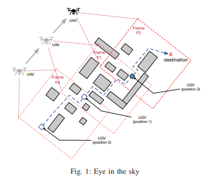
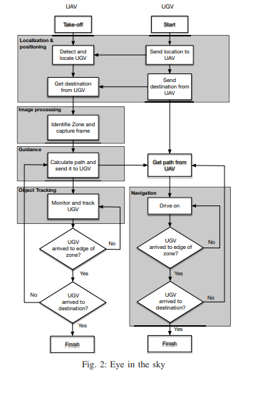
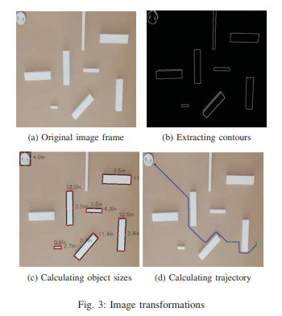
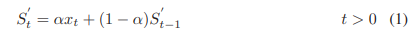
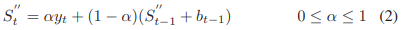
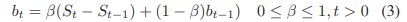
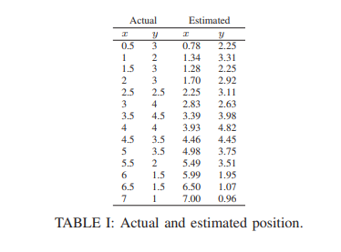
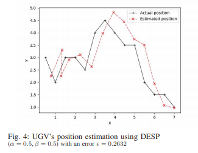
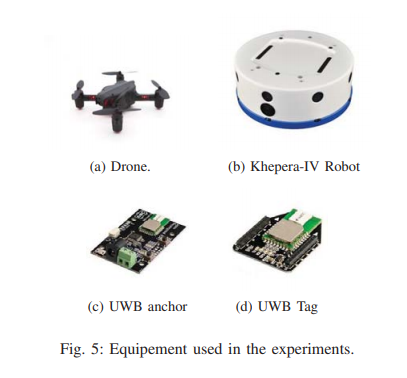

# 경로 탐색 및 계획을 위한 협력 UAV-UGV 시스템을 위한 프레임 워크
## Abstract
우리는 자율 지상 차량을위한 컴퓨터 비전 기반 협동 uav 지원 경로 계획을위한 새로운 프레임 워크를 설명함. 최근 몇 년 동안 무인 항공기 (UAV)는 자율 주행 차량의 경로 계획을 비롯한 많은 애플리케이션과 서비스에서 유익한 것으로 입증되었음. 대부분의 경로 계획 애플리케이션은 지상이든 항공이든 차량이 랜드 마크와 장애물을 통과 할 수 있도록하는 디지털지도의 가용성을 가정함. 그러나 특히 천재 지변이나 전쟁 지역에서지도를 사용할 수없는 시나리오에서는 주변 환경을 탐색하고 실시간으로 궤도 안내를 생성하는 하늘의 눈 역할을하는 드론을 사용하는 것이 매우 편리함. 장애물과 장애물 주변의 지상 차량. 이 연구에서 UAV는 하늘의 눈 역할을하는 카메라에는 주변의 이미지를 수집하고 지상 차량이 최종 목적지를 향한 경로를 계획하는 데 도움이되는 카메라가 장착되어 있음. 우리의 접근 방식에는 도로, 경로 및 장애물을 인식하고 목적지까지의 경로를 계산하는 비전 기반 알고리즘 사용이 포함됨. 동시에 UAV는 이동을 모니터링하고 추적하여 목적지까지 지상 차량 진행 상황을 추적함. 궤적의 생성은 A * 알고리즘의 향상된 버전을 기반으로함. 실험 설정에는 로봇과 드론, 차량이 현재 위치를 알 수있는 초 광대역 (UWB) 실내 위치 확인 시스템이 포함됨.

## 1. Introduction
일반적으로 언급되는 무인 항공기 (UAV) 또는 드론은 가까운 장래에 국가 영공을 가득 채울 것으로 예상됨. 다른 유형의 무인 운송 차량과 함께 UAV는 도시 및 농촌 지역 모두에 상품 전달, 모니터링, 측량, 표적 탐지, 수색 및 구조, 감시 등을위한 새롭고 정교한 서비스 및 애플리케이션의 배치에 중요한 역할을 함. 많은 민간 및 군사 응용 분야에서 구상되는 것처럼 UAV는 항공, 지상 및 해상 차량과 같은 다른 무인 차량과 협력하여 작동함. 임무 기반 애플리케이션의 경우 UAV는 분산되고 조정 된 작업이 필요할 수있는 특정 임무를 실행하기위한 공통 목표를 가지고 다른 자율 지상 차량과 긴밀하게 협력하고 통신함. 이러한 응용 프로그램에서 UAV,지상의 차량을 위해 하늘의 눈 . 즉, 지상 차량에게 UAV는 자유도의 확장으로 볼 수 있음. 수색 및 구조 (S & R) 및 임무 기반 현장 작전은 지상 차량에 대한 UAV 지원에 가장 필요한 애플리케이션의 전형적인 예임. 실제로 수색 및 구조 작업의 경우 지상 차량은 특히 재난 또는 재난 후 지역에서 알 수없는 환경에서 정상적으로 진행하기가 매우 어려움. 무인 지상 차량 (UGV) 위를 비행하고 주변을 감독하는 하나 또는 여러 개의 UAV를 사용하면 안내와 지원을 제공 할 수 있음.

이 백서에서는 응용 프로그램 별 작업을 수행하는 과정에서 경로 계획을 위해 UAV가 지원하는 UGV의 경우를 다룸. 이 논문의 나머지 부분은 다음과 같이 구성되어 있음. 다음 섹션에서는 드론이 제공하는 항공 이미지를 사용하여 장애물과 장애물을 감지하고 식별하기위한 비전 기반 기술에 대한 주요 연구를 제시하고 검토함. 섹션 II 에서는 시스템 설계를 제시하고 주요 구성 요소를 설명함. 섹션 III 는 분석과 함께 시스템의 성능 결과를 제공함. 섹션 IV 에서 논문을 마침.

### 1.1. Related Work
다양한 연구 연구가 경로 계획 및 장애물 회피를위한 UAV-UGV 협력 문제를 해결했음. 무인 항공기와 지상 로봇의 협력을 할 수있는 webGIS 플랫폼에서 아케텍처를 개발함. UAV는 자율적으로 지상 로봇을 따라 가면서 UAV가 이미지 처리 알고리즘을 사용하여 계산하는 궤적을 제공함

UAV-UGV의 아이디어는 지상에있는 여러 로봇을 지원하도록 확장되었습니다. 객체 수송 분산 멀티 로봇 공중 지상 협력 방식을 제시함. 이 방식에서는 물체를 운반하는 지상 이동 로봇 그룹이 드론에 의해 안내되어 그룹이 미리 정의 된 형태로 이동할 수 있음. 경로는 드론에 의해 지속적으로 계산되어 지상에있는 그룹의 리더에게 전송됨. 나머지 그룹은 리더 주변의 형성을 유지하기 위해 예측 비전 기반 목표 추적 메커니즘을 사용하여 리더를 따름

지상 및 공중 차량을 조정하는 그룹을 사용하여 이동 목표 위치를위한 협력 제어 방식을 전환 개발함. 위의 작업과 유사하게, 계획은 해당 지역을 비행하는 UAV 그룹에 의해 계산 된 궤적을 기반으로 목표를 추적하고 추적하면서 지상 그룹을 유지하는 것으로 구성됨. 이 작업의 주된 아이디어는 장애물 회피를 위해 분산 형 몰려 알고리즘과 탐색 기능을 결합하는 것임.

UAV-UGV 협력 시스템을 사용하여 자동지도 작성 및 경로 계획 기술을 제시함. 이 기술에서 UAV는 정기적으로 지상 이미지를 캡처하고 노이즈 제거, 이미지 보정 및 패턴 매칭과 같은 일련의 변환을 통해이를 처리하여 장애물을 감지함. 생성 된지도는 유전 알고리즘에 기반한 최적 경로 계획을 사용하여 경로 계획을 위해 UGV로 전송됨.

UAV-UGV 협력 시스템은 군중을 모니터링하고 추적하는 데 사용됨. 이러한 맥락에서 움직임 감지 알고리즘을 기반으로 군중을 추적하기 위해 UAV 그룹과 다중 UGV 그룹의 비전 기반 표적 감지 및 위치 파악 시스템을 제시함. UAV에는 UAV로 촬영 한 이미지를 사용하고 탐지 된 개인의 지리적 위치를 추정하는 지역화 알고리즘이 장착되어 있음.

컴퓨터 성능이 향상되고 자동 이미지 이미지 처리 기능이 개선 된 덕분에 카메라가 장착 된 UAV는 항공 이미지 분석에 대한 많은 연구 연구를 낳음. 이러한 연구의 흥미로운 측면 중 하나는 많은 산업 및 소비자 애플리케이션에 대한 잠재적 인 이점에 대한 의미 론적 수준의 이미지 분석임. 실제로 도로, 건물, 랜드 마크 및 교차로의 자동 인식 및 매칭을 위해 최근에 개발 된 많은 컴퓨터 비전 알고리즘이 제시되어 있음.

UAV로 캡처 한 비디오를 사용하여 도로 감지 및 추적 프레임 워크를 개발함. 그들의 연구는 빠른 호모 그래피 기반 도로 추적 체계를 사용하여 특정 지역에서 도로지도를 추출하기위한 그래프 절단 기반 감지 접근 방식을 제안함.

여러 연구가 항공 이미지를 사용하여 패턴 매칭 및 물체 감지를위한 최신 컴퓨터 비전 기술을 조사하는 데 초점을 맞추 었음. UAV로 생성 된 이미지에 대한 컴퓨터 비전 기술에 대한 조사들이 제공됨.

## 2. System design
본 논문에서는 비행 UAV가 생성 한 항공 영상에서 도로 및 장애물 특징을 인식하여 알려지지 않은 환경을 매핑하는 문제를 해결함. 목적은 지상 차량을 지원하고 목적지에 도달하기위한 적절한 궤도를 협력 적으로 계획하는 것임. 즉, 구조대와 차량이 최적의 시간에 피해자 위치에 도달 할 수있는 지상지도를 실시간으로 구축하여 알려지지 않은 환경을 탐색하는 것이 주요 목표 인 전형적인 재난 구조 애플리케이션을 고려함. 즉석에서 맵을 만들고 스트리밍하면 구조자가 구조 작업을위한 효율적이고 실행 가능한 경로를 계획 할 수 있습니다. 이 논문의 주요 공헌은 다음과 같음.

  1. UAV를 사용하여 항공 이미지를 획득하고이를 처리하여 장애물 표시를 추출 할 수 있음. 이는 이미지 노이즈 제거, 이미지 보정 및 패턴 인식 기술과 같은 간단한 알고리즘을 통해 수행 할 수 있음. 대부분의 기존 작품은 이미지 보정을 사용하지 않아 장애물 인식에 영향을 미침. 여기에서는 UGV가 장애물 인식 정확도를 향상시킬 수 있도록 이미지 보정을 추가함. 결과적으로 장애물을 피할 수 있고보다 실현 가능한 경로를 얻을 수 있음.

  2. 다양한 자연의 장애물을 감지하고 주변 경로를 계획하는 복잡성은 지상에서 차량을 추적하는 것까지 확장됨. 결국, UGV에 대한 경로가 생성되고 어떤 이유로 UGV가 더 이상 UAV 카메라의 비전 파일 내에 있지 않으면이 작업을 수행 할 수 없음. 즉, 우리의 작업에는 UAV가 다른 작업을 수행하는 동안 UGV를 지속적으로 추적하고 추적 할 수있는 알고리즘이 포함되어 있음. 사용 된 추적 방법은 UAV가 UGV의 다음 움직임을 예측할 수있는 DESP (double exponential smoothing predict) 기술을 사용하여 UGV가 UAV의 시야에서 사라져도 적절한 위치를 조정할 수 있음
  
  3. 지도 정보를 바탕으로 UGV가 목적지로 더 나아가도록하는 하이브리드 경로 계획 알고리즘을 제안함. A * 알고리즘의 최적화 된 버전을 사용함. 수색 및 구조 응용 프로그램을위한 경로 계획은 일반적 으로 자연을 탐구 하고 우리가 계획하는 목적지는 종종 일시적인 성격임. 따라서 우리의 계획 알고리즘은 새로운 목적지를 즉시 입력하여 현재 경로를 변경할 수 있음.
  
  4. 이 연구에서는 시스템을 테스트하기위한 실험실 기반 실험 인 성능 결과를 제시함. 우리는 시스템의 정확성과 효율성을 테스트하기 위해 여러 시나리오를 수행했음.
  
### 2.1. Obstacle detection algorithm
이미지 프레임에서 장애물을 감지하는 프로세스는 다음 주요 단계에 설명 된 이미지 처리 알고리즘을 사용하여 일련의 이미지 변환을 따름.

  1. 이미지 노이즈 제거 : 이 단계는 가우스 필터링을 적용하여 이미지에서 가우스 노이즈를 제거하는 것으로 구성됨
  
  2. 윤곽 추출 :이 단계는 먼저 이미지를 이진 이미지 (흑백)로 변환하여 장애물의 윤곽을 찾은 다음 캐니 에지 감지 알고리즘을 사용하여 장애물의 윤곽을 찾음 ( 그림 3b 참조 ).
  
  3. 크기 추정 : 윤곽을 찾아 장애물을 파악한 후이를 상자로 간주하여 각 장애물의 크기를 추정함. 이 단계는 탐지 된 장애물의 위치 지정 및 위치 파악을위한 프로세스 후반에 유용함 ( 그림 3c 참조 ).
  
### 2.2. Tracking
지상에서 UAV를 사용하여 움직이는 표적을 추적하는 것은 감시, 정찰 및 모니터링과 같은 중요한 응용 프로그램임. 추적은 최근에 광범위하게 연구되었으며 많은 추적 전략이 제안되었음. 우리의 경우 UGV를 추적하려면 UAV가 다양한 수단을 통해 UGV의 위치를 지속적으로 획득하고 그 위치 위로 마우스를 가져가는 것과 같은 특정 작업을 수행해야함. 우리 시스템을 위해 우리는 두 가지 전략을 제안함. 첫 번째는 GPS와 같은 위치 지정 및 위치 확인 시스템을 지원하는 경우에 사용됨. 여기서 우리는 필요시 UAV에 현재 위치를 알려주는 UGV에 의존하여 UAV가 UGV 위에 위치 할 수 있도록함.

두 번째 전략은 UAV에 탑재 된 카메라를 사용하는 비전 기반 기술을 사용하고 프레임 내에서 UGV를 유지할 수 있도록 자체 위치를 지정하는 것임. 이 전략에서 광학 흐름 기술은 비디오 프레임을 사용하는 특징 추적에 일반적으로 사용되는 기술임. 가장 널리 사용되는 광학 흐름 알고리즘 중 하나는 Lucas-Kanade 광학 흐름 알고리즘임. 이 기술은 비디오에서 픽셀이 한 프레임에서 다른 프레임으로 이동 한 거리를 측정하는 것으로 구성됨. 그런 다음 후속 프레임 사이에서 픽셀 세트에 의해 이동 한 거리를 사용하여 비디오 내 대상의 속도를 결정할 수 있음.

광학 흐름을 위해 openCV 내에서 사용 가능한 기능을 사용하여 지상에서 차량을 추적하는 전체 프로세스를 다음 단계로 요약 할 수 있음.

  1. 두드러진 포인트 식별 : 추적을 수행하려면 좋은 기능 세트가 필요하며 Shi-Tomasi 좋은 기능 세트를 얻기 위해 openCV를 사용하여 결정됨.
  
  2. Lucas-Kanade 방법 : 이전 단계에서 추출한 특징을 사용하여 Lucas-Kanade 알고리즘을 사용하여 광학 흐름을 계산함.
  
  3. 속도 계산 :이 단계는 결정된 모든 좋은 기능의 이동 평균 속도를 계산하는 것으로 구성됨. 이것은 UAV의 모션 모델을 결정하고 다음 위치가 될 위치를 결정하는 데 필요함.
  
### 2.3. UGV Trajectory prediction
표적 탐지 방법이 일반적으로 충분히 정확하더라도 특히 표적이 UAV의 시야 범위를 벗어날 때 잘못된 경보 또는 오 탐지가 발생할 수 있음. 따라서 이러한 오 탐지는 예측 기술을 적용하여 탐지 및 추적 프로세스를 강화함으로써 수정할 수 있음. 칼만 필터 (KF)는 물체 추적을위한 가장 일반적인 방법으로 간주됨. 그러나 타겟 추적과 같은 실시간 응용 프로그램에 대해 이러한 방법으로 도입 된 지연 시간을 고려할 때 훨씬 빠른 예측 방법으로 간주되는 이중 지수 평활 기반 예측 (DESP) 알고리즘을 사용하기로 선택함. 실제로 지수 평활화는 노이즈 제거를 목표로하는 저역 통과 필터임. DESP 알고리즘은 향후 몇 걸음 앞으로의 차량 자세 (차량의 위치와 방향)를 예측할 수 있음. 즉, DESP 연산은 다음 방정식으로 공식화 할 수 있음.

    
   
    

0α1 과 0β1 여기서 α는 평활 인자라고 하는 상수이고, β 추세 평할 인자임. 위의 방정식에서 시간 t 에서 상태 s의 추정은 첫 번째 방정식에서 S '로 표현되고 두 번째 방정식에서 S'로 표현 된 두 번의 라운드로 이루어짐. 표 1 에는 지상 차량의 실제 경로 웨이 포인트의 예와 각 단계에서 DESp 방법을 사용하여 얻은 추정 위치가 포함되어 있음. 그림 4 는 표 I 의 데이터에서 얻은 실제 경로와 예상 경로를 보여줌.

### 2.4. Path generation algorithm
이 알고리즘은 지상 차량이 현재 위치에서 목표 목적지까지 이동하기위한 최적의 경로를 찾는 것으로 구성됨. A 알고리즘은 가장 잘 알려진 경로 계획 알고리즘 중 하나임. A 는 그리드 기반 구성 공간에 적용됨. 이 알고리즘은 구성 공간의 각 셀에 다음 방정식을 기반으로 값이 할당되는 최상의 우선 검색 알고리즘으로 정의됨.

어디 h ( v ) 셀에서 대상 셀까지의 휴리스틱 거리 (예 : Manhattan, Euclidean, Chebyshev 등) g( v ) 선택한 셀 시퀀스를 통해 초기 셀에서 대상 셀까지의 경로 길이임.

## 3. Experiments and Setup
우리 시스템은 실외에서 작동하도록 설계되었으므로 GPS 또는 이와 유사한 실외 위치 시스템을 사용하는 것으로 가정함. 그러나 실내 실험실에서의 실험을 위해 우리는 GPS와 많은 구조적 유사성을 공유하는 UWB (Ultra-Wideband) 기반 포지셔닝 시스템을 사용하도록 선택했음. UWB의 주요 특징은 다른 무선 주파수 신호와 달리 동시에 여러 주파수 대역 (3.1 ~ 10.6GHz)을 통해 신호를 전송하므로 500MHz 이상의 대역폭을 제공한다는 것임. 실내 물체의 자체 위치 파악을 위해 UWB는 잠재적으로 높은 위치 정확도를가짐. 이 포지셔닝 시스템은 UAV와 UGV가 고정 위치에서 수신되는 UWB 무선 신호를 기반으로 자체 위치를 파악할 수 있도록함.

실험을 위해 우리 는 드론과 함께 사용하기위한 비트 크레이즈 로코 위치 앵커와 태그 ( 그림 5 참조 )를 사용했지만 로봇에도 사용을 확장했음. 이 경우 기지국은 실험실의 알려진 위치에 배치 된 앵커로 표시되며 차량에서 수신하는 신호를 주기적으로 전송함. 앵커는 TOA 또는 TDOA 모드에서 작동 할 수 있음.

## 4. Conclusion
이 백서에서 우리는 구조 작업을 완료하는 과정에서 UAV와 UGV가 함께 작동하는 협력 임무 기반 애플리케이션의 프레임 워크를 제시했음. 이 맥락에서 UGV를 비행하는 UAV는 UGV를 둘러싼 환경의 이미지를 수집하고 일련의 컴퓨터 비전 알고리즘 처리를 통해 UAV는 UGV가 피할 장애물을 감지함. 이 시스템은 또한 UGV의 다음 움직임을 예측하는 이중 지수 평활 기술을 기반으로하는 추적 알고리즘을 포함하여 UAV가 온보드 카메라의 시야 내에 유지할 수 있도록함. UAV와 UGV의 포지셔닝 및 자체 위치 파악을 위해 8-anchor UWB 기반 실내 측위 시스템을 사용했음. 경로 계획은 인기있는 A * 알고리즘의 수정 된 버전을 기반으로하여 UGV가 최종 목적지가 동적으로 변경되는 탐색 모드에서 작동 할 수 있도록함. 우리는 더 많은 실험 테스트를 수행하여 더 많은 연구를 추구하고 다양한 알고리즘을 더 개선 할 계획임.

