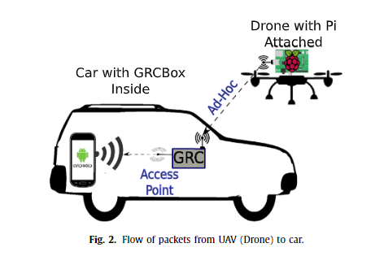

# UAV-자동차 통신의 
## Abstract
드론으로 널리 알려진 무인 항공기(UAV)는 지상 차량 네트워크와 함께 배치 할 수 있음. 인프라를 사용할 수 없는 상황에서는 드론을 모바일 인프라 요소로 배포하여 모든 유형의 서비스를 제공 할 수 있음. 이러한 서비스의 예로는 긴급 상황 발생시 차량에 중요한 경고를 전달하기 위한 정보 릴레이로 드론을 신속하게 배치 할 수있는 농촌 지역의 안전이 있음. 이 작업에서는 고도, 안테나 방향 및 상대 거리를 고려하여 자동차와 드론 ㄱ나의 연결에 대한 통신 성능을 분석함. 제시된 겨로가는 드론과 자동차 간의 통신이 농촌 지역에서 최대 3km까지 도달 할 수 있으며 2.7km 범위에서 배송률에 대해 최소 50%의 성공률을 달성한다는 것을 보여줌. 드디어, 네트워크 시뮬레이터에서 실험 결과는 이러한 종류의 통신에 적합한 표현을 제공하는 수정 된 가우스 함수로 모델링되었습니다.

## 1. Introduction
지능형 교통 시스템(ITS)은 안전 및 효율성과 같은 교통 관련 문제에 대한 효율적인 솔루션을 제공 할 수 있음. 도로를 더 안전하게 만들려고 시도 할 때 ITS는 발생하는 사고 수를 줄이는 안전 관련 응용 프로그램 시스템을 제공 할 수 있음. 자동차(V2V 또는 Vehicle-to-Vehicle) 간의 데이터 교환으로 분류되는 V2X(Vehicle-to-Everything) 패러다임과 더 넓은 범위를 향한 릴레이 역할을 하는 인프라 요소 (V2I 또는 Vehicle-to-Infrastructure) 네트워크 또는 인터넷은 ITS 서비스 및 애플리케이션을 제공하는데 필수적임. 그러나 차량 네트워크는 빠르게 움직이고 역동적인 경우 긴급 및 안전 시나리오에 대해 적시에 중요하고 가능한 한 신속하게 처리해야하는 중요 정보가 포함 된 메시지를 배포 할 때 문제가 발생함. V2X 통신에서 고려해야 할 또 다른 문제는 커버리지 영역에 인프라 지원이 부족한 경우임. 차량 통신은 다양한 무선 액세스 기술에 의존 할 수 있지만, 예르르 들어 4G LTE 기술을 사용하여 농촌 지역과 같이 인프라가 제한된 지역에서 통신을 지원 하는 경우, 인프라 지원이 없는 지역에서 통신이 이루어질 때 일반적으로 주요 문제가 발생함.

무인 항공기(UAV) 또는 드론이 현재 긴급 상황 즉 SAR(Search And Rescue) 및 소방과 같은 재난 대응을 위한 새로운 솔류션이 되고 있음. 또한 지상파 통신에 비해 UAV의 채택은 빠르고 유연한 배치를 제공할 뿐만 아니라 높은 고도로 인해 수신기와 함께 LOS(Line-Of-Sight)를 가질 가능성이 높아집니다. 최근에는 통신 에이전트로서 UAV의 기능과 여러 응용 시나리오에서의 유용성을 철저한 연구에서 분석함

UAV는 또한 특정 네트워크의 지상 차량과 협력하여 이들 간의 데이터 교환을 개선 할 수 있음. 이 접근 방식은 구조 및 재난 지원 작업 및 원격 감지와 같은 여러 ITS 애플리케이션에 이점을 제공함. 이러한 경우, 우리는 일반적으로 여러 UAV에 의존하여 그들 사이의 네트워크를 일치시켜 플라잉 애드혹 네트워크(FANET)를 만듬. A와 서브 클래스의 수레 AD HOC 네트워크(VANET), FANET은 3D 공간에서 자유롭게 움직이는 고도의 이동성 노드가 특징이기 떄문에 표준 VANET과 다름. 반대로 VANET은 거리를 따라 2D 이동으로 제한됨. FANET 통신의 과제는 특정 애플리케이션에 따라 다름. 예를 들어, 재난 모니터링은 짧은 지연 시간돠 매우 높은 정보 전송 속도(실시간 비디오 피드)와 같은 강력한 요구 사항을 도입함. 다중 UAV 시스템의 사용은 링크 중단의 단점을 최소화하기 위해 UAV간에 패킷이 중계 및 전달 될 수 있기 때문에 달성 가능한 전송 범위와 효율성을 개선하는데도 도움이 될 수 있음.

FANET의 과제중 하나는 정확한 무선 전파 모델을 얻는 것임. 이 문제는 문헌에서 다르는 일반적인 시나리오와 다름. 대부분의 작업은 무인 항공기 및 정적 지상 기지국 사이의 링크에 초점으로 일반적 가시선 조건을 가짐. 또 다른 경우, 저자는 UAV를 사용하여 공대지 경로 손실을 모델링함. 그러나 지상 수신기는 움직이는 노드가 아님. 대신, 이 작업에서 우리는 현재 매우 중요한 주제인 UAV-to-car 통신에 중점을 둠. 그리고 그것은 차량 이동성으로 인해 지상 기본 케이스와 다름. 따라서 UAV와 이동 차량간의 통신을 특성화하고 FANET 및 VANET 시나리오를 결합한 시뮬레이션에 사용할 수 있는 모델을 도출하는 것이 필요함.

이 논문에서는 시뮬레이션 연구에 사용되는 통신 모델의 개발을 촉진하기 위한 실제 실험을 기반으로 UAV-자동차 통신의 특성화를 수행함. 이 시나리오에서 UAV는 모바일 RSU(Road Side Unit) 역할을 하여 5GHz 대역에서 항공 및 지상 차량 간의 차량 통신 연구를 수행 할 수 있음. 실험은 통신 성능을 결정하기 위해 차량과 드론을 사용하여 실제 현장 테스트와 함께 발렌시아의 시골 지역에서 수행됨. 또한 얻은 결과를 기반으로 수정 된 가우스 함수를 사용하여 다양한 시나리오(드론 고도, 안테나 회전 및 안테나 방향)에서 패킷 전달 비율을 모집함.

이 백세의 나머지 부분은 다음과 같이 구성됨. 다음 섹션에서는 공대지 통신을 포함하는 VANET 시나리오와 관련된 고나련 작업의 개요를 제공함. 섹션3에서는 실험에 관련된 방법론, 하드웨어 및 소프트웨어를 설명함. 그런 다음 섹션 4에서 실험에 사용 된 시나리오에 대한 세부 정보를 제공함. 실험 결과는 섹션 5에서 제시하고 논의한 다음 섹션 6에서 얻은 결과를 모델링 함. 마지막으로 섹션 8에서 논문을 마무리하고 향후 작업을 참조함.

## 2. Related works
UAV는 최근 농촌 및 도시 지역 모두를 위한 다목적 플랫폼이 될 수 있기 때문에 광범위한 ITS 솔루션에 채택됨. 많은 애플리케이션 중에서 감시 용으로 사용하거나 기존 인프라가 원하는 서비스를 적절하게 제공하지 못하는 경우(예: 셀 과부하 또는 중단) 공중 중계기가 될 수 있음. 이를 통해 구조 작업에 필수적인 비상 통신 시스템을 사용할 수 있음. 재해 후 이벤트에서 여러 UAV를 수색 및 구조를 위해 쉽게 배치 할 수 도 있음. 또한 다중 UAV는 협력 네트워크를 준수 할 수 있으며 분산 방식으로 더 나은 조정을 위한 최적의 포지셔닝 전략을 정의 할 수 있음. 이러한 솔루션의 일반적인 적용에는 네트워크가 검색에서 사용자 에이전트 및 지상 노드의 추적으로 동적 전환을 허용하는 국토 방어 작전이 포함됨. 여러 UAV(스윔)를 배포하는 다른 응용 프로그램에는 잠재적인 재난을 모니터링하고 감지하기 위해 WSN(무선 센서 네트워크)과 함께 작업하는 것이 포함됨

UAV와 자동차 간의 통신(공대지 통신)은 예를 들어, UAV는 중간 릴레이 역할을 하여 차량 네트워크를 지원할 수 있음. UAV는 재해가 발생하는 지역에도 배치 할 수 있으므로 DTN(Delay-Tolerant Network) 패러다임에서 번들 캐리어 및 릴레이 역할을 함. 다른 연구에서, 저자들은 재난 발생시 차량 구조를 위한 통신을 위한 비행 기지국으로 UAV를 배치 할 가능성을 분석함. 이 시나리오에서 차량은 UAV가 가정하는 작업 인 지상 통신 인프라를 사용할 수 없을 때 차량간에 협력하고 연결을 유지해야 함. 이 경우 저자는 UAV에 의존하는 분리 된 자동차 그룹의 상호 연결성을 분석함. 그들은 전체 전송 품질에 대한 그룹의 자동차 수 증가의 영향을 연구했음. 이 경우는 UAV가 차량 네트워크를 위한 Stor-Carry-Foward 노드로 배치되는 시나리오에서도 적용될 수 있음. 이 분야에서 더 많은 노력을 기울이는 것은 VDNET(Vehicle-Drone hybird vehicular ad hoc Network)의 배치를 포함함. 이는 차량 노드에 UAV를 장착하여 차량 노드에 더 많은 차량 노드와 통신 할 수 있도록 함으로써 더 나은 메시지 전송을 제공함. 다른 관련 작업에서, UAV 네트워크는 최적의 정보 배포를 달성하기 위해 도시 전체에 배치 될 수 있음. 고층 건물과 랜드 마크가 있으면 무선 신호가 중단되어 차량 간 통신 오류가 자주 발생 할 수 있음. 따라서 UAV는 정보를 차량으로 라우팅하는데 도움을 줄 수있음.

통신 대역 측면에서 5GHz에서 공대지 링크 사용하는 방법이 있음. 특성화는 WiFi 지원 UAV를 사용하여 수행됨. 특히 802.11a를 사용하는 WLAN 운영은 경제적인 이유로 선호됨. 서로 다른 주파수 대역의 적합성에 대해 논의하여 통신이 높은 사용으로 인해 허가되지 않은 산업, 과학 및 의료(ISM)대역에서 작동 할 경우 심각한 간섭을 받을 수 있음. 따라서 간섭의 영향을 제한하기 위해 IEEE 802.11p(5.9GHz 대역)에서 채택한 것과 같은 라이센스 대역이 바람직함. 이 문제를 더욱 갖오하기 위해 2.4GHz 대역의 FANET 통신은 특히 무선 제어가 동일한 주파수 대역에서 작동 할 때(대부분의 경우) 매우 열악한 성능을 제공하는 경향이 있음을 입증함. 비용, 전련 소비 및 복잡성을 고려할 때 IEEE 802.15.4 표준을 이용하는 방법이 있음. 그들은 FANET을 배포하기 위한 기본 요구사항인 메시 네트워크로 사용될 때 성능 수준이 적절하지 않다는 것을 알게되었음. FANET 애플리케이션에서 지향성 안테나 사용을 가정하는 MAC 프로토콜을 제안함. 이는 기존의 무 지향성 안테나를 사용하는 것에 비해 전송 범위 측면에서 추가적인 이점을 제공하기 떄문임. 그러나 우리 작업에서는 무 지향성 안테나를 사용하는 5GHz 링크와 일반적인 사례를 연구할 것임. 이는 실제 시나리오에서 가장 일반적인 상황임.

우리의 작업은 주어진 대상 지역에 인프라가 부족할 때 차량 네트워크를 지원하기 위해 모바일 인프라를 배포하는 문제를 해결함. UAV는 장거리에 대한 가시선 통신을 제공할 수 있으며, 이는 항상 차량 간 통신으로 달성 할 수 없음. 그래서 우리는 시골 지역에서 UAV와 차량 간 통신을 위한 네트워크 성능을 측정하는 것으로 시작함. 특히, 비행 UAV에서 이동 차량으로 전송되는 데이터에 대한 패킷 전송 비율을 평가함. 그런 다음 실제 실험에서 얻은 결과를 사용하여 거리를 기준으로 패킷 전달 비율을 추정 할 수있는 모델을 생성함. 제안 된 네트워크의 아키텍처는 다음 섹션에서 자세히 설혐함.

## 3. Architecture overview
이 섹션에서는 계획된 시나리오에 대한 일반적인 개요를 제공하는 것으로 시작한 다음 데이터 흐름 및 관련된 다양한 요소를 포함하여 제안 된 아키텍처를 자세히 설명함. 우리가 제안한 GRCBox라는 이름의 온보드 장치 도 이 섹션 끝에 소개됨.

### 3.1. General overview
우리의 궁극적인 목표는 인프라 지원이 제한되거나 없는 지역에서 통신을 지원하기 위해 UAV를 배포 할 수 있는 환경을 구축하는 것임. 특히, UAV는 가시선 부족으로 인해 차량 간 통신이 방해 받는 시나리오에 대처하기 위해 전략적으로 배치되어야 함. 그림 1에 그려진 바와 같이, UAV는 주변 언덕 꼭대기 근처에 위치하여 자동차 사이의 가시선 장애물을 유발할 수 있음. 이러한 UAV 지원 통신 인프라는 원격 사고를 감지 할 때 유용함. 특히 장거리 및 비가 시선 제한으로 인해 지상 차량 통신이 신뢰할 수 없는 경우에 유용함.

### 3.2. UAV-to-car communications
우리의 작업은 UAV와 자동차 간의 지점 간 애드혹 통신의 효과를 측정하는 데 중점을 두고 있으며, 이는 결국 이전 하위 섹션에서 자세히 설명한 큰 그림을 따를 수 있음. 특히 이 실험 작업을 위해서는 패킷 전송률, 범위를 측정하고 얻은 데이터를 분석하기 위해 적절한 하드웨어/소프트웨어가 필요함. 통신 실험에는 드론에 장착된 Raspberry Pi, Android 스마트폰, 마지막으로 애도혹 통신을 포함한 여러 통신 인터페이스가 부여 된 차량 탑재 장치 인 GRCBox의 세 가지 다른 장치가 사용됨. GRCBox는 최종 수신기로 작동하는 Android 기기와 함꼐 자동차에 배치됨.

전 세계적으로 널리 보급된 스마트 폰을 고려할 때 이 구성은 ITS 장비를 배포하는 데 비해 싸고 빠른 솔루션이 될 수 있음. 실험을 위해 Android 스마트 폰에 설치된 Android 용 테스트 애플리케이션을 개발함. 이 응용 프로그램을 사용하면 운전자가 GRCBox를 통해 드론에서 데이터를 수신 할 수 있음. 드론 자체에 대해서는 라즈베리 파이를 내장함. 전자는 패킷을 주기적으로 생성하고 생성 된 애드혹 네트워크를 통해 브로드 캐스팅 하는데 사용됨. AD-hoc 네트워크에 가입하려면 Android 장치가 기본적으로 이 모드에서 작동 할 수 없기 때문에 차량 탑재 장치 (GRCBox)가 필요함.

생성 된 패킷 흐름은 그림 2에 나와있음. 각 패킷은 애드혹 네트워크를 통해 UAV에서 차량 탑재 장치(GRCBox)로 전송됨. GRCBox는 차량 내부에 액세스 포인트도 제공하므로 패킷 릴레이 역할을 하여 수신 된 패킷을 GRCBox에 연결된 Android 장치로 전달함.

