# UAV-자동차 통신의 실험적 특성
## Abstract
드론으로 널리 알려진 무인 항공기(UAV)는 지상 차량 네트워크와 함께 배치 할 수 있음. 인프라를 사용할 수 없는 상황에서는 드론을 모바일 인프라 요소로 배포하여 모든 유형의 서비스를 제공 할 수 있음. 이러한 서비스의 예로는 긴급 상황 발생시 차량에 중요한 경고를 전달하기 위한 정보 릴레이로 드론을 신속하게 배치 할 수있는 농촌 지역의 안전이 있음. 이 작업에서는 고도, 안테나 방향 및 상대 거리를 고려하여 자동차와 드론 ㄱ나의 연결에 대한 통신 성능을 분석함. 제시된 겨로가는 드론과 자동차 간의 통신이 농촌 지역에서 최대 3km까지 도달 할 수 있으며 2.7km 범위에서 배송률에 대해 최소 50%의 성공률을 달성한다는 것을 보여줌. 드디어, 네트워크 시뮬레이터에서 실험 결과는 이러한 종류의 통신에 적합한 표현을 제공하는 수정 된 가우스 함수로 모델링되었습니다.

## 1. Introduction
지능형 교통 시스템(ITS)은 안전 및 효율성과 같은 교통 관련 문제에 대한 효율적인 솔루션을 제공 할 수 있음. 도로를 더 안전하게 만들려고 시도 할 때 ITS는 발생하는 사고 수를 줄이는 안전 관련 응용 프로그램 시스템을 제공 할 수 있음. 자동차(V2V 또는 Vehicle-to-Vehicle) 간의 데이터 교환으로 분류되는 V2X(Vehicle-to-Everything) 패러다임과 더 넓은 범위를 향한 릴레이 역할을 하는 인프라 요소 (V2I 또는 Vehicle-to-Infrastructure) 네트워크 또는 인터넷은 ITS 서비스 및 애플리케이션을 제공하는데 필수적임. 그러나 차량 네트워크는 빠르게 움직이고 역동적인 경우 긴급 및 안전 시나리오에 대해 적시에 중요하고 가능한 한 신속하게 처리해야하는 중요 정보가 포함 된 메시지를 배포 할 때 문제가 발생함. V2X 통신에서 고려해야 할 또 다른 문제는 커버리지 영역에 인프라 지원이 부족한 경우임. 차량 통신은 다양한 무선 액세스 기술에 의존 할 수 있지만, 예르르 들어 4G LTE 기술을 사용하여 농촌 지역과 같이 인프라가 제한된 지역에서 통신을 지원 하는 경우, 인프라 지원이 없는 지역에서 통신이 이루어질 때 일반적으로 주요 문제가 발생함.

무인 항공기(UAV) 또는 드론이 현재 긴급 상황 즉 SAR(Search And Rescue) 및 소방과 같은 재난 대응을 위한 새로운 솔류션이 되고 있음. 또한 지상파 통신에 비해 UAV의 채택은 빠르고 유연한 배치를 제공할 뿐만 아니라 높은 고도로 인해 수신기와 함께 LOS(Line-Of-Sight)를 가질 가능성이 높아집니다. 최근에는 통신 에이전트로서 UAV의 기능과 여러 응용 시나리오에서의 유용성을 철저한 연구에서 분석함

UAV는 또한 특정 네트워크의 지상 차량과 협력하여 이들 간의 데이터 교환을 개선 할 수 있음. 이 접근 방식은 구조 및 재난 지원 작업 및 원격 감지와 같은 여러 ITS 애플리케이션에 이점을 제공함. 이러한 경우, 우리는 일반적으로 여러 UAV에 의존하여 그들 사이의 네트워크를 일치시켜 플라잉 애드혹 네트워크(FANET)를 만듬. A와 서브 클래스의 수레 AD HOC 네트워크(VANET), FANET은 3D 공간에서 자유롭게 움직이는 고도의 이동성 노드가 특징이기 떄문에 표준 VANET과 다름. 반대로 VANET은 거리를 따라 2D 이동으로 제한됨. FANET 통신의 과제는 특정 애플리케이션에 따라 다름. 예를 들어, 재난 모니터링은 짧은 지연 시간돠 매우 높은 정보 전송 속도(실시간 비디오 피드)와 같은 강력한 요구 사항을 도입함. 다중 UAV 시스템의 사용은 링크 중단의 단점을 최소화하기 위해 UAV간에 패킷이 중계 및 전달 될 수 있기 때문에 달성 가능한 전송 범위와 효율성을 개선하는데도 도움이 될 수 있음.

FANET의 과제중 하나는 정확한 무선 전파 모델을 얻는 것임. 이 문제는 문헌에서 다르는 일반적인 시나리오와 다름. 대부분의 작업은 무인 항공기 및 정적 지상 기지국 사이의 링크에 초점으로 일반적 가시선 조건을 가짐. 또 다른 경우, 저자는 UAV를 사용하여 공대지 경로 손실을 모델링함. 그러나 지상 수신기는 움직이는 노드가 아님. 대신, 이 작업에서 우리는 현재 매우 중요한 주제인 UAV-to-car 통신에 중점을 둠. 그리고 그것은 차량 이동성으로 인해 지상 기본 케이스와 다름. 따라서 UAV와 이동 차량간의 통신을 특성화하고 FANET 및 VANET 시나리오를 결합한 시뮬레이션에 사용할 수 있는 모델을 도출하는 것이 필요함.

이 논문에서는 시뮬레이션 연구에 사용되는 통신 모델의 개발을 촉진하기 위한 실제 실험을 기반으로 UAV-자동차 통신의 특성화를 수행함. 이 시나리오에서 UAV는 모바일 RSU(Road Side Unit) 역할을 하여 5GHz 대역에서 항공 및 지상 차량 간의 차량 통신 연구를 수행 할 수 있음. 실험은 통신 성능을 결정하기 위해 차량과 드론을 사용하여 실제 현장 테스트와 함께 발렌시아의 시골 지역에서 수행됨. 또한 얻은 결과를 기반으로 수정 된 가우스 함수를 사용하여 다양한 시나리오(드론 고도, 안테나 회전 및 안테나 방향)에서 패킷 전달 비율을 모집함.

이 백세의 나머지 부분은 다음과 같이 구성됨. 다음 섹션에서는 공대지 통신을 포함하는 VANET 시나리오와 관련된 고나련 작업의 개요를 제공함. 섹션3에서는 실험에 관련된 방법론, 하드웨어 및 소프트웨어를 설명함. 그런 다음 섹션 4에서 실험에 사용 된 시나리오에 대한 세부 정보를 제공함. 실험 결과는 섹션 5에서 제시하고 논의한 다음 섹션 6에서 얻은 결과를 모델링 함. 마지막으로 섹션 8에서 논문을 마무리하고 향후 작업을 참조함.

## 2. Related works
UAV는 최근 농촌 및 도시 지역 모두를 위한 다목적 플랫폼이 될 수 있기 때문에 광범위한 ITS 솔루션에 채택됨. 많은 애플리케이션 중에서 감시 용으로 사용하거나 기존 인프라가 원하는 서비스를 적절하게 제공하지 못하는 경우(예: 셀 과부하 또는 중단) 공중 중계기가 될 수 있음. 이를 통해 구조 작업에 필수적인 비상 통신 시스템을 사용할 수 있음. 재해 후 이벤트에서 여러 UAV를 수색 및 구조를 위해 쉽게 배치 할 수 도 있음. 또한 다중 UAV는 협력 네트워크를 준수 할 수 있으며 분산 방식으로 더 나은 조정을 위한 최적의 포지셔닝 전략을 정의 할 수 있음. 이러한 솔루션의 일반적인 적용에는 네트워크가 검색에서 사용자 에이전트 및 지상 노드의 추적으로 동적 전환을 허용하는 국토 방어 작전이 포함됨. 여러 UAV(스윔)를 배포하는 다른 응용 프로그램에는 잠재적인 재난을 모니터링하고 감지하기 위해 WSN(무선 센서 네트워크)과 함께 작업하는 것이 포함됨

UAV와 자동차 간의 통신(공대지 통신)은 예를 들어, UAV는 중간 릴레이 역할을 하여 차량 네트워크를 지원할 수 있음. UAV는 재해가 발생하는 지역에도 배치 할 수 있으므로 DTN(Delay-Tolerant Network) 패러다임에서 번들 캐리어 및 릴레이 역할을 함. 다른 연구에서, 저자들은 재난 발생시 차량 구조를 위한 통신을 위한 비행 기지국으로 UAV를 배치 할 가능성을 분석함. 이 시나리오에서 차량은 UAV가 가정하는 작업 인 지상 통신 인프라를 사용할 수 없을 때 차량간에 협력하고 연결을 유지해야 함. 이 경우 저자는 UAV에 의존하는 분리 된 자동차 그룹의 상호 연결성을 분석함. 그들은 전체 전송 품질에 대한 그룹의 자동차 수 증가의 영향을 연구했음. 이 경우는 UAV가 차량 네트워크를 위한 Stor-Carry-Foward 노드로 배치되는 시나리오에서도 적용될 수 있음. 이 분야에서 더 많은 노력을 기울이는 것은 VDNET(Vehicle-Drone hybird vehicular ad hoc Network)의 배치를 포함함. 이는 차량 노드에 UAV를 장착하여 차량 노드에 더 많은 차량 노드와 통신 할 수 있도록 함으로써 더 나은 메시지 전송을 제공함. 다른 관련 작업에서, UAV 네트워크는 최적의 정보 배포를 달성하기 위해 도시 전체에 배치 될 수 있음. 고층 건물과 랜드 마크가 있으면 무선 신호가 중단되어 차량 간 통신 오류가 자주 발생 할 수 있음. 따라서 UAV는 정보를 차량으로 라우팅하는데 도움을 줄 수있음.

통신 대역 측면에서 5GHz에서 공대지 링크 사용하는 방법이 있음. 특성화는 WiFi 지원 UAV를 사용하여 수행됨. 특히 802.11a를 사용하는 WLAN 운영은 경제적인 이유로 선호됨. 서로 다른 주파수 대역의 적합성에 대해 논의하여 통신이 높은 사용으로 인해 허가되지 않은 산업, 과학 및 의료(ISM)대역에서 작동 할 경우 심각한 간섭을 받을 수 있음. 따라서 간섭의 영향을 제한하기 위해 IEEE 802.11p(5.9GHz 대역)에서 채택한 것과 같은 라이센스 대역이 바람직함. 이 문제를 더욱 갖오하기 위해 2.4GHz 대역의 FANET 통신은 특히 무선 제어가 동일한 주파수 대역에서 작동 할 때(대부분의 경우) 매우 열악한 성능을 제공하는 경향이 있음을 입증함. 비용, 전련 소비 및 복잡성을 고려할 때 IEEE 802.15.4 표준을 이용하는 방법이 있음. 그들은 FANET을 배포하기 위한 기본 요구사항인 메시 네트워크로 사용될 때 성능 수준이 적절하지 않다는 것을 알게되었음. FANET 애플리케이션에서 지향성 안테나 사용을 가정하는 MAC 프로토콜을 제안함. 이는 기존의 무 지향성 안테나를 사용하는 것에 비해 전송 범위 측면에서 추가적인 이점을 제공하기 떄문임. 그러나 우리 작업에서는 무 지향성 안테나를 사용하는 5GHz 링크와 일반적인 사례를 연구할 것임. 이는 실제 시나리오에서 가장 일반적인 상황임.

우리의 작업은 주어진 대상 지역에 인프라가 부족할 때 차량 네트워크를 지원하기 위해 모바일 인프라를 배포하는 문제를 해결함. UAV는 장거리에 대한 가시선 통신을 제공할 수 있으며, 이는 항상 차량 간 통신으로 달성 할 수 없음. 그래서 우리는 시골 지역에서 UAV와 차량 간 통신을 위한 네트워크 성능을 측정하는 것으로 시작함. 특히, 비행 UAV에서 이동 차량으로 전송되는 데이터에 대한 패킷 전송 비율을 평가함. 그런 다음 실제 실험에서 얻은 결과를 사용하여 거리를 기준으로 패킷 전달 비율을 추정 할 수있는 모델을 생성함. 제안 된 네트워크의 아키텍처는 다음 섹션에서 자세히 설혐함.

## 3. Architecture overview
이 섹션에서는 계획된 시나리오에 대한 일반적인 개요를 제공하는 것으로 시작한 다음 데이터 흐름 및 관련된 다양한 요소를 포함하여 제안 된 아키텍처를 자세히 설명함. 우리가 제안한 GRCBox라는 이름의 온보드 장치 도 이 섹션 끝에 소개됨.

### 3.1. General overview
우리의 궁극적인 목표는 인프라 지원이 제한되거나 없는 지역에서 통신을 지원하기 위해 UAV를 배포 할 수 있는 환경을 구축하는 것임. 특히, UAV는 가시선 부족으로 인해 차량 간 통신이 방해 받는 시나리오에 대처하기 위해 전략적으로 배치되어야 함. 그림 1에 그려진 바와 같이, UAV는 주변 언덕 꼭대기 근처에 위치하여 자동차 사이의 가시선 장애물을 유발할 수 있음. 이러한 UAV 지원 통신 인프라는 원격 사고를 감지 할 때 유용함. 특히 장거리 및 비가 시선 제한으로 인해 지상 차량 통신이 신뢰할 수 없는 경우에 유용함.

### 3.2. UAV-to-car communications
우리의 작업은 UAV와 자동차 간의 지점 간 애드혹 통신의 효과를 측정하는 데 중점을 두고 있으며, 이는 결국 이전 하위 섹션에서 자세히 설명한 큰 그림을 따를 수 있음. 특히 이 실험 작업을 위해서는 패킷 전송률, 범위를 측정하고 얻은 데이터를 분석하기 위해 적절한 하드웨어/소프트웨어가 필요함. 통신 실험에는 드론에 장착된 Raspberry Pi, Android 스마트폰, 마지막으로 애도혹 통신을 포함한 여러 통신 인터페이스가 부여 된 차량 탑재 장치 인 GRCBox의 세 가지 다른 장치가 사용됨. GRCBox는 최종 수신기로 작동하는 Android 기기와 함꼐 자동차에 배치됨.

전 세계적으로 널리 보급된 스마트 폰을 고려할 때 이 구성은 ITS 장비를 배포하는 데 비해 싸고 빠른 솔루션이 될 수 있음. 실험을 위해 Android 스마트 폰에 설치된 Android 용 테스트 애플리케이션을 개발함. 이 응용 프로그램을 사용하면 운전자가 GRCBox를 통해 드론에서 데이터를 수신 할 수 있음. 드론 자체에 대해서는 라즈베리 파이를 내장함. 전자는 패킷을 주기적으로 생성하고 생성 된 애드혹 네트워크를 통해 브로드 캐스팅 하는데 사용됨. AD-hoc 네트워크에 가입하려면 Android 장치가 기본적으로 이 모드에서 작동 할 수 없기 때문에 차량 탑재 장치 (GRCBox)가 필요함.

생성 된 패킷 흐름은 그림 2에 나와있음. 각 패킷은 애드혹 네트워크를 통해 UAV에서 차량 탑재 장치(GRCBox)로 전송됨. GRCBox는 차량 내부에 액세스 포인트도 제공하므로 패킷 릴레이 역할을 하여 수신 된 패킷을 GRCBox에 연결된 Android 장치로 전달함.

### 3.3. GRCBox overview
GRCBox는 5GHz 대역을 사용하여 자동차와 드론 간의 애드혹 통신을 제공하는데 필요함. 실험에서는 Android 기기를 사용하여 이 목적으로 특별히 개발 된 애플리케이션을 실행함. Android 기기는 기본적으로 임시 연결을 제공하지 않으므로 최종 사용자에게는 실용적이지 않은 요구 사항인 이를 달성하기 위해 기기를 루팅해야 함. 따라서 우리가 제안한 GRCBox는 Ad-hoc 모드에서 Android 장치를 구성하는 어려움을 우회하는 솔루션으로 등장함. 실제로 GRCBox는 애드혹 모드 통신의 자동 배포를 위한 라우터 역할을 할 수 있으므로 스마트 폰을 루팅 할 필요가 없음. 이 기능을 통해 V2X 통신이 완벽하게 지원되고 스마트 폰과의 원할한 통합이 이루어짐.

Raspberry Pi 2 장치 모델 B1은 GRCBox의 주요 하드웨어 임. 신용 카드 크기의 단일 보드 컴퓨터이며 비용은 35USD에 불과함. 이 장치에는 낮은 규모의 네트워크 라우팅을 수행 할 수있는 충분한 CPU 전력이 있음. Debian 기반의 Raspbian 배포가 이 장치에 설치됨. 이 Raspbian 배포판은 다른 임베디드 운영 체제의 일반적인 문제를 피하면서 현재 네트워킹 하드웨어를 지원함.

각 GRCBox에는 여러 네트워크 인터페이스가 장착되어 있음. 자동차 승객을 위한 액세스 포인트 역할을 하는 내부 인터페이스 하나는 2.4GHz 대역에서 WiFi 통신을 지원하는 스마트 폰을 사용하여 GRCBox에 연결할 수 있음. 외부 인터페이스는 차량 통신을 제공함. 특히 5.8GHz 대역에서 작동 하는 차량 네트워크에 연결됨. 또한 인터넷에 연결되는 다른 네으퉈크 인터페이스를 추가 할 수 있음. 예를 들어 하나의 네트워크 인터페이스는 WiFi 액세스 포인트에 연결할 수 있고 다른 인터페이스는 4G 셀룰러 기지국에 연결하는 데 사용할 수 있음. 그림 3은 GRCBox 연결 기능을 설명하는 다이어 그램임

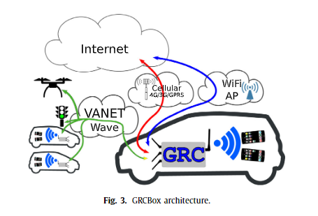

GRCBox는 여러 서비스를 제공함. GRCBox의 내부 인터페이스는 스마트 폰용 소프트 AP(액세스 포인트) 역할을 함. 이러한 스마트 폰이 GRCBox에 연결되면 외부 네트워크에서 실행되는 서비스에 액세스 할 수 있음. 모든 연결은 GRCBox에 의해 전달되기 때문에 기본 인터페이스(인터넷 연결 제공)와 다른 사용 가능한 인터페이스를 사용해야하는 모든 응용 프로그램은 명시 적으로 GCBox에 이를 알려야 함. 이러한 단계에는 규칙 유형, 인터페이스 이름, 프로토콜, 원본 포트, 원본 주소, 대상 포트 및 대상 주소로 정의 된 규칙이 필요함.

우리의 실험에서 우리는 송신자 측에서 드론이 브로드 캐스트하는 패킷의 수신기로 GRCBox를 사용할 것임. GRCBox는 차량 내부에 배치됨(그림 2). 이 GRCBox는 드론과 자동차를 연결하는 애드혹 네트워크에서 이동하는 패킷의 진입 게이트 역할을 할 수 있음. 그런 다음 GRCBox 인식 응용 프로그램을 실행하는 스마트 폰을 장착 한 승객에게 패킷이 전달됨. 이 실험에서는 패킷이 브로드 캐스팅되기 때문에 연관된 포트 및 인터페이스 측면에서 일치를 갖기 위해 패킷 수신 전에 GRCBox 규칙을 정의해야함.

드론과 관련하여 애드혹 모드에서 패킷을 전송하도록 구성된 Rspberry Pi가 장착되어 있음. 이렇게 하면 드론의 Raspberry Pi와 차량 내부의 GRCBox가 동일한 애드혹 네트워크를 통해 투명하게 통신 할 수 있음. 드론의 Raspberry Pi 안테나는 GRCBox의 안테나 (5GHz)와 동일한 주파수 대역을 가지고 있음.

## 4. Experimental settings
이 섹션에서는 실험이 발생한 위치에 대한 개요를 제공하는 것으로 시작함. 그 후 사용 된 실험 도구에 대해 자세히 설명함. 마지막으로 실험에서 수집 된 데이터를 분석함.

### 4.1. Experimental environment
실험 테스트를 위해 스페인 발렌시아 서쪽에 위치한 작은 마을인 카지노 외곽에 위치한 시골 지역을 선택함. 도로는 도시 지역에서 멀리 떨어져 있어 5GHz 주파수 대역에서 작동 할 때 간섭이 최소화되었음. 조감도(그림 4)에 표시된대로 길이가 3km가 넘는 차량의 경로를 선택함

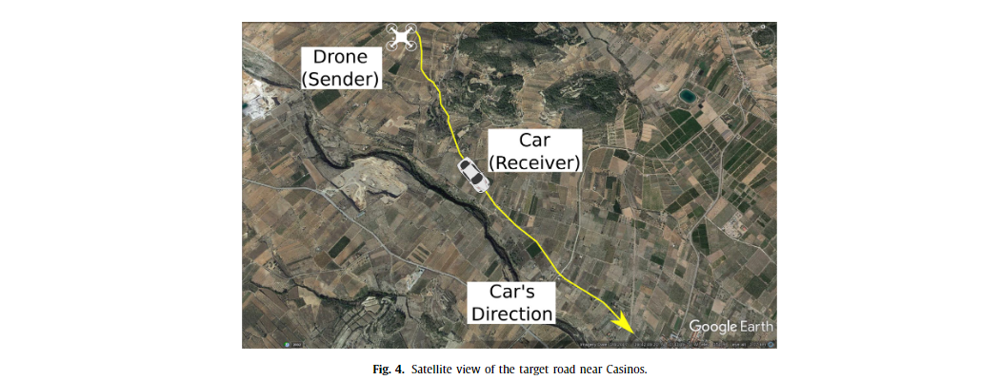

실험은 화창한 여름철 지중해 기후에서 수행됨. 실험 당시에는 침전물이 없었음. 풍속은 매우 낮은 것으로 나타 났으며, 언덕으로 둘러싸인 계곡의 전형적인 기상 조건임. 따라서 기상 조건은 실험에서 통신 성능에 큰 영향을 미치지 않음.

실험 위치를 둘러싼 표면 측면에서 궤적은 다른 고도 지점을 경험함(그림 5). 출발지에서 목적지까지 도로는 내리막 길을 달리고 있음. 구체적으로 그림 6(a)에서 설명한 바와 같이 시작 점의 표고는 약 400m, 최종 점은 해발 약 320m임. 우리는 무인 차량 간의 LOS를 (시선)을 계산함. 그림 6(b)는 무인항공기의 고도에 따라서, 최악의 경우 가시선 조건이 예상되는 차량이 시작 지점에서 약 900m 떨어진 곳에 위치하며 신호 장애가 있는 상황임. 이러한 상황으로 인해 통신이 NLOS(None-Line-Of-Sight)조건을 경험하게 됨.

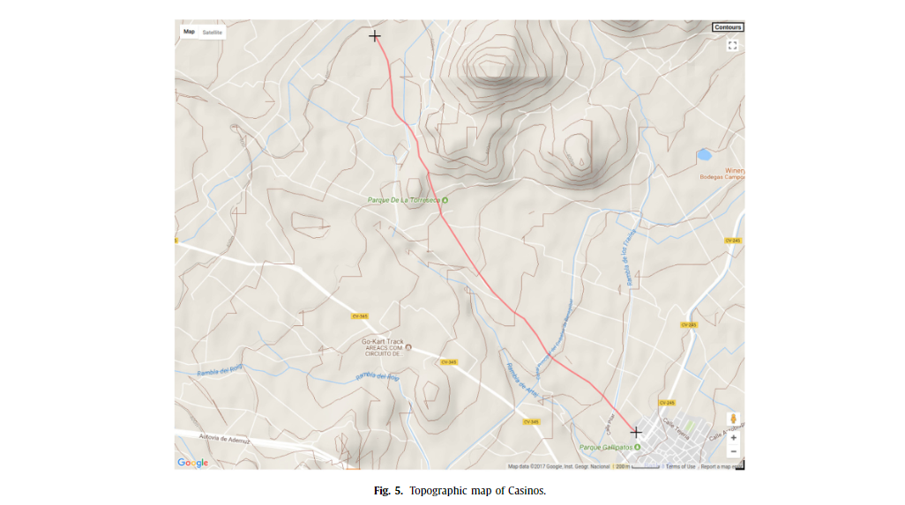
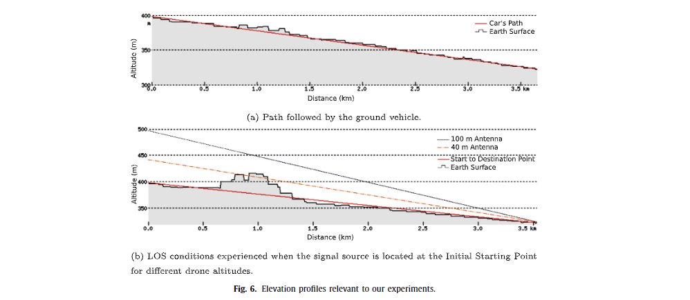

우리의 운전 테스트는 그림 7과 같이 정적 드론과 하나의 이동 차량으로 수행됨. 드론은 시나리오 상단, 차량의 초기 위치 근처에 있음. 차량이 아래쪽으로 이동하면 위치와 드론의 위치가 모두 추적 파일에 저장됨. 이는 패킷 송신 및 수신 이벤트와 관련된 위치를 결정하기 위해 수행됨.

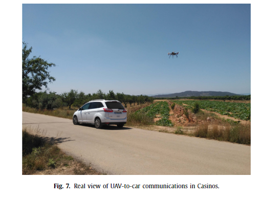

### 4.2. Experimental tools
그림 8은 패킷이 전송되고 기록되는 방법을 예제와 함께 보여주는 대상 시나리오를 보여줌. 드론은 UDP 패킷을 생성하여 애드혹 네트워크로 브로트 캐스트 함. 드론이 고정되어있는 동안 자동차는 드론에서 멀어지고 있음. 움직이는 차에는 GRCBox와 안드로이드 폰이 장착되어 있음. 이렇게 하면 차량이 애드혹 네트워크에 원할하게 연결될 수 있음. 패킷을 이동하고 수신하는 동안 자동차는 지리적 위치를 기록함. 이러한 방식으로 지리 정보를 지속적으로 검색함으로써 수신기(이 경우 자동차)는 각 특정 패킷의 수신과 관련된 GPS 좌표를 매우 정확하게 결정 할 수 있음.

발신자 측(드론에 내장 된 Raspberry Pi)에서는 브로드 캐스트 메시지를 생성하기 위해 Java 애플리케이션을 개발함. 이 테스트 도구는 10Hz의 패킷 생성 속도로 조정되었으며 각 패킷 크기는 약 1.4Kbyte이며 각 패킷은 순차 ID로 변호가 매겨짐. 또한 발신자의 타임 스탬프와 GPS 위치도 패킷에 포함됨. 이러한 전송 매개 변수는 차량 네트워크의 맥락에서 전형적인 DEM(Decentralized Environmental Notification Message)의 전송 매개 변수와 유사함. 또한 모든 패킷 전송이 방송되는 경우 전송 속도는 6Mbps로 제한됨. 위치 정보는 라즈베리 파이와 드론의 하드웨어 간의 통신을 가능하게 하는 MAVLink 프로토콜을 사용하여 드론의 GPS 장치에서 획득함.

수신자 측에서는 GRCbox를 릴레이로 사용하여 Android 스마트 폰에서 패킷을 수신함. 이를 위해 특정 Android 기반 애플리케이션을 개발함. 이 응용 프로그램은 드론에서 받은 정보의 렌더링을 제공함. 이 도구는 패킷 전달 비율 측정에도 사용됨. 테스트 시나리오에서 Android 기반 애플리케이션이 GRCBox와 완전히 호환된다는 점이 중요함. 이는 사용자가 GRCBox 인터페이스에 대한 연결을 구성 할 필요가 없음을 의미함. 대신 응용 프로그램에는 GRCBox 모듈에 원할하게 연결할 수 있는 라이브러리와 플러그인이 포함되어 있음. 스마트 폰이 GRCBox(내부 인터페이스)의 액세스 포인트에 연결되면 외부 인터페이스(애드혹 네트워)와 양방향 통신 릴레이가 설정됨. 이 응용 프로그램에서 패킷 수신 수신자측에서 사용자가 수신 버튼을 누르면 시작됨. 수신 된 패킷은 사용자가 응용 프로그램을 중지 할 때까지 기록되고 로그 파일에 저장됨. 그런 다음 저장된 변수를 측정하여 통신 품질에 더 많은 영향을 미치는 변수를 결정함.

### 4.3. Data analysis
실험에서 생성 된 로그파일에는 지리적 정보(위도, 경도, 고도)를 포함하여 다양한 거리에서 패킷 전달 비율을 측정하는 데 필요한 모든 데이터가 포함됨. 수신자는 발신자의 지리적 위치를 기록하므로 발신자의 위치와 수신자의 위치를 비교하여 드론과 움직이는 차량 사이의 거리를 직접 추론할 수 있음.

패킷 전달 비율은 발신자 측어세 보낸 패킷 수와 특정 시간 간격 동안 수신 한 패킷 수를 비교하여 계산됨. 연구를 위해 실제로 각 장치에 저장된 로그 파일을 포함하고 있기 때문에 엔드 포인트, 발신자 및 수신자를 모두 분석함. 그런 다음 로그 파일을 분석하여 내부의 지리 정보를 고려하여 송수신 된 패킷의 비율을 비교하고 계산함.

통신 성능에 영향을 미칠 수 있는 잠재적 인 요소를 측정하기 위해 실험을 위해 송신자(드론)의 고도, 송신자의 안네나 방향, 마지막으로 수신기의 안테나 위치의 세 가지 변수를 선택함. 첫째, 드론의 고도는 LOS 확률에 분명한 영향을 미칠 것임. 드론이 높을 수록 장애물을 찾을 확률이 낮아 지므로 각각 40m 와 100m의 두 가지 고도를 고려함. 드론 안테나의 방향은 안테나 파동이 다른 방사 패턴에 따라 전파되기 때문에 통신 범위에도 영향을 미침. 그래서 우리는 수평 및 수직 방향을 고려함(그림 9). 마지막으로, 차량의 다른 안테나 위치를 사용한 테스트는 차량의 금속 요소로 인해 통신 성능이 젛되므로 연구하는 것이 흥미로움(그림 10). 그래서 차량 측에서 안테나에 대해 내부와 외부(옥상)의 두 가지 다른 위치를 테스트 함.

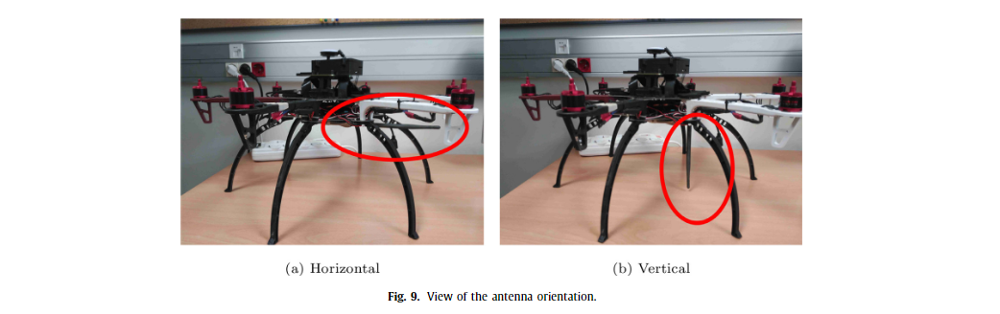
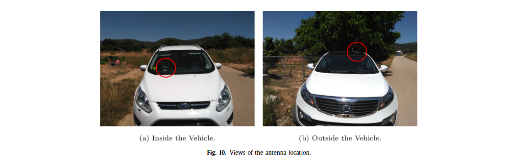

우리 시나리오의 정의를 단순화 하기 위해, 우리는 표 1(무인기의 고도, 차에서 안테나 위치 및 상기 안테나 방향에 따라)에 따라 시나리오를 정의하였음.

## 5. experimental results
실험 결과는 다양한 드론 고도에 대한 히트맵(그림 11 및 12)으로 표시됨. 각 지점은 패킷 그룹이 성공적으로 수신 된 위치를 나타냄. 포인트는 관련 배송 비율에 따라 색상이 다름. 통신 범위와 패킷 전달 비율 사이의 관계에 대해 얻은 결과는 그림 13에 나타나 있음. 이러한 결과는 다음 섹션에서 모델링 됨.

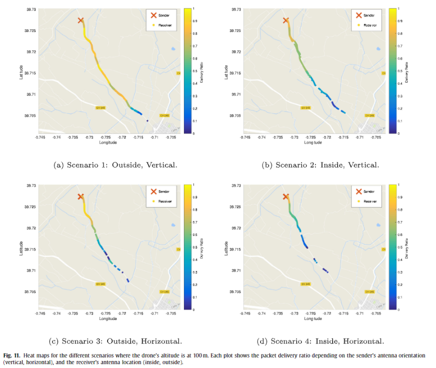
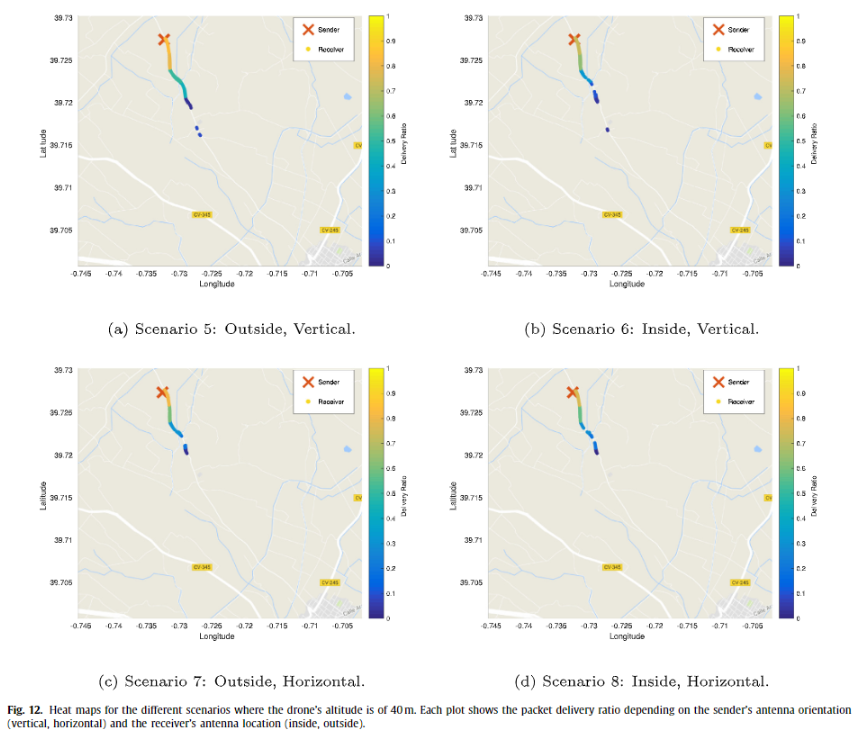
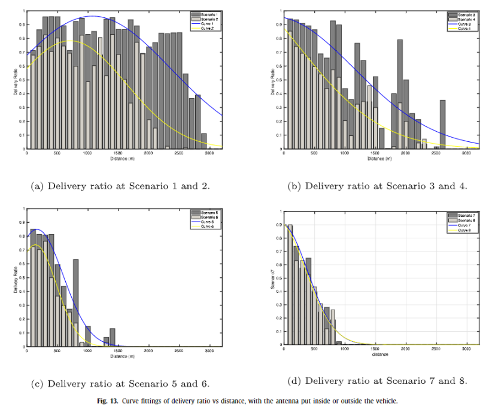

### 5.1. 100m altitude
높은 고도에 위치한 드론으로 실험 한 결과는 그림 11과 같음. 최상의 결과는 차량의 안테나를 위부에 두고 드론의 안테나가 수직으로 아래를 향하도록함으로써 얻을 수 있음(시나리오 1). 그림 11(a)에서 볼 수 있듯이 이 상황에서 통신은 3km까지 도달함. 가장 높은 거리에 도달하면 전달 비율이 약 10%이상임. 1.4km까지 배송비 90% 이상임. 2.8km 범위에서 비율이 약 0.7에서 0.5미만으로 떨어지는 것을 볼 수 있음. 예상대로 차가 가장 멀수록 수신되는 패킷 수가 적음.

반면에 수신기의 안테나를 차 안에 넣으면(시나리오 2) 결과가 약간 나빠짐. 그림 11(b)에서 볼 수 있듯이 배송 률은 약간 감소했지만 수신 추세는 이전 시나리오와 동일한 패턴을 보임. 이는 신호르 ㄹ차단하는 자동차의 재료, 특히 금속의 존재 따문임. 2.8km 범위에서 배송비는 약 20%임. 반면, 가장 먼 수신 지점에서는 배송률이 10% 미만임.

드론의 안테나가 수평을 향하도록하면 패킷 전달 측면에서 상당한 차이가 발생함. 시나리오 3에서 자동차의 안테나를 바깥쪽에 놓으면 드론의 안테나가 아래(수직)를 가리키는 시나리오 1과 비교할 때 통신 범위가 더 낮음. 흥미롭게도 특정(짧은) 거리까지 배송 비율은 거의 100%에 가까움.

마지막으로 시나리오 4는 이전 세 가지와 비교할 때 최악의 전체 결과를 나타냄. 범위가 더 짧고 비율은 다른 경우에 비해 모든 거리에서 더 낮음. 1.4km 거리에서 패킷 전송률은 이미 50% 미만이며 이 시나리오에서 도달 한 최대 거리는 2.4km에 불과함. UAV가 100m 높이에서 비행 하는 다른 실험과 비교할 때 이 시나리오는 통신 범위 및 패킷 전송률 성능 측면에서 최악의 결과를 나타내며 이론적 기대를 충족함

### 5.2 40m altitude
이 시나리오에서는 이전 시나리오와 동일한 변수를 유지하면서 드론의 높이를 줄임. 그림 12는 새로운 결과를 보여줌. 일반적으로 100m 에서 얻은 결과와 비교할 때 범위가 줄어드는 것을 볼 수 있음.또한 위도 39.718957과 경도 -0.729005에 위치한 도로 사이에 작은 언덕이 미치는 영향을 관찰 할 수 있으므로 배송 률이 크게 감소함. 

이전 실험에서와 같이 시나리오 5는 통신 버우이가 최대 1.5km에 달하는 이 그룹에서 최상의 결과를 달성함. 그러나 1km에서 패킷 전송률은 이미 20% 미만으로 떨어지기 시작함

차량 내부에서 안테나를 찾으면(시나리오 6) 결과가 이전보다 만족스럽지 않음. 더 낮은 범위를 사용하면 이전 시나리오와 비교할 때 모든 거리에서 전달 비율이 더 낮음. 또 다른 흥미로운 사실은 처음 몇 미터 동안 생성 된 비율임. 시나리오 6의 경우 이 비율은 0~250m 범위에서 감소하지 않음. 사실, 그 지점까지 약간 증가하고 나중에는 감소함. 이는 안테나가 수신기를 직접 향하도록 하는 것이 해당 안테나의 에너지 방사 측면에서 최악의 조건을 나타내기 때문에 드론에서 안테나의 방향 떄문임. 이 시나리오에서 도달 한 최대 거리는 1.3km 임.

반면에 드론의 안테나가 수평 인 경우 결과가 더 표준적이 어서 거리가 멀어 질수록 전달률이 단조롭게 감소함. 그러나 범위 및 전달 비율 값 측면에서 차량의 안테나를 외부에 두면(시나리오 7) 이전 두 시나리오(시나리오 5 및 6)보다 성능이 여전히 낮음. 실제로 통신 범위가 1.3km 인 이전 시나리오와 비교할 때 이 시나리오에서 다루는 최대 거리는 1km 미만임. 500m에서 패킷 전송룰은 이미 43%로 떨어짐.

반면에 드론의 안테나가 수평 인 경우 결과가 더 표준적이 어서 거리가 멀어 질수록 전달률이 단조롭게 감소함. 그러나 범위 및 전달 비율 값 측며에서 차량의 안테나를 외부에 두면(시나리오 7) 이전 두 시나리오 (시나리오 5및 6)보다 성능이 여전히 낮음. 실제로 통신 범위가 1.3km인 이전 시나리오와 비교 할 때, 이 시나리오에서 다루는 최대 거리는 1km 미만임. 500m 에서 패킷 전송률은 이미 43%로 떨어짐.

드론의 안테나가 수평을 향하게 하면서 차량 내부에 안테나를 배치하는 것은 예상대로 통신 범위가 낮고 패킷 전송률이 낮은 최악의 조합임. 예를 들어, 시나리오 7에서 달성 한 성능은 시나리오 8의 성능보다 현저하게 우수함. 실제로 최대 도달 가능 거리가 이전 시나리오와 유사 함에도 불구하고 거리가 증가함에 따라 얻은 패킷 전달 비율은 이전 시나리오보다 상당히 적음.

## 6. Communincation modeling
이전 실험의 결과를 사용하여 이제 연구중인 다양한 요소(드론의 고도, 송신기 안테나 방향 및 수신기 안테나 위치)를 기반으로 통신을 모델링함. 우리 모델은 등록 된 각 위치에서 수신 된 패킷 수를 기반으로 획득함. 애즈 패킷 전달비가 작은 거리 간격에 대해 계산하고, 우리는 최적의 파라미터를 유도하는 데 커브 피팅을 수행 하였음. 그런 다음 생성 된 모델을 시뮬레이션 도구에 통합하여 보다 현실적인 성능 결과를 얻을 수 있음.

특히 이 시스템을 모델링하기 위해 수신 된 패킷의 위치(위도, 경도 및 고도)와 해당 타임 스탬프를 사용함. 발신자는 또한 전소오딘 패킷 수와 수신 된 패킷과 비교하여 거리 범위를 기반으로 전송 비율을 계산할 수 있는 시간에 대한 정보를 저장함. 거리 범위를 100m 간격으로 분할함. 그런 다음 거리 범위의 간 간격에 대해 전달 비율이 계산됨. 그런 다음 테스트 된 모든 시나리오에 대한 배송 비율 정보가 막대 차트에 표시됨. 이 정보를 사용하여 비선형 최소 제곱 Marquardt-Levenberg 알고리즘을 사용하여 곡선 피팅을 계속함. 이 곡선 맞춤을 통해 다양한 조건에서 패킷 전달 비율 대 거리에 대한 일반적인 모델을 도출 할 수 있음.

곡선 피팅 겨로가는 그림 13에 나와 있음. 우리는 변수(안테나 방향, 안테나 위치 및 UAV 고도)에 적합한 공통 모델을 찾으려고 노력함. 목표는 동일한 기능을 유지하면서 시나리오마다 다를 수 있는 피팅 매개 변수를 갖는 것임. 따라서 선택한 피팅 함수는 수정 된 가우였으며 연구 된 여러 사례에 대해 최상의 피팅이 평가됨

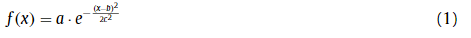

방정식 (1)에 각 시나리오에 대해 a, b 및 c의 매개 변수가 있음. 이러한 매개 변수는 표 2에 표시된 값을 사용함. 또한 적합도를 나타내기 위해 R2값을 추구함. 언급 된 표를 기반으로 각 시나리오에 대해 모델은 평균에 대한 반응 데이터의 모든 변동성을 설명함. 매개 변수는 데이터가 적합 회귀선에 얼마나 가까운지를 통게적으로 측정 한 R2으로 표시됨. 실험에서 얻은 전달 비율과 거리 값을 피팅하면서 R2 값이 높으며 값이 0.7162에서 0.9844 사이임. 따라서 모델은 적절한 적합을 나타냄

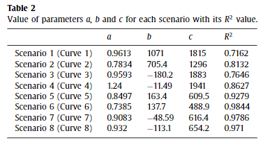

그림 13에 나타난 바와 같이, 안테나가 차량 외부에 위치하는 시나리오를 나타내는 곡선은 안테나가 차량 내부에 위치하는 시나리오를 나타내는 곡선보다 더 높은 값을 가짐.

안테나(수직)을 반대의 경우(수평 방향)을 가리키는 시나리오를 나타내는 곡선을 비교하면 일부 곡선은 구부러지고 다른 곡선은 구부러지지 않음. 구부러진 곡선은 안테나가 아래쪽(수직)을 가리키는 시나리오를 나타내는 곡선임. 이는 차량이 드론의 위치 바로 아래에 있을 때 배송 비율이 낮아지고 차량이 드론에서 조금 멀저지면 증가하기 때문에 예상 할 수 있음. 이 현상은 UAV에 설치된 안테나가 무 지향성 안테나 이기 때문에 하나의 평면에서 균일하게 전력을 방사 하고, 안테나 축에서 이론적으로 0에 도달 할 때까지 해당 평면 위 또는 아래의 각도에 따라 전력이 감소 하기 때문임. 따라서 안테나에서 잔파되는 신호는 수신기가 수직 일 때 가장 강력한 전력을 가짐. 반면에 수신기가 안테나와 평행하게 위치하면 약한 신호를 수신함.

다른 관점에서, 드론의 고도를 변경하는 시나리오의 곡선을 비교할 때 더 높은 고도가 더 먼 거리와 관련이 있다는 것이 금방 분명해짐. 시나리오 1과 2의 경우 곡선은 3.2km가 넘는 거리까지 계속됨. 시나리오 3의 경우 곡선은 3km에서 멈추고 시나리오 4에서 추가 200미터에 도달함. 반면에 시나리오 5와 6의 경우 결과 피팅 함수는 1.5km를 초과 할 수 없음. 마지막 둣 시나리오에서 결과 곡선이 도달하는 최대 지점은 1.3km임. 즉, 드론의 고도가 40m인 시나리오의 경우, 이러한 컷 오프 값은 그림 6(b)와 같이 LOS가 언덕에 의해 차단 된 위치와 정확히 일치함.

우리의 실험은 아주 먼 시골 지역에 있었기 때문에 통신 대역을 방해 할 수 있는 심각한 간섭이 없었음을 지적 할 가치가 있음. 따라서 이 상황에서 피팅이 AWGN(Additive White Gaussian Noise) 채널 모델에 적합하므로 달성 된 결과는 상당히 합리적임. 즉, 가산성 백색 가우스 노이즈의 효과 만 눈에 띄게 나타남. 또한 의사 소통을 방해하는 유일한 장애물은 선택한 시나리오의 일부 영역에서 시선을 차단하는 작은 언덕이었음.

## 7. Model applicability and comparison against existing models
이 섹션에서는 다른 기존 전파 모델과 비교하고 기존 네트워크 시뮬레이터의 일부로 사용할 수 있는 방법을 설명 하여 모델의 참신함과 적용 가능성에 대해 논의함.

### 7.1. Comparison with existing models
두 엔드 포인트 간의 데이터 링크 특성화에는 대상 환경에서 신호 전파 조건을 연구해야 함. 가시선 조건과 장애물의 존재는 신호 반사 및 도플러 확산 효과로 인해 채널 모델에 분명하게 영향을 미침. 이는 건물, 지형 프로필 또는 자동차 금속 구조물 자체의 존재에 의해 영향을 받을 수 있는 차량 통신의 특히 영향이 큼.

신호 전파 현상을 해결하기 위해 다양한 경험적 경로 손실 모델이 제안됨. 그러나 이러한 모델은 일반적인 전파 동작만 제공하므로 매우 구체적인 전송 조건을 다룰 수 없음. 차량 통신 설정과 관련하여 우리는 이전 작업에서 서로 다른 유형의 고차로가 건물이나 나무에 의해 두 논드 사이의 가시성이 차단 될 때 통신 성능을 가지고 있음을 발견함. 현재 작업에서 지형 조건(예 : 언던, 산)이 UAV와 지상 차량 간의 통신에 영향을 미치는 중요한 요소가 될 수 있음을 발견함.

이 작업에서 파생 된 모델의 유용성과 참신함을 명확하게 보여주기 위해 실제 실험 설정을 모방 한 시뮬레이션 실험에서 얻은 결과와 비교함. 시뮬레이션 테스트를 위해 OMNeT++ 도구를 선택함. 표 3은 채택된 시뮬레이션 매개 변수를 나타냄. 실제 실험 결과와 유사한 시뮬레이션 결과를 얻기 위해 분석중인 매개 변수인 경로 손실 모델을 제외하고 실제 설정에 따라 시뮬레이션 매개 변수를 설정함.

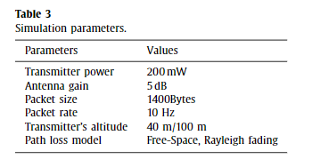

시뮬레이션 실험을 위해 기존의 두 가지 경험적 경로 손실 모델을 고려함. 첫 번째는 자유 공간 경로 손실 모델이고 두 번째는 레일리 페이딩 모델임. 시뮬레이션 실험에는 두 개의 노드(정적 및 이동)가 포함되어 실제 실험의 드론과 자동차와 유사함. 그런 다음 송신기에서 보낸 패킷과 수신기 노드에서 올바르게 수신한 패킷을 측정함. 이후 두 노드 사이의 거리에 따라 패킷 전달 비율을 점진적으로 계산함. 이런 식으로 실제 실험에서 얻은 결과와 동일한 방식으로 패킷 전달 비율 대 거리 그래프를 얻음.

그림 14는 비교를 위해 실제 테스트와 시뮬레이션 테스트의 결과를 결합함. 곡선에는 뚜렷한 색상이 있으며, 시나리오 1은 녹색 곡선에서 100m에서 비행하는 드론의 실제 실험을 나타내고 시나리오 5는 빨간색 곡선에서 40m에서 비행하는 드론의 실제 실험을 나타냄. 두 경우 모두 이러한 결과는 UAV 안테나가 아래를 향하고 차량의 안테나가 그 위에 위치하는 최상의 시나리오에 해당함. 파란색 곡선의 그림에 표시된 Rayleigh 결과는 Rayleigh 페이딩 모델을 사용한 시뮬레이션 테스트에 해당하고, Free-Space 선 (청록색)은 Free-Space 경로 손실 모델을 사용한 시뮬레이션 결과에 해당함. 고도 매개 변수와 관련하여 시뮬레이션 결과는 실제로 UAV의 고도 변화에 따른 영향이 무시할 만하다는 것을 보여 주며 송신기를 40m 또는 100m에 놓았을 때 매우 유사한 결과를 얻음. 따라서 그림에 표시된 곡선은 선택한 송신기의 고도에 관계없이 채널 모델에 적용됨.

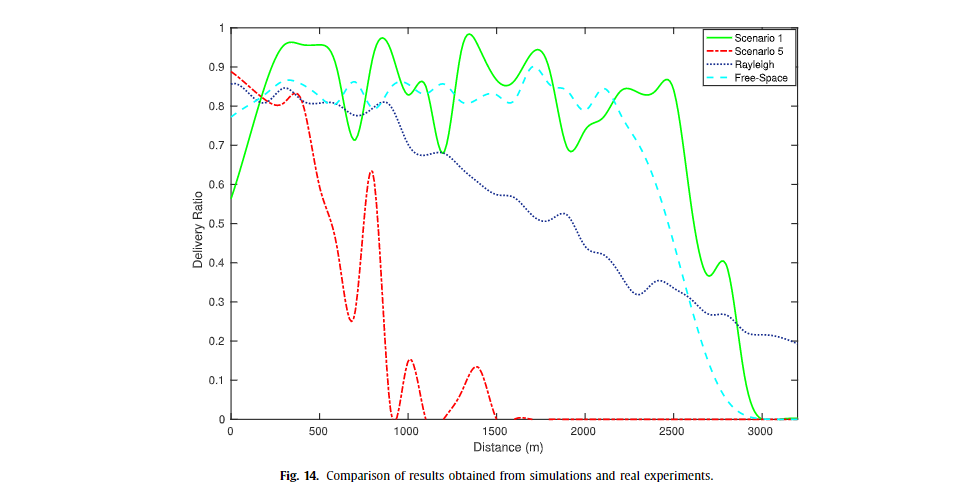

그림 14에 제시된 결과를 바탕으로 Rayleigh 페이딩 모델이 40m 또는 100m에섯 비행 할 때 달성 된 통신 성능을 나타내지 않음을 알 수 있음. 실제로 Rayleigh 페이딩 모델은 끝점 사이의 거리가 증가 함에 따라 점진적인 감소만을 보여줌. 또한 실제 실험에서 3.2km 후에 통신이 끊어 졌음에도 불구하고 곡선은 해당 거리를 넘어서는 성공적인 패킷 전달을 보여줌. 전반적으로 UAV와 차량간 통신 조건에 대한 성능을 나타낼 수 없다는 결론을 내릴 수 있음.

여유 공간 경로 손실 모델과 관련하여 테스트중인 시나리오에 더 적합함. 거리가 멀어짐에 따라 일정 거리가 지나면 전력이 급격히 감소하는 것을 볼 수 있음. 이것은 2000m에 도달했을 때 곡선으로 표시되며, 200m의 거리 변화에 대해 곡선이 0.85에서 0.5 미만으로 급락함. 이 경향은 송신기가 100m 고도에있을 때 실제 실험을 나타내는 곡선과 유사함. 이 특정 고도에서 지형 프로필은 가시선 방해를 일으키지 않음. 그러나 40m 고도에서 송신기를 사용한 실험을 나타내는 곡선과 비교할 때 Free Space 모델은 더 이상 적용되지 않음. 이제 송신기 역할을 하는 드론과 움직이는 차량 사이에 통신 장애가 때문임.

위에 제시된 결과를 고려할 때, 기존 채널 모델은 여전히 UAV-to-Car 통신 시나리오의 특정 특성을 처리 할 수 없다는 결론을 내림. 사실, 자유 공간 경로 손실 모델이 적용 가능하지만 두 끝점 사이에 가시선이 있을 때만 가능하다는 것을 발견함. 지형 프로파일로 인해 장애물이 발생하는 경우 기존 모델은 더 이상 적용 할 수 없으며 각 특정 시나리오에 특정한 장애물 모델이 필요함.

### 7.2 Applicability of the proposed model in simulation
제안된 모델이 UAV 대 차량 시나리오에서 통신 성능을 정의하기 위한 대안이 될 수 있음을 알고 있으므로, 우리의 의도 된 목표는 대규모 시뮬레이션에 이 모델을 사용하는 것임. 시뮬레이션 환경에 모델을 적용하려면 대상 지역의 지형 프로필에 대한 정보를 미리 알고 있어야 함. 따라서 시뮬레이션이 가능한 한 현실적이려면 고도 정보가 포함 된 지형지도가 필요함.

3D지도(고조 정보 포함)를 분석하여 고도와 지형을 통신 장애물로 분류하여 UAV와 자동차 사이의 가시선 상태를 특성화 할 수 있음. 이 분류 프로세스는 실제 시뮬레이션 전에 수행 할 수 있음. OpenStreetmap과 같이 널리 사용되는지도 제공 업체에는 고도 정보가 포함되어 있어 모델을 채택 할 수 있음. 이런식으로, 본 백서에서 파생 된 모델의 채택은 장애물로 인한 신호 차단이 발생할지 여부를 결정하는 데 사용되는 실제 시나리오 토폴로지의 정보를 기반으로 한 가시선 가용성과 결합하여 사용할 수 있음. 거리 관련 손실을 설명하는 패킷 전달 가능성을 확인하기 전에

## 8. Conclusions
이 논문에서 우리는 UAV-to-car 통신에서 패킷 전달 효과를 연구함. 이 연구에서는 드론의 고도, 송신기 안테나 방향 및 수신기 안테나 위치를 변경함. 우리의 실험에 따르면, 무인 항공기와 자동차 간 통신을 위한 최상의 시나리오는 무인 항공기의 안테나가 아래를 향하고(수직)자동차의 안테나가 차량 외부에 있으며 무인 항공기의 고도가 매우 높을 때(100m, 다른 국가의 법률에 따라 제한에되며, 허용되는 최대 값에 가까움) LOS 방해를 방지하는데 도움이 됨. 이 설정에서 달성 된 통신 범위는 3.2km임

또한 얻은 실험 결과를 바탕으로 최적의 함수를 찾고 회귀를 적용하여 연구중인 다양한 상황에 적용 할 수 있는 일반 모델을 제공함. 이 모델은 수정 된 가우스 함수를 기반으로 하여 테스트에서 얻은 것과 같은 적절한 결과 표현을 제공함. 실제로 피팅 함수의 두 값을 조정하기 만하면 테스트 된 다른 시나리오에 적용 할 수 있음. 시뮬레이션 결과는 또한 LOS 조건이 충족 될 때 파생된 모델이 표준 여유 공간 모델과 일부 관계를 유지하지만 그렇지 않은 경우를 보여 줌.

향후 작업으로 다른 고도에 존재하는 장애물의 영향을 더 자세히 연구 할 것임. 특히 시선 통신을 방해하는 언덕의 존재는 고려해야 할 중요한 요소이므로 네트워크 시뮬레이션 도구에 3D 지도를 통합하면 실험의 현실성을 향상시키는데 유용할 수 있음.
