# 드론 LED 킻 카메라와 가시광 통신을 위한 드론 포지셔닝
## Abstract
세상은 종종 재난에 시달립니다. 
주문형 드론 장착 가시 광선 통신 (VLC) 네트워크는 재해 대응 작업을 활용하기 위해 재해 피해 지역을 모니터링하는 데 적합합니다. 
이미지 센서 기반의 VLC 개념도 최근 불안정하게 움직이는 드론을 이용한 안정적인 링크 구축으로 주목을 받고있다. 
그러나 기존 작업에서는 일대 다 이미지 센서 기반 VLC 시스템을 충분히 고려하지 않았습니다. 
따라서 본 논문에서는 VLC 링크 간의 간섭을 피하기 위해 드론 포지셔닝 알고리즘을 사용하여 카메라와 여러 드론에 장착 된 LED 조명 간의 일대 다 이미지 센서 기반 VLC 개념을 제안합니다. 
여러 드론이 재난 피해 지역에 주문형으로 배치되어 지상을 모니터링하고 이미지 센서 기반 가시 광선 통신 (VLC) 링크를 통해 이미지 데이터를 카메라에 지속적으로 전송합니다. 
제안 된 아이디어는 LED 패널과 4K 카메라가 장착 된 드론으로 구현 된 PoC (개념 증명)로 입증됩니다. 
그 결과 제안 된 시스템의 타당성을 확인했습니다.

## 1. INTRODUCTION
세계는 종종 지진, 허리케인, 쓰나미를 포함한 재앙적인 재난에 시달리고 있습니다 [1], [2].
광섬유 케이블과 같은 시설의 파괴 또는 에너지 공급 중단으로 인해 재난 피해 지역에서 통신 서비스를 사용할 수 없게됩니다.
재난 대응 및 인명 구조 운영을 위해 이러한 영역에서 통신 네트워크를 신속하게 복구하는 것이 중요한 문제였습니다. 
무선 바이 패스 경로를 설정하여 생존 시설을 사용하는 복구 방안이 제안되었지만 [3] – [5] 대규모 정전이 발생하면 그러한 접근 방식을 채택하기가 어렵습니다.
재난 후 모니터링을위한 유망한 솔루션은 많은 드론이 재난 피해 지역에 주문형으로 유연하게 배치 될 수 있기 때문에 드론 장착 무선 네트워크를 사용하는 것입니다.
주문형 드론 탑재 네트워크는 부상자 찾기와 같은 재난 대응 작업을 활용하기 위해 대상 지역의 현재 상황을 파악하는 데 적합합니다  
  
드론으로 강화 된 무선 네트워크의 개념은 공공 안전 네트워크를 배치하기위한 뜨거운 연구 주제였습니다 [6], [7]. 
재난 후 상황에 대해 비행 셀룰러 네트워크의 확률 적 기하학 기반 설계가 [8]에서 제안되었습니다. 
비행 네트워크의 효과는이 작업에서 입증되었습니다. 
드론의 수와 해당 고도를 최적으로 선택하여 지상 커버리지를 향상시킬 수 있습니다. 
또한, 기존의 포화 된 지상 인프라를 강화하기 위해 드론이 장착 된 LTE 펨토셀 기지국이 [9]에서 조사되었습니다. 
그들은 도시의 모든 사용자를 다루기 위해 많은 수의 드론이 필요하지만 비행 기지국의 유효성을 보여주는 초기 결과를 제시했습니다. 
드론에 대한 VLC의 개념은 유연한 통신과 조명을 동시에 제공하기 위해 [10]에서 연구되었습니다. 
노드 및 셀 연결의 위치는 조명 및 통신 제약 조건에서 전력 소비를 최소화하도록 최적화되었습니다.
그러나 기존의 드론 탑재 무선 네트워크는 재난 후 모니터링을 위해 많은 드론에 의한 애드혹 네트워크 구축에 집중하지 않았습니다.  
  
이 문제를 해결하기 위해 본 논문에서는 다수의 드론과 이미지 센서를 이용한 가시광 애드혹 네트워크의 개념과 예비 결과를 제안한다. 
제안 된 접근 방식의이면에있는 아이디어는 정전 지역에서 조명과 통신 모두에 온보드 LED 조명을 활용하는 것입니다. 
여러 대의 드론이 재난 피해 지역에 주문형으로 배치되어 지상을 모니터링하고 이미지 센서 기반 가시광 통신 (VLC) 링크를 통해 이미지 데이터를 카메라에 지속적으로 전송합니다.
이 논문은 또한 VLC 링크 간의 간섭을 피하기 위해 여러 드론에 대한 위치 결정 알고리즘을 제안합니다.
이는 카메라가 여러 개의 드론에 장착 된 LED로부터 광학 신호를 수신하기 때문에 드론이 촬영 요건을 충족하는 중첩을 피하기 위해 이동해야하기 때문입니다. 즉, 인식 가능한 드론의 범위는 카메라의 초점 거리를 포함한 조건에 따라 결정됩니다.
제안 된 아이디어는 LED 패널과 4K 카메라가 장착 된 드론으로 구현 된 PoC (개념 증명)로 입증됩니다.  
  
이 문서의 나머지 부분은 다음과 같이 구성됩니다. 
섹션 II에서는 VLC 관련 작업과이 작업의 기여를 소개합니다. 
섹션 III는 제안 된 계획을 설명합니다. 섹션 IV는 제안 된 위치 결정 알고리즘과 시뮬레이션 결과를 제시합니다. 
섹션 V는 구현 된 PoC를 사용한 실험 결과를 설명합니다. 
마지막으로, 결론은 섹션 VI에서 제공됩니다.  
  
## RELATED WORK
드론을 이용한 자유 공간 광학 (FSO) 통신은 최근에 집중적으로 연구되었습니다. 
신속한 이벤트 대응과 유연한 배치를 위해 드론을 사용하는 에지 컴퓨팅 기반 무선 액세스 네트워크 아키텍처가 [11]에서 제안되었습니다.
여기서 드론과 지상 노드 간의 FSO 통신을 통해 프론트 홀 및 백홀 링크가 설정되었습니다. 
ad hoc mesh FSO 네트워크에서 난류 유도 신호 페이드는 대기 채널의 감쇠 및 위상 왜곡의 영향에 대한 지식을 얻기 위해 실험적으로 [12]에서 측정되었습니다.
FSO 기반 드론 지원 모바일 액세스 네트워크는 재난 대응 목적으로 [13]에서 조사되었습니다. 
드론과 모바일 사용자 협회의 배치는 재난 피해 지역에서 서비스를받는 사용자 수를 최대화하기 위해 공동으로 최적화되었습니다. 
그러나 FSO 기반 통신에서 가장 큰 어려움은 송수신기와 수신기 사이에 광축을 구성하는 것입니다. 
광축이 일치하지 않으면 수신 된 광 출력이 크게 감소합니다. 
이러한 특성으로 인해 FSO는 고정 접지 노드 간의 통신에 적합합니다. 
대부분의 드론은 바람에 의해 공중에서 불안정하게 움직이기 때문에 광축을 동적으로 조정하기가 어렵습니다.  
  
이 문제를 해결하기 위해 광 신호를 수신하는 카메라 시스템 개념이 많은 관심을 끌었다. 
[14]에서는 차량에 LED 송신기와 비디오 카메라가 장착 된 VLC 기반 V2V (vehicle-to-vehicle) 통신 시스템이 개발되었습니다. 
드론에 장착 된 LED 조명과 카메라 사이의 VLC와 관련하여 드론과 지상 기지국을 사용한 PoC 테스트 결과가 [15]에보고되었습니다. 
그러나이 작업의 주요 한계는  

1) 드론 한 대와 카메라 한 대의 신호 품질을 측정하는 것, 
2) 이미지에서 드론의 위치를 ​​인식하지 못하는 것입니다.   

따라서 본 논문의 공헌은 VLC 링크 간 간섭을 피하기 위해 드론 포지셔닝 알고리즘을 사용하여 카메라와 여러 드론 장착형 LED 조명 간의 일대 다 이미지 센서 기반 VLC 개념을 제안하는 것입니다. 
또한 제안 된 방안에 대한 예비 결과를 제시한다.  
  
### A. Concept
드론이 장착 된 LED 조명과 카메라 사이의 VLC 개념적 시스템 아키텍처는 그림 1에 나와 있습니다.
재해 후 모니터링을위한 애드혹 네트워크를 구성하기 위해 여러 드론이 재난 피해 지역에 배치됩니다.
각 드론은 온보드 카메라로 지상을 촬영합니다. 
드론은 온보드 LED 조명을 사용하여 녹화 된 이미지를 VLC가있는 지상 카메라로 전송합니다.
카메라는 드론과 그 위에 장착 된 LED 조명을 촬영하고 데이터를 에지 서버로 전송합니다.
에지 서버는 수신 된 이미지에서 드론을 감지하고 LED 조명의 신호를 복조합니다.
에지 서버는 드론 감지 후에 만 ​​LED 조명의 신호를 복조 할 수 있습니다.  
  
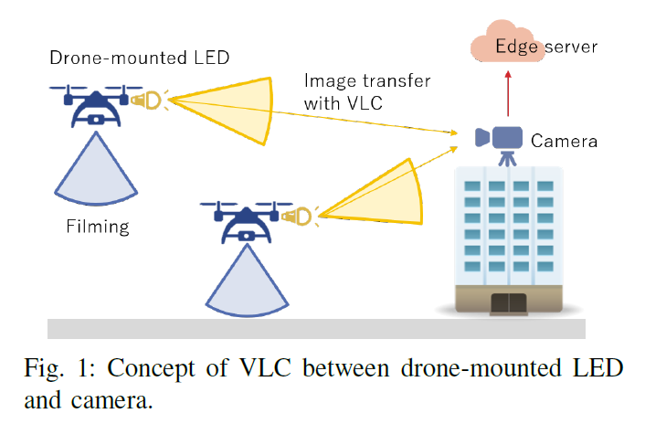
###### [그림 1] Concept of VLC between drone-mounted LED and camera  
  
제안 된 드론 포지셔닝 알고리즘의 목표는 VLC 링크를 통해 효율적인 데이터 전송을 달성하는 것입니다. 
드론의 궤적은 겹침을 피하기 위해 결정되며 촬영 요건을 충족하고 외부 조건을 고려하여 인식 가능한 드론의 범위를 보장합니다. 
VLC를위한 드론 측위 모델은 다음과 같이 정의되며, 모델을 기반으로 측위 알고리즘을 제안한다. 
제안 된 계획은 복구 작업을 활용하기 위해 재해 피해 지역의 실시간 모니터링을 가능하게합니다. 
가시 광선 사용은 대상 지역의 넓은 범위와 다목적 사용으로 인해 재해 후 모니터링에 적합합니다.  
  
### B. Image processing sequence
이 섹션에서는 에지 서버에서 이미지 처리 순서를 소개합니다. 
그림 2는 카메라로 촬영 한 이미지의 예를 보여줍니다. 
에지 서버는 먼저 DNN으로 드론을 감지합니다. 
여러 개의 드론이 이미지에 캡처되었으므로 이미지를 잘라 원본 파일에서 각 드론을 추출합니다.
잘린 이미지마다 드론에 장착 된 LED 조명의 신호가 감지되고 복조됩니다. 
복조 프로세스는 드론 감지가 성공한 경우에만 실행할 수 있으며, 그렇지 않으면 에지 서버가 온보드 LED를 가로등과 같은 다른 광원과 구별 할 수 없습니다. 
너무 멀리있는 드론은 너무 작아 인식 할 수 없습니다.  
  
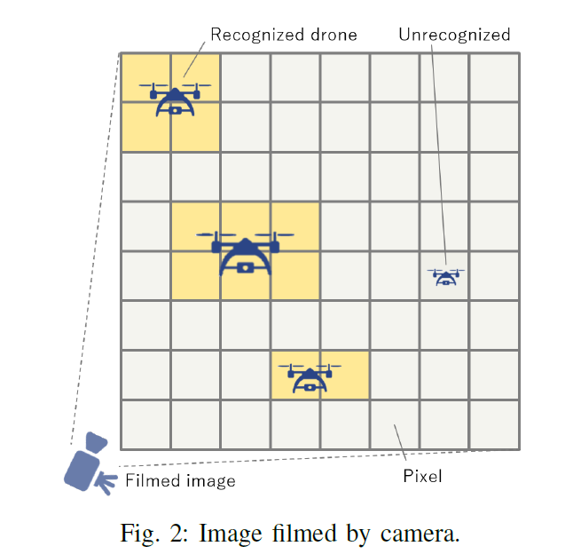
###### [그림 2] Image filmed by camera  
  
### C. Model
1) 변수 정의 : 제안 된 모델에서 사용 된 변수는 표 1에 요약되어있다. 
각 변수에 대한 세부 사항은 다음과 같다. 
제안 된 모델에서 우리는 드론이 일반성을 잃지 않고 구체로 근사한다고 가정했습니다.  
  
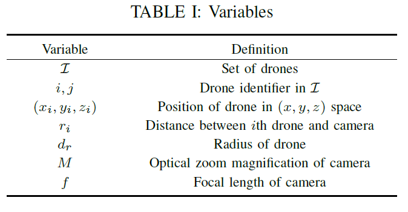  
  
2) 드론 좌표 : 드론 세트를 표시하고 i와 j는 해당 드론의 식별자를 나타냅니다. 
각 드론이 GPS (Global Positioning System) 센서와 같은 센서를 사용하여 현재 위치를 측정한다고 가정합니다. 
원점은 위치를 나타내고 y 축은 각각 카메라의 방향을 나타냅니다. 
거리 ri는 (xi, yi, zi)에서 계산됩니다.  
  
3) 감지 범위 : 카메라의 광학 줌 배율을 M으로 정의하겠습니다. 
dw와 dh는 I에있는 모든 드론의 크기가 같다고 가정하고 드론의 ​​너비와 높이를 나타냅니다. 
M을 사용하면 다음과 같은 식을 얻을 수 있습니다.  
  
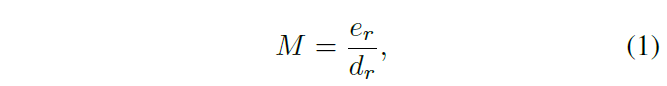  
  
여기서 eh와 eh는 각각 카메라에서 촬영 된 드론의 너비와 높이를 나타냅니다.  
  
여기에 렌즈에 대한 일반적인 방정식이 있습니다.  
  
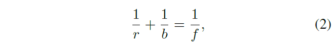  
  
여기서 r은 드론과 렌즈 사이의 거리, b는 이미징 포인트와 렌즈 사이의 거리, f는 카메라의 초점 거리입니다.
그림 3은 그들 사이의 관계를 보여줍니다. 
M = b/r을 사용하면 (2)는 다음과 같이 변환됩니다.  
  
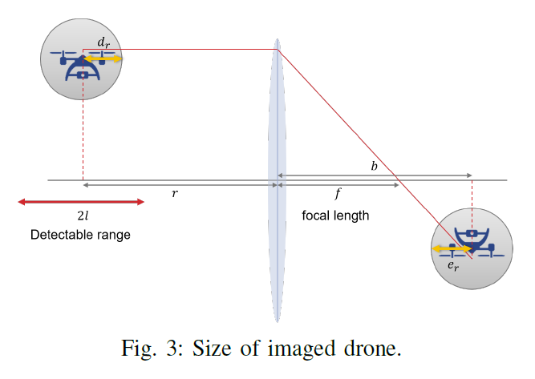
###### [그림 3] Size of imaged drone  
  
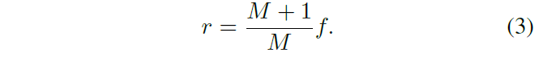  
  
M과 f의 범위는 카메라 사양에 따라 결정됩니다. 
(3)에서 드론과 이미징 포인트 사이의 거리는 다음과 같이 공식화됩니다.  
  
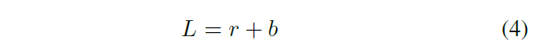  
  
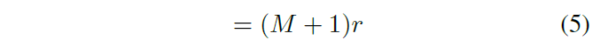  
  
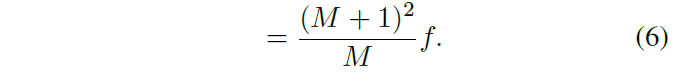  
  
따라서 초점 거리의 범위는 매개 변수 M 및 f에 의해 결정됩니다. 거리 L에서 일정 범위 내에있는 드론도 인식 할 수 있습니다. 
이 감지 범위는 2l로 정의됩니다. 
즉, (L - b) - l) ≤ r ≤ (L - b) + l 에 위치한 드론을 탐지 할 수 있습니다.  
  
4) 드론의 겹침 : 겹치는 드론은 별도로 인식 할 수 없기 때문에 촬영 된 이미지에서 드론의 겹침을 모델링합니다. 
다음 모델은 y 축이 카메라의 방향을 나타내므로 x-z 평면에서 설명됩니다. 
드론의 겹침을 피하기 위해 출입 금지 구역을 정의합니다. 
그림 4는 j 번째 드론에 의해 생성 된 i 번째 드론의 noentry 영역을 나타냅니다. 
i 번째 드론의 x-z 평면에 투영되는 j 번째 드론의 좌표는 다음과 같이 공식화됩니다.  
  
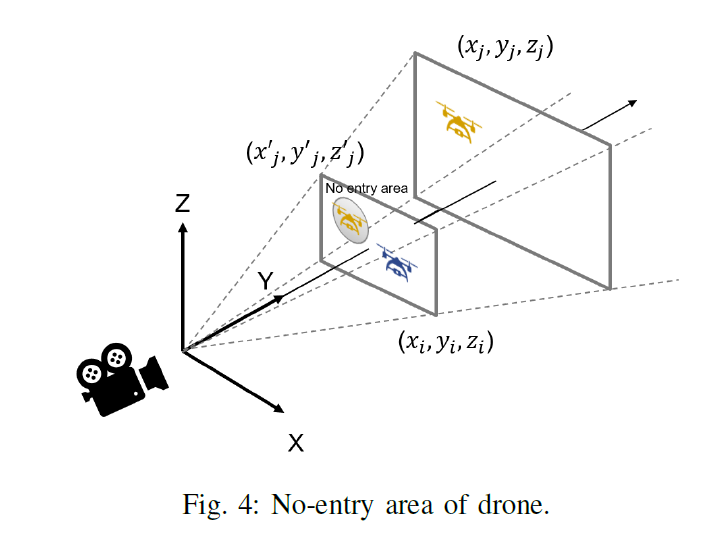  
###### No-entry area of drone  
  
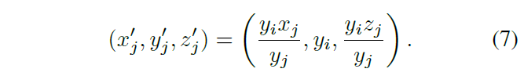  
  
투영 된 j 번째 드론의 반경은 다음과 같이 계산됩니다.  
  
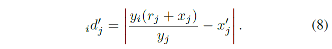  
  
i 번째 드론의 x-z 평면에서 i 번째 드론과 j 번째 드론 사이의 거리는 다음과 같이 계산됩니다.  
  
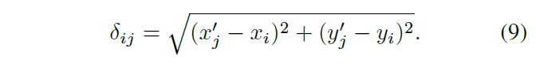  
  
따라서 촬영 된 영상에서 i 번째 드론과 j 번째 드론이 겹치지 않는다는 제약은 다음과 같다.  
  
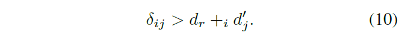  
  
5) 드론 포지셔닝 제약 : 위 모델을 바탕으로 드론 포지셔닝 제약을 요약하면 다음과 같다.  
  
a) 감지 가능 범위 : I의 모든 드론이 감지 가능 범위 내에 있습니다.  
  
![방정식 11]
