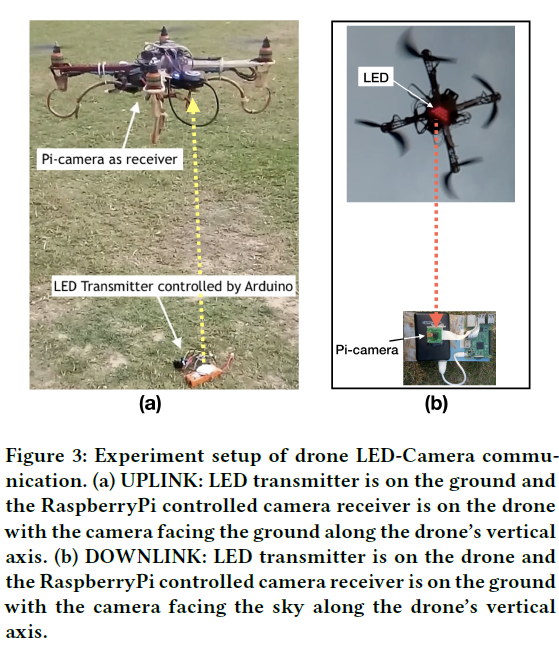
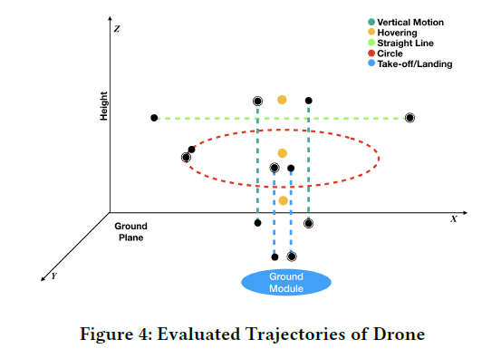

# 드론 LED-카메라 통신
## ABSTRACT
이 작업은 드론 통신에 LED 카메라 통신을 사용하는 아이디어를 탐구합니다. 
특히,이 연구는 지상과 드론 간, 드론 간 통신을 위해 LED 송신기와 카메라 / 이미지 센서 수신기를 사용하는 광 무선 링크를 사용하는 아이디어를 제시합니다.
이 개념은 무선 주파수 (RF) 무선에 대한 보완적인 가시선 (LOS) 기술에 대한 기회를 열어 드론 통신을 가능하게하는 동시에 드론 고유의 가혹한 모바일 설정에서 통신 할 수있는 능력에 대한 근본적인 연구 문제를 제기합니다.
이를 위해 본 논문에서는 다양한 모바일 설정 또는 드론의 궤적에서 지상 드론 통신을위한 LED 카메라 통신 성능에 대한 실증적 연구를 제시합니다.
비트 오류율 (BER) 메트릭 기반 성능 평가를 통해 실제 모바일 조건에서 드론 지상 업 링크 및 다운 링크 LED 통신의 품질을 평가합니다.
BER 평가의 통찰력을 통해 우리는 드론 가시광 통신 (VLC)의 실용성을 제한하는 해결해야 할 근본적인 문제를 강조합니다.  
  
## 1. INTRODUCTION
드론으로 널리 알려진 무인 항공기 (UAV)는 IoT [1–3], 차세대 인프라 [4] 계획에서 필수적인 부분이되었습니다. 
이를 지원하는 통신 기술과 인프라의 발전으로 드론은 단순한 항공 감지 장치 이상으로 인식되고 있습니다. 
드론을 공중 기지국으로 사용하는 개념은 점점 더 탄력을 받고 있습니다. 
드론과 지상국 간의 통신은 안전에 중요한 것부터 통신 중계, 라스트 마일 연결 활성화에 이르기까지 다양한 애플리케이션에 매우 유용 할 수 있습니다. 
현재 드론 통신을위한 가장 인기있는 선택은 무선 주파수 (RF) [5, 6]를 사용하는 것입니다. 
그러나 도청 가능성, 해킹 경향, 무선 스펙트럼이 매우 복잡하다는 사실과 같은 RF 통신의 근본적인 문제는 드론 통신에 RF를 사용하는 데 중요한 문제를 제기합니다. 드론을위한 최고의 통신 매체를 선택하는 것은 분명한 질문이며, 어떤 RF에 대해 강력한 경쟁자이지만 핵심적인 한계가 있으므로 다른 방식을 탐색 할 필요가 있습니다.  
  

###### [fig 1] Conceptual illustration of drone based use-cases for LED to camera communication.
  
개념적으로, 드론-지상 및 드론-드론 통신 링크는 OTA (over-the-air) 매체를 사용하며, 이러한 링크는 일반적으로 대부분의 사용 사례 시나리오에서 신호 경로에 장애물 / 장애물이 없습니다 (그림 1 참조). 
대부분의 통신 시나리오에서 드론-그라운드 및 드론-드론 통신 링크는 가시선 (LOS) 채널을 통해 이루어 지므로 드론 통신에 LOS 통신 방식을 사용할 수있는 기회가 열립니다. 
이와 관련하여이 연구에서 우리는 발광 다이오드 (LED)를 송신기로 사용하고 이미지 센서 또는 카메라를 수신기로 사용하여 가시 광선 스펙트럼에서 광 무선 통신을 사용하는 방법을 탐구합니다. 
이는 문헌에서 LED- 카메라 통신이라고도합니다.  
  
저자의 이전 연구는 LED와 광 수신기를 사용하는 드론 [7]에서 가시광 통신 (VLC)을 사용하는 아이디어도 제시했습니다. 
VLC는 높은 데이터 용량, 조명 및 통신의 이중 사용과 같은 RF 통신에 비해 몇 가지 이점을 제공 할 수 있으며 눈에 띄지 않게 스니핑하여 링크 보안을 향상시키는 데 어려움을 겪습니다.
또한 드론은 거의 기본적으로 영상 캡처 또는 고급 시각 감지 / 컴퓨터 비전에 정기적으로 사용하기 위해 카메라를 장착 할 예정입니다. 
이것은 드론 카메라 통신을 가능하게하는 빌트인 인프라를 제공합니다.  
  
모바일 환경에서 LED- 카메라 통신을 가능하게하는 문제는 아직 해결되지 않은 열린 연구 문제이며 최근 연구의 초점이기도합니다. 
드론 통신은 관심 영역 / 객체 위를 떠 다니는 경우에도 제로 이동성 또는 정적 상태로 간주 될 수 없습니다 (논문 후반부에서 통신 성능에 미치는 영향). 
드론에서 광 무선 통신을 가능하게하는 것에 대한 조사는 제한적이며 [8] 이전 작업의 공통 전제는 드론 광 무선 링크의 가용성 (따라서 좋은 이해)입니다.  
  
10 년 넘게 VLC 기술을 개발하면서 얻은 경험과 학습이 드론 사용 사례에 적용될 수 있지만, 모바일 설정에서 강력한 VLC를 가능하게한다는 기본 개념이 핵심이며 실제로 드론 광 무선 통신의 기반입니다. 
이와 관련하여이 작업에서는 먼저 이동성 문제를 해결하는 드론 LED- 카메라 통신 방식을 탐색합니다. 
첫 번째 단계로 진행중인이 연구는 드론 이동성과 LED- 카메라 통신 품질에 미치는 영향을 연구합니다. 
실제 실험 기반 접근 방식을 통해이 작업은 BER (bit-error-rate)을 메트릭으로 사용하여 LED- 카메라 통신 품질의 경험적 평가를 제시합니다. 
요약하면이 백서의 기여는 다음과 같습니다.  
1. (i)에서 드론-지면 LED- 카메라 통신을위한 실험 설정 설계. 다운 링크 모드 (드론의 LED, 지상의 카메라) 및 (ii) 업 링크 모드 (지면의 LED, 드론의 카메라).  
2. 수직 운동, 호버링, 직선 운동, 원 운동, 이륙 및 착륙을 포함한 다양한 드론 이동 궤적에서 드론 LED- 카메라 통신의 실험적 평가. 평가는 통신 성능의 품질을 정량적으로 표현하고 비교하기위한 메트릭으로 BER을 사용합니다.  
  
## 2. RELATED WORK
이 작업은 드론에서 가시광 통신을 사용하는 개념화 [7]를 기반으로하여 실제 드론 -VLC를 구현하는 데 근본적인 문제를 제기했습니다.
이 백서에서는 드론 이동성이 광학 무선 링크에 미치는 영향을 연구하는 데 중점을 둡니다.
최근 [8]의 저자들은 최소한의 전력 사용으로 유연한 통신 및 조명을 제공하기 위해 UAV에서 VLC를 사용하는 방법을 제안했습니다.
그들은이 문제를 해결하기 위해 2 단계 접근 방식을 제시합니다.
첫 번째 단계는 주어진 셀 연관에 대한 최적의 UAV 위치를 찾는 것이고 두 번째 단계는 고정 된 UAV 위치를 가정하여 최적의 셀 연관을 찾는 것입니다.
이러한 하위 문제는 무작위 증분 구성을 적용하여 최적의 UAV 위치를 얻고 탐욕스러운 알고리즘을 적용하여 최적이 아닌 셀 연관성을 얻음으로써 해결됩니다. 
추정 된 UAV 위치 및 셀 연결은 전력 소비를 최소화하기 위해 반복적으로 최적화됩니다. 
이 접근 방식은 전력 효율이 38.5 % 향상되었음을 보여 주지만,이 연구에서는 UAV의 이동으로 인한 잠재적 인 정전 및 처리량 변동성을 고려하지 않았습니다.  
  
LED- 카메라 통신은 지난 반년 동안 중요한 연구 관심의 주제였습니다. 
작품 [9, 10]은 조명에 사용되는 천장 조명이 롤링 셔터 기술을 사용하는 다양한 기성 카메라와 통신 할 수있는 LED- 카메라 통신 시스템을 제시합니다. 
[11]은 스마트 폰 카메라를 수신기로 사용하는 LED 카메라 통신을위한 에너지 효율적인 접근 방식을 개발하고 [12]는 LED 카메라 통신을 위해 반사광 (수동) 감지를 사용하여 전체적으로 광자를 최대한 활용하는 것을 목표로합니다. 
[13]은 통신을위한 다양한 반 사면을 이용한 주변 광 변조를 제안하고, [14]는 CSK (Color Shift Keying) 변조 기법을 이용한 LED- 스마트 폰 카메라 통신 시스템을 제시하며 5-7kbps의 데이터 전송률을 입증했다. 
[15]는 Markov 변조 Bernoulli 프로세스를 사용하여 LED 카메라 채널 모델을 연구하고이 모델을 캡처하는 네트워크 시뮬레이터 CamComSim을 개발합니다.
[16]에서 저자는 증강 현실 기반 애플리케이션에서 포지셔닝을위한 60bps LED- 스마트 폰 카메라 링크를 설계했습니다. 
[17, 18]에서 저자는 디스플레이 화면을 통해 카메라 수신기에 감지 할 수없는 신호를 보내기 위해 LED- 카메라 통신 채널을 사용합니다.  
  
## 3. EXPERIMENTATION SETUP
이 연구 단계의 주요 초점은 실제 드론 이동성 조건에서 실험을 수행하는 것입니다. 
우리는 반경 0.5km 이상 동안 드론 이동성을 방해하지 않는 개방 된 땅에 실험용 드론 LED- 카메라 통신 플랫폼을 설치했습니다.
그림 3에서 볼 수 있듯이 설정은 기성 부품을 사용하여 처음부터 만든 프로토 타입 4 프로펠러 드론으로 구성되었습니다. 
드론은 최대 4m / s의 속도를 낼 수 있으며 배터리 수명은 약 15 분입니다. 
드론은 9 차원 IMU와 GPS 모듈을 호스팅합니다.
LED- 카메라 통신은 Arduino [19]에 의해 제어되는 LED 송신기를 호스트하는 두 개의 동일한 트랜시버 모듈과 초당 30 프레임 (FPS)으로 비디오 프레임을 캡처 할 수있는 RaspberryPi 카메라 [20]를 사용하여 설정됩니다.
RaspberryPi [21] 모듈에 의해 제어되는 울트라 HD 해상도에서.
실험은 기본적으로 송신기로 작동하는 것과 수신기로 작동하는 것에 따라 다른 두 가지 양식에 걸쳐 수행되었습니다. 
업 링크 모드는 드론 트랜시버 모듈을 지상에있는 트랜시버 모듈의 LED에서 전송되는 데이터에 대한 카메라 수신기로 사용합니다. 
DOWNLINK 모드는 드론 트랜시버 모듈을 지상에있는 트랜시버 모듈에서 카메라로 데이터를 전달하는 LED 송신기로 사용합니다.
이러한 양식에 대한 하드웨어 설정 아키텍처는 그림 2에 나와 있습니다.  
  

###### [fig 2] Drone LED-Camera Communication Modalities. (a) Camera receiver on ground and LED transmitter on drone, (b) LED transmitter on ground and Camera receiver on drone. The modulator is implemented on an Arduino and uses ON-OFF Keying (OOK)  
  

###### [fig 3] Experiment setup of drone LED-Camera communication. (a) UPLINK: LED transmitter is on the ground and the RaspberryPi controlled camera receiver is on the drone with the camera facing the ground along the drone’s vertical axis. (b) DOWNLINK: LED transmitter is on the drone and the RaspberryPi controlled camera receiver is on the ground with the camera facing the sky along the drone’s vertical axis.  
  
트랜시버의 하드웨어 구성 : 
송신기는 Arduino 마이크로 컨트롤러, 25W LED, 9V 배터리, 드라이버 모듈 (L293D)로 구성됩니다. 
송신기는 15 비트 / 초의 전송 속도로 ON-OFF-Keying (OOK)을 사용하여 임의 비트 스트림 (파일에 저장 됨)을 변조하도록 구성됩니다. 
Nyquist 기준에 따라이 전송 속도를 선택합니다. 
수신기 샘플링 속도 제한은 30FPS입니다.
카메라 통신에서 각 이미지 프레임은 샘플로 취급됩니다. 
RaspberryPi 카메라는 실제로 최대 200FPS를 지원하지만 이미지 해상도를 제한합니다.
우리 실험의 주요 목표는 이동성을 특성화하는 것이기 때문에 카메라가 30FPS로 제한되는 가장 높은 값 (ultra HD)으로 해상도를 유지했습니다. 
수신기 모듈은 RaspberryPi 카메라 [20], Raspberry Pi [21] 컴퓨팅 모듈 및 5V 전원으로 구성됩니다.
RaspberryPi는 여러 용도로 사용됩니다.
카메라를 제어하고, 송수신기 기능에 대한 제어 코드를 실행하고, Arduino에서 LED 전송 코드를 실행하기위한 제어 코드를 실행합니다.  
  
## 4. EXPERIMENTATION METHODOLOGY
데이터 전송 : 
전송되는 데이터는 LED에서 on-off keying (OOK)을 사용하여 변조되고 UDP 패킷 통신을 사용하여 초당 15 비트로 전송됩니다. 
각 UDP 패킷은 시작 (101010) 및 중지 비트 (00000)를 사용하여 분리됩니다. 
페이로드는 임의의 비트 스트림 소스에서 생성 된 4 비트 심볼이며 임의 순서 방식으로 0000에서 1111 사이의 값으로 매핑되었습니다. 
데이터 전송은 실험 전반에 걸쳐 루프로 계속되었습니다.  
  
데이터 수신 : 
LED의 광학 신호는 piCamera 이미지 프레임에서 광도 패턴으로 수집됩니다. 
우리는 실험에서 카메라 모듈로 piCamera를 특별히 선택했습니다. 
무게가 가볍고 전력이 적어 드론에 통합하기에 적합하기 때문입니다. 
Raspberry pi에서 실행되는 스크립트는 두 가지 중요한 작업을 수행합니다.
먼저, picamera는 30fps로 비디오 장면을 녹화하고 RaspberryPi의 Unix (운영 체제) 타임 스탬프를 비디오에 주석으로 표시합니다. 
둘째, 드론 상태 정보는 직렬 연결을 사용하여 3DR Pixhawk 1 [22] (드론의 제어 모듈)에서 라즈베리 파이로 전송됩니다.
이 정보에는 타임 스탬프, GPS 정보 (위도 및 경도), 고도, 기본 축 (X, Y 및 Z)을 따른 속도, 각도 회전 (롤, 피치 및 요)이 포함됩니다.
이 드론 메타 데이터는 Python의 pymavlink [23] 라이브러리를 사용하여 50Hz에서 캡처되며, 각 실험 시도 동안 Raspberry pi에 텍스트 파일로 저장됩니다.  
  
데이터 처리 :
비디오의 비트 디코딩 및 추가 분석은 오프라인으로 수행됩니다.
비디오에서 비트를 디코딩하려면 먼저 색상 기반 세분화 컴퓨터 비전 기술을 사용하여 각 샘플 이미지에서 LED를 찾습니다.
LED에 해당하는 픽셀이 국부 화되고이 관심 영역의 평균 픽셀 강도 값이 계산됩니다. 
이진 가설을 사용하여 LED 상태는 ROI가 평균 인 경우 ON (비트 1)으로 추정됩니다. 픽셀 강도는 임계 값보다 크고 그렇지 않으면 OFF (비트 0)입니다.
임계 강도는 각 비디오 스냅 샷 (실험 당)에서 LED ROI의 ON 및 OFF 상태 평균값을 계산하는 보정 프로세스를 통해 각 실험 시도의 각 비디오에 대해 계산됩니다. 보정 된 임계 값을 사용하여 BER 계산을위한 강력한 실측 데이터 세트를 확인합니다.
속도, 고도, GPS 좌표 및 IMU 판독 값을 포함하는 드론의 타임 스탬프 메타 데이터는 실험 트레일 및 비디오 프레임과 일치합니다.
BER은 각 실험의 창에서 전송 된 총 비트 수에 대한 총 오류 비트 수의 비율로 각 이동성 궤적에 대해 계산됩니다.  
  
## 5. EVALUATION
LED-Camera 통신 실험 평가 연구를 제시합니다.
다양한 실제 드론 모빌리티 구성에서.
BER을 메트릭으로 사용하여 두 가지 평가에 중점을 둡니다.
차원 : (i) 이동 궤적 (드론 이동 유형) 및 (ii) 고도 (높이).  
  
### 5.1. Mobility trajectories
다른 항공기와 같이 선 또는 곡선 궤적을 가로 질러 비행 할 수있을뿐만 아니라, 상업용 및 레크리에이션 용 UAV 또는 드론은 공중에서 호버링, 수직 이착륙 기능, 빠른 속도와 같은 고유 한 이동 기능을 갖추고 있습니다. 
움직임의 방향 변경. 프로펠러 기반의 공기 역학을 통해 드론은 한 위치에 오랫동안 머물고 (호버링) 궤적을 매우 빠르게 가속하고 변경할 수 있습니다. 
이러한 정도의 움직임은 드론을위한 수많은 애플리케이션을 열지 만, 강력한 통신 링크, 특히 LOS가 필요한 링크를 유지하는 것은 매우 어렵습니다. 
이와 관련하여 우리는 이러한 현실적인 드론 궤적에서 LED- 카메라 통신의 성능을 연구하기 위해 설정했습니다. 
특히지면을 기준으로이 작업에서는 6 가지 모션 궤적에 걸쳐 드론 시스템을 평가합니다.  
  
<pre>
    * 호버링 : 고정 된 위치와 지상 고도에서 프로펠러를 켠 상태로 드론이 떠 있습니다.
    * 수직 모션 : 드론이 하늘을 향해 수직으로 비행하고 특정 고도를 지나면 방향을 바꾸고지면을 향해 비행합니다.
    * 직선 : 고정 된 고도에서지면과 평행 한 직선으로 비행하는 드론.
    * 원 : 고정 반경으로 지상의 목표물을 중심으로 한 원을 따라 비행하며, 원주는 지상 평면과 평행하고 지상에서 고정 된 고도에서 비행합니다.
    * 이륙 : 지상의 완전한 정지 위치에서 하늘을 향해 날아갈 때까지 수직 축을 따라 드론이 이륙합니다.
    * 착륙 : 특정 고도에서 지상의 완전한 정지 위치까지 수직 축을 따라 아래로 비행하여 드론이 착륙합니다.
</pre>
  
수직 모션과 이착륙의 주요 차이점은 수직 모션 시나리오에서 드론이 이미 이륙했으며 특정 고도에서 호버링하거나 특정 고도에서 특정 궤적을 따라 비행한다는 것입니다. 
그림 4의 실험에서 고려한 드론의 6 가지 궤적 1을 모두 설명합니다.  
  
  
###### [fig 4] Evaluated Trajectories of Drone  
  
우리는 6 개의 궤적 각각에 걸쳐 각 실험에 대해 2 분 길이의 비디오 시퀀스를 캡처하는 광범위한 실험을 수행했습니다.
드론 배터리 수명 (15 분)을 고려해야했기 때문에 각 시험 기간에 2 분을 선택했습니다. 
전체적으로 우리는 각 궤적 사례에 대해 약 2000 프레임 분량의 데이터 (약 1000 개의 임의 비트 스트림)를 수집했습니다. 
우리의 실험에서 직선 궤도는 중앙에 트랜시버 모듈이있는 9m 라인 세그먼트 이상이었고 원은 반경 4.5m의 모듈을 중심으로했습니다. 
이러한 궤적의 고도는 지상에서 10m였으며 전체 실험에서 시도한 최대 고도이기도합니다.  
  
우리는 그림 5에서 서로 다른 궤적에서 BER을보고합니다.
일반적으로 BER이 차량 사용 사례에서보고 된 다른 VLC 및 카메라 통신 시스템보다 상대적으로 높다는 것을 관찰 할 수 있습니다.
드론의 불안정한 특성 때문이라고 생각합니다. 
약간의 기울기에서도 LED와 카메라 센터를 연결하는 벡터 간의 각도 변화로 인해 신호 대 잡음비 (SNR)가 크게 변경되어 비트 오류가 발생할 수 있습니다.
또한 이러한 평가는 오류 제어 코딩 및 최적화 메커니즘을 고려하지 않고 원시 BER을 기록하고 있음을 유의해야합니다.
다음 관찰은 직선 및 원형 궤적에 대한 BER이 다른 것보다 나쁘다는 것입니다. 
이는 LED가 카메라 뷰에서 벗어나 이러한 궤적에서 더 자주 발생할 수 있기 때문에 중단으로 인한 링크 실패 가능성이 증가했기 때문일 수 있다고 가정합니다.
채널이 대칭 인 업 링크 및 다운 링크 케이스를 설정하는 방법에 따라 BER이 서로 매우 가까울 것으로 예상되며, 이는 실험 결과에서도 확인할 수 있습니다. 
다운 링크 BER이 업 링크보다 높은 이착륙 케이스에서 고유 한 순서 반전이 관찰됩니다.
이에 대한 우리의 설명은 LED를 드론에 놓았을 때 LED를지면에 놓을 때보 다 흔들림과 진동의 양 (더 불안정 함)이 훨씬 더 크다는 것입니다. 
이것은 카메라 프레임에있는 LED의 픽셀 ROI의 큰 변화와 모션 블러를 반영합니다.
교정 노력으로 인해 LED 추적에 오류가 없는지 확인했지만 특히 모션으로 인한 다른 카메라 및 조명 아티팩트는 해결되지 않았습니다. 
이러한 결과는 이러한 인공물의 영향을 보여주고 드론에서 광 무선 통신을 사용하는 데있어 열린 도전과 현실을 상기시켜줍니다.  
  

###### [fig 5] BER of LED-Camera communication under different drone mobility trajectories for uplink (Ground Module) and downlink (Drone module).  
  
### 5.2. Altitudes
또 다른 실험 세트에서는 드론이 다른 고도에서 지상의 트랜시버 모듈 위로 호버링하도록 설정했습니다. 
우리가 만든 드론에는 호버링 (드론 제조 / 엔지니어링의 일반적인 문제)시 안정성 문제가있어 드론이 호버링 중에 고도를 흔들 었습니다. 
우리의 실험은 무인 항공기의 모든 움직임에 대한 완전한 기록을 가지고 있으며 고도계 및 IMU 판독 값을 기반으로 실험이 무인 항공기를 LOW (2m-3m), MEDIUM (6m-7m) 및 HIGH ( 9m-10m).
우리는 표 1의 각 고도 지역에 대해 각각 2 분 동안 5 번의 시도를 통해 평균 BER을보고합니다. 
우리는 BER이 높이에 따라 증가하는 것을 관찰합니다. 
이는 통신 품질이 두 지역 사이의 거리에 따라 저하되는 광 무선 링크에 대한 이해와 일치합니다. 
우리는 또한 업 링크 및 다운 링크 케이스에 대한 BER이 다른 궤적에서도 관찰 된 것처럼 각 높이에 대해 서로 매우 가깝다는 것을 관찰합니다.
이 결과는 또한 드론이 호버링하더라도 정적 (움직임 없음)이 아니라는 우리의 가설을 강조하고 확인합니다.
BER 번호에서 호버링이 드론의 가능한 최상의 모션 시나리오가 아닐 수도 있다는 것을 관찰합니다.  
  
## 6. DISCUSSIONS
### 6.1. Example Applications
VLC 기술과 드론의 통합은 드론 지상, 드론 드론 및 하이브리드 통신 영역에서 수많은 새로운 애플리케이션으로 이어질 수 있습니다.
이것은 드론과 환경 간의 안전한 통신을 지원하는 연결된 인프라로 이어질 것입니다.
일부 드론에는 센서가 장착되어 있으며 지역을 조사하거나 3D 구조를 매핑하는 데 사용됩니다.
이러한 시나리오에서 드론은 센서 판독 값을 근처 원격 스테이션으로 보냅니다. 
드론은 또한 특히 GPS 거부 시나리오에서 자신의 상태 정보 (위도, 경도, 고도, 배터리 등)를 지상국과 통신합니다. 
이러한 모든 유형의 통신은 가시 광선으로 효율적으로 수행 할 수 있습니다.  
  
### 6.2. Mobility Challenges
드론의 이동성은 송신기와 수신기 사이의 거리에 급격한 변화를 가져올 것입니다. 
드론은 지속적으로 공중에서 균형을 유지하려고 노력하여 방향을 자주 변경합니다. 
드론의 방향 각도 (롤, 피치 및 요)의 변화는 송신기와 수신기의 정렬이 변경됨에 따라 링크 손실로 이어집니다.
VLC 링크에 대한 드론의 안정성 및 온보드 진동 효과도 시스템에 대해 아직 테스트되지 않았습니다.
사용 된 드론이 표준화 된 디자인, 견고한 품질 및 카메라의 짐벌 메커니즘을 가지고 있다면 이러한 요인의 영향을 줄일 수 있습니다. 
드론은 본질적으로 매우 민첩하며 더 빠른 속도로 빠르게 가속 할 수 있습니다.
지상 모듈에 비해 드론의 속도가 빠르면 유용한 데이터를 잘못 수신 할 수 있습니다.
[24]에서 저자는 송신기와 수신기가 로봇 무리처럼 자유롭게 움직일 수있는 고도의 이동 환경에서 VLC의 몇 가지 한계를 논의하고 해결합니다.
VLC 링크에 대한 다양한 속도 및 다양한 궤적에서 드론의 기타 매개 변수가 정의 된 조건에서 광범위하게 연구되어야합니다.  
  
### 6.3. Improving data rates and coverage
드론을 항공 VLC 핫스팟으로 사용하거나 드론에서 비디오를 전송하려면 높은 데이터 속도가 기본 요구 사항입니다. 
새로운 고차 변조 방식, 향상된 인코딩 방식, 고급 수신기를 사용하고 다양한 이미 터 및 광 감지 / 이미징 특성을 활용하여 데이터 속도를 개선 할 수 있습니다.
계획된 향후 작업의 일부로 오류 수정 코드가 처리량에 미치는 영향을 연구 할 계획입니다.
또한 드론 VLC의 커버리지 및 데이터 속도를 개선하기 위해 어레이 이미 터 및 수신을 사용하는 MIMO 기술을 탐색 할 계획입니다.  
  
## 7. CONCLUSION
이 연구는 다양한 드론 이동성 조건에서 실험적 추적 기반 분석을 통해 드론 LED- 카메라 통신의 BER 성능을 연구했습니다. 
고려 된 드론 이동성 상황에는 호버링, 수직 모션, 직선과 원을 따라 비행, 이착륙이 포함되었습니다. 
다양한 이동성 조건에서 BER의 감소와 링크 지속성의 불일치성은 드론 VLC를 사용한 정보 전달 품질에 대한 모션의 영향을 강조합니다. 
결과는 또한 지상 무인 항공기 VLC 사용 사례에서 업 링크 및 다운 링크 조건 간의 대칭을 나타냅니다.
