# 무인항공기와 VLC 통신
## Abastract
가시광 통신 (VLC)과 무인 항공기 (UAV)를 결합하여 유연한 통신과 조명을 동시에 제공하는 새로운 접근 방식이 제안되었습니다. 
전력 소비를 최소화하기 위해 UAV의 위치와 셀 연결은 조명 및 통신 제약 조건에서 최적화됩니다. 
원래 문제를 두 개의 하위 문제로 나누는 효율적인 차선책이 제안됩니다. 
첫 번째 하위 문제는 셀 연결이 주어지면 UAV의 최적 위치를 얻기 위해 고전적인 가장 작은 둘러싸는 디스크 문제로 모델링됩니다. 
그런 다음 고정 된 UAV 위치를 가정하면 두 번째 하위 문제를 최소 크기 클러스터링 문제로 모델링하여 최적화 된 셀 연관성을 얻습니다. 
또한 획득 한 UAV 위치 및 셀 연결은 전력 소비를 줄이기 위해 여러 번 반복적으로 최적화됩니다. 
수치 결과는 제안 된 접근 방식이 고정 UAV 위치를 사용하는 두 개의 기본 알고리즘에 비해 총 전송 전력 소비를 최소 53.8 % 줄일 수 있음을 보여줍니다.  
  
## 1. Introduction
VLC (V Isible Light Communication)는 신호 전송을 위해 LED (LightEmitting Diode)를 사용하므로 조명과 통신이 모두 필요한 수색 및 구조와 같은 시나리오에 특히 적합합니다. 
최근 [1]의 저자들은 LED가 장착 된 무인 항공기 (UAV)를 도시 안전 및 재난 복구와 같은 응용 분야의 조명에 사용한다는 아이디어를 바탕으로 구축 된 개념 인 Twinkle을 사용할 것을 제안했습니다. 
업계에서 Draganfly Innovations는 야간 드론 작업을 위해 SureFire LLC의 LED 기술을 UAV와 통합하고 테스트하고 있습니다. 
UAV에 장착 된 LED를 사용하면 VLC와 UAV를 결합하여 이러한 응용 분야에서 유연한 통신과 조명을 모두 제공 할 수 있습니다.

UAV는 종종 무선 네트워크의 커버리지와 용량을 향상시키기 위해 공중 기지국 또는 릴레이로 사용됩니다. 
UAV의 배치는 UAV 네트워크의 주요 과제 중 하나입니다. 
UAV의 최적 배치에 관한 많은 선행 기술이 있습니다 [2] – [4]. 
[2]의 저자는 다양한 UAV 배치에서 네트워크 커버리지 및 속도 분석을위한 분석 프레임 워크를 제안했습니다. 
[3]의 저자는 UAV의 고도, 위치, 빔폭 및 대역폭을 공동으로 고려하여 업 링크 전력을 최소화했습니다. 
경험 품질 측면에서 최적의 배치는 캐시 사용 UAV [4]에 대해서도 조사되었습니다. 
그러나 이러한 선행 연구 중 어느 것도 VLC 지원 UAV 네트워크에 중요한 통신 및 조명의 공동 설계를 조사하지 않았습니다.  
  
이 백서의 주요 공헌은 조명 및 통신 제약 조건 하에서 전력 소비를 최소화하면서 VLC 장착 UAV의 배치를 최적화하기위한 새로운 프레임 워크를 제안하는 것입니다. 
이 목표를 달성하기 위해 다음과 같은 주요 기여를 제공합니다.
    * UAV의 전력에 대한 조명 및 통신 제약의 영향을 분석하여 전력 효율적인 VLC 기반 UAV 네트워크 최적화 프레임 워크를 공식화합니다.
    * 최적화 변수 간의 상호 의존성을 해결하기 위해 최적화 문제를 UAV 위치 최적화 하위 문제와 셀 연관 하위 문제로 나누는 차선책 접근법이 제안됩니다. 이 두 가지 하위 문제는 순차적으로 해결되고 얻은 솔루션은 반복적으로 최적화됩니다.
수치 결과는 제안 된 방식이 고정 된 UAV 위치를 가진 두 개의 기본 알고리즘에 비해 최소 53.8 %의 전력 소비를 줄일 수 있음을 입증합니다. 
우리가 아는 한 이것은 사용자의 데이터 속도 및 조명 요구 사항을 충족시키기 위해 VLC 및 UAV의 사용을 공동으로 고려한 첫 번째 작업입니다.
  
  
###### [fig 1] The application scenarios of VLC with UAV
  
## 2. SYSTEM MODEL AND PROBLEM FORMULATION
U 사용자와 통신하는 K UAV가 다운 링크 통신을 제공하는 지리적 영역을 고려하십시오. 그림 1과 같이 UAV는 대상 지역에 대한 조명과 방송 정보를 동시에 제공합니다. 
VLC의 지향성 전송 특성을 고려하여 각 사용자가 하나의 UAV와 연관되어 있다고 가정합니다.
VLC 링크의 채널 이득은 다음과 같이 나타낼 수 있습니다.  
  
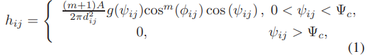
  
여기서 hij는 UAV i와 사용자 j 사이의 채널 이득, A는 검출기 영역, dij는 UAV i와 사용자 j 사이의 거리입니다. 또한 m = − ln 2 / ln (cos Φ1 / 2), 여기서 Φ1 / 2는 송신기 반각, ψij는 입사각, φij는 조사 각, Ψc는 수신기 시야 ( FOV) 반각, g (ψij)는 집광기의 이득이며 다음과 같이 주어질 수 있습니다.  
  
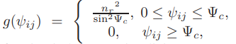  
  
여기서 nr은 굴절률입니다. 단순화를 위해 모든 UAV의 높이가 zu1로 고정되고 사용자의 높이가 0 인 2 차원 배포 시나리오를 고려합니다. 
UAV (xi, yi, zu)의 위치가 주어지면 i = 1, 2,. . . 사용자의 K 및 q (xj, yj, 0), j = 1, 2,. . . U, 우리는 dij =  및 cos φij = cosψij = 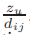입니다. 
이러한 각도는 송신기와 수신기가 각각 수직 아래쪽과 위쪽에 있다는 가정을 기반으로하여 얻은 것입니다. 
여기에서 카메라 또는 포토 다이오드는 지상 사용자에게 수신기로 배치하여 광학 신호를 전기 신호로 변환하고 사용자가 이동할 때 통신을 지원할 수 있습니다.
  
UAV i와 사용자 j 사이의 VLC 링크의 채널 용량 C는  [5]에 의해 하한이 됩니다.
여기서 σw는 가산 성 백색 가우스 잡음의 표준 편차입니다. ξ는 조명 타겟이고 Pi는 UAVi의 광학 파워입니다.
LED 지원 UAV는 희미한 시나리오 (예 : 야간) [1]에 배치 될 가능성이 더 높으므로 주변 광의 효과를 가우스 노이즈로 모델링 할 수 있습니다. 
우리는 각 사용자에게 데이터 속도 제약 Cth가 있다고 가정합니다. 
따라서 사용자 j와 관련된 UAVi의 필요한 최소 광 강도는로 표현할 수 있습니다.
VLC는 통신과 조명을 모두 포함하므로 조명 제약도 고려해야합니다. 
조도는 조명 된 표면의 밝기를 의미하며 ηj = ξPihij [6]에 비례합니다. 
그림 1의 평면도에서 UAV와 사용자 간의 거리를 줄여서 소비되는 전송 전력을 줄 이도록 UAV를 신중하게 구성 할 수 있음을 알 수 있습니다. 
따라서 관련 최적화 문제는 다음과 같이 공식화됩니다.  
  
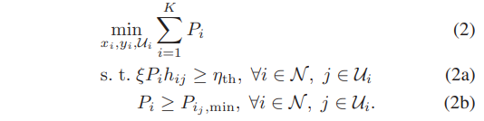  
  
여기서 Ui는 UAV i에 의해 서비스되는 사용자 집합이고 ij는 사용자 j에 서비스를 제공하는 UAV i의 인덱스입니다. 
또한 N은 UAV의 집합이고 ηth는 수신기의 조명 임계 값입니다. 
문제 (2)의 목표는 UAV의 총 전력 소비를 최소화 할 수있는 각 UAV i (xi, yi, zu) 및 셀 연관 Ui의 최적 위치를 찾는 것입니다. 
그러나 xi, yi, Ui 간의 상호 의존성으로 인해 (2)를 푸는 것은 어렵습니다. 
따라서 (2)의 해를 찾기 위해 추가 조작이 필요합니다.  
  
 ## 3.  UAV LOCATION AND CELL ASSOCIATION OPTIMIZATION
(1)에서 거리에 따라 채널 이득이 감소하는 것을 볼 수 있습니다. 
즉, UAV는 가장 먼 사용자의 요구 사항이 충족되면 모든 사용자의 요구 사항을 성공적으로 충족 할 수 있습니다. 
우리는 가장 먼 사용자를 연관된 UAV까지 최대 거리가있는 사용자로 정의합니다. 
VLC는 낮은 복잡성으로 정확한 위치 파악을 달성 할 수 있기 때문에 [7] 모든 사용자의 위치를 ​​알고 있다고 가정하는 것이 합리적입니다. 
가장 먼 사용자의 위치와 가장 먼 사용자와 관련 UAV 사이의 거리는 UAV의 위치와 셀 연결에 따라 다릅니다. 
이는 문제 (2)가 UAV 위치 최적화 문제와 셀 연관 문제로 구성되어 있음을 의미합니다. 
먼저 원래 문제를 두 가지 하위 문제, 즉 UAV 위치 최적화와 셀 연관 최적화로 나눕니다. 
그런 다음 무작위 증분 구성 기반 알고리즘과 탐욕 전략을 사용하여이 두 가지 문제를 각각 해결합니다.
이 제안 된 접근 방식은 문제 분할로 인해 차선책이지만 효율적이며 엄청나게 높은 복잡성을 요구하는 철저한 검색을 사용하지 않습니다.  
  
### A. UAV Location Optimization
여기서는 셀 연관이 고정되어 있다고 가정합니다. 이는 각 UAV에서 서비스를받는 사용자가 알려져 있음을 의미합니다. 
이 가정 하에서 각 UAV에 대한 최적화 문제는 독립적이됩니다. 
또한 UAV는 가장 멀리있는 사용자의 요구 사항이 충족되면 다른 모든 사용자의 요구 사항이 충족되므로 가장 멀리있는 사용자 만 고려하면됩니다. 
이러한 관찰을 기반으로 각 UAV i에 대한 최적화 문제는 다음과 같이 표현할 수 있습니다.  
  
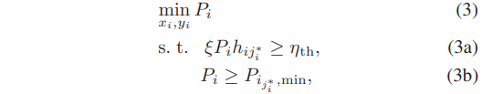  
  
여기서 ji∗ 는 UAV i에서 가장 먼 사용자를 나타냅니다. 
가장 먼 사용자는 UAV의 위치에 따라 동적으로 변경됩니다. 
각 UAV의 최적 위치는 다음 정리에 따라 결정될 수 있습니다.  

정리 1. 고정 셀 연관의 경우 UAV i의 고유 한 최적 위치는 UAV i의 조명 영역에있는 모든 사용자를 포함하는 가장 작은 둘러싸는 디스크의 중앙에 존재합니다.  
증명. (1)을 (3a)로 대체하면 , 여기서 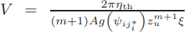.
마찬가지로 (3b)에 대해 , 여기서 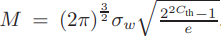, 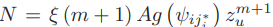.
따라서 (3)은 다음 방정식과 동일합니다.  
  
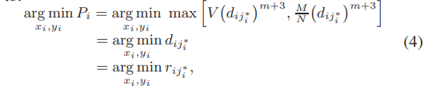
  
여기서 max [·, ·]는 입력의 최대 값을 출력하고 riji*는 UAV i와 사용자 ji* x-y 평면 사이의 수평 거리 이며 rij*i = 로 정의됩니다.
시스템 매개 변수가 주어지면 변수 M, N 및 V는 일정합니다. 또한, 변수 rij*i는 ji ∈ Ui에 대한 제약 조건 riji*</sup ≥ riji를 포함하며, 여기서 ji는 UAV i가 서비스하는 j 번째 사용자를 나타냅니다. 
따라서 문제 (4)의 목표는 반경 riji*i를 최소화하는 둘러싸는 디스크 중심의 최적 위치를 찾는 것입니다.  
  
다음으로 UAV i의 최적 위치가 고유함을 보여줍니다. 
반지름이 r 인 가장 작은 두 개의 둘러싸는 디스크 D1, D2가 있다고 가정합니다. 모든 사용자는 D1 ∩ D2에 있으며 반경  인 디스크에 추가로 포함되어 있습니다. 
여기서 a는 두 디스크 중심 사이의 거리의 절반입니다. 
따라서 a는 0이어야합니다. 
즉, D1과 D2가 같거나 더 작은 디스크를 가진 모든 사용자를 포함하는 디스크가 존재합니다. 
이것으로 증명이 끝납니다.  
  
정리 1에서 사용자의 위치가 주어지면 가장 작은 둘러싸는 디스크는 무작위 증분 구성 [8]으로 얻을 수 있습니다. 
이 방법의 그래픽 표현은 그림 2에 나와 있습니다. 
여기서 Ui는 UAV i가 서비스하는 사용자 수이고 Dj-1은 1부터 j-1까지의 모든 이전 사용자를 포함하는 디스크입니다. 
디스크 DUi와 그 반경 ri (그림 2)에서 UAV i의 최소 전력은 로 유도 할 수 있습니다.  
  
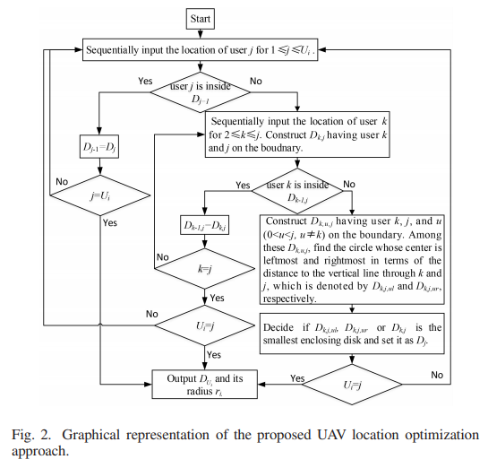  
###### [fig 2] Graphical representation of the proposed UAV location optimization approach.  

### B. Cell Association Optimization
정리 1에서 UAV에 필요한 전력이 가장 먼 사용자 diji*까지의 거리에 의해 결정된다는 것을 알 수 있습니다. 
이 거리는 UAV의 위치뿐만 아니라 사용자의 위치에 따라 다르므로 다음으로 셀 연결에 의한 전력 소비를 더욱 줄입니다. 
최적화 문제는 다음과 같이 공식화됩니다.  
  
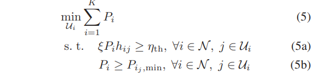
  
마찬가지로 (5)에서 우리는 (6)을 찾을 수 있습니다.  
  
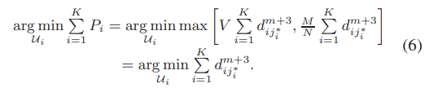  
  
(6)에서 문제가 고전적인 클러스터링 문제 [9]가되는 것을 볼 수 있습니다. 
즉, 모든 사용자를 처리하면서 각 디스크의 비용 dm+3ij*i를 최소화합니다. 
지수 비용 함수의 거듭 제곱이 1보다 클 때이 문제는 NP-hard라는 것이 입증되었습니다 [9]. 
따라서 탐욕 전략에 기반한 셀 연관에 대해 차선의 알고리즘이 제안된다 [9]. 
다음과 같이 작동합니다.
1) 각 UAV에 중심이 있고 반경이 0 인 K 디스크로 시작합니다. 
2) 각 사용자의 위치를 ​​순차적으로 입력하고 최소 비용 기능 증가가 필요한 모든 K 디스크 중에서 디스크를 찾습니다. 
3) 모든 사용자가 디스크에 포함되고 적합한 셀 연결이 생성 될 때까지 반복합니다.  
  
(3)과 (5)를 순차적으로 푸는 것은 얻은 솔루션이 전체적으로 최적이라는 것을 보장 할 수 없기 때문에 전력 소비를 더욱 줄이기 위해 여러 번 반복해야합니다. 
명확하게, 획득 한 차선의 셀 연관을 사용하여 업데이트 된 UAV 위치는 (3)에서 얻을 수 있습니다. 
그런 다음 업데이트 된 UAV 위치를 사용하여 셀 연결을 다시 업데이트 할 수 있습니다.
알고리즘이 전력 소비를 더 줄일 수 없을 때 반복이 종료됩니다. 
실제로 알고리즘은 중앙 UAV에 의해 중앙 집중식으로 실행될 수 있습니다.  
  
## IV. NUMERICAL RESULTS
네 개의 하위 영역으로 더 나뉘는 정사각형 영역을 고려합니다. 
각 하위 영역에서 UAV를 배치하여 통신 및 조명을 제공하고 사용자는 고려 된 영역에 균일하게 분포합니다.
이 작업에서는 상대적으로 넓은 반각 LED를 사용하여 고정 된 높이에서 더 넓은지면을 비춥니다. 
달리 명시되지 않는 한 모든 시스템 매개 변수는 표 I에 나열되어 있습니다.
VLC 링크의 입사 및 조사 각도와 같은 매개 변수는 UAV 및 사용자의 위치에 의해 결정되므로 표 I에 나열되지 않습니다. 
통계 결과는 다수의 독립적 인 실행에 대해 평균화됩니다.

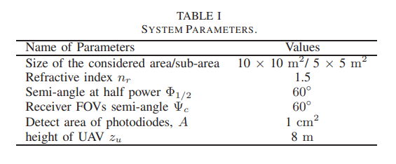  
  
초기 상태에서 UAV는 각 사각형 하위 영역의 중앙에 있으며 각 하위 영역의 사용자는 하위 영역의 UAV와 연결됩니다. 
목표 지역이 고정되면 중심이 UAV를위한 최적의 위치 인 것은 잘 알려져 있으며 [10], 이것은 우리의 시뮬레이션에서 기본 계획으로 사용됩니다. 
특히 정적 알고리즘 1 (SA1)에서는 UAV에서 사용자의 위치를 ​​알고 있다고 가정하고 각 UAV의 전력은 하위 영역의 중앙에있는 UAV에서 해당 위치까지의 거리에 의해 결정됩니다. 
해당하는 가장 먼 사용자. 정적 알고리즘 2 (SA2)는 SA1의 최악의 경우입니다. 
즉, 항상 가장 먼 사용자가 서비스 영역에서 중심까지 가장 먼 지오메트리 지점에 있다고 가정합니다.
또한 UAV 위치 최적화 만 (UAVOO)으로 배포를 시뮬레이션하여 UAV 위치 최적화 및 셀 연관 최적화로 얻은 성능 향상을 명확하게 보여줍니다.  
  
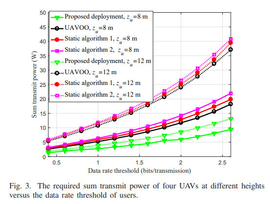
###### [Fig 3] The required sum transmit power of four UAVs at different heights versus the data rate threshold of users.  
  
그림 3에서는 서로 다른 데이터 속도와 조명 임계 값에 필요한 총 전송 전력을 분석합니다. 
그림 3에서 볼 수 있듯이 제안 된 배포는 다른 세 가지 방식과 비교할 때 항상 최소 요구 전력을 산출합니다. 
예를 들어 필요한 데이터 속도 임계 값이 2 비트 / 전송 인 경우 제안 된 배포는 UAV 높이가 8m 일 때 UAVOO, SA1 및 SA2보다 각각 약 53.8 %, 57.14 % 및 60 % 적은 전력을 소비합니다. 
또한 제안 된 접근 방식은 12m 높이에서 비행하는 UAV의 추가 성능 향상을 달성 할 수도 있습니다. 
이것은 고도가 높을수록 UAV가 더 큰지면을 덮을 수 있음을 의미하기 때문입니다. 
셀 연결 프로세스를 적절하게 최적화하면 더 적은 UAV를 배포 할 수 있으므로 성능 향상이 더욱 두드러집니다.  
  
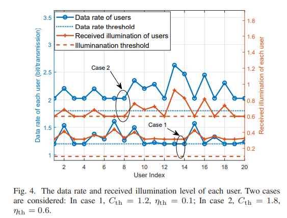
###### [fig 4] Fig. 4. The data rate and received illumination level of each user. Two cases are considered: In case 1, Cth = 1.2, th = 0.1; In case 2, Cth = 1.8, th = 0.6.  
  
그림 4는 각 사용자의 데이터 전송률과 수신 조도 수준을 보여줍니다. 두 가지 일반적인 경우가 고려됩니다.
특히, 경우 1의 경우, 데이터 레이트 제약은 조명 제약보다 더 높은 합 전송 전력을 필요로한다. 
따라서 특정 사용자의 데이터 속도는 모든 사용자의 수신 된 조도 수준이 조도 임계 값을 초과하는 동안 데이터 속도 임계 값보다 약간 크거나 정확히 동일합니다.
대조적으로, 조명 제약에 의해 요구되는 총 전송 전력은 데이터 속도 제약에 의해 요구되는 것보다 더 높기 때문에 특정 사용자의 조명이 조명 임계 값보다 약간 크거나 정확히 일치하는 동안 데이터가 모든 사용자의 비율이 데이터 비율 임계 값보다 높습니다. 
그러나 두 경우 모두 각 사용자의 데이터 속도 및 조명 요구 사항을 충족 할 수 있습니다.  
  
## 5. CONCLUSION
이 논문에서는 조명과 통신을 모두 제공 할 수있는 VLC 기반 UAV의 최적 배치 문제를 연구했다. 
우리는 조명 및 통신 제약 하에서 문제를 전력 최소화 문제로 공식화했습니다. 
그런 다음 문제를 해결하기 위해 2 단계 접근 방식을 제안했습니다. 
우리는 문제가 가장 작은 엔 클로징 디스크 문제와 최소 크기 클러스터링 문제로 분리 될 수 있음을 보여주었습니다. 
이러한 문제를 해결하기 위해 무작위 증분 구성을 적용하여 최적의 UAV 위치를 얻고 탐욕스러운 방법을 사용하여 최적이 아닌 세포 연관성을 얻었습니다. 
수치 결과는 제안 된 접근 방식이 전력 효율을 38.5 % 이상 향상시킬 수 있음을 보여줍니다.
