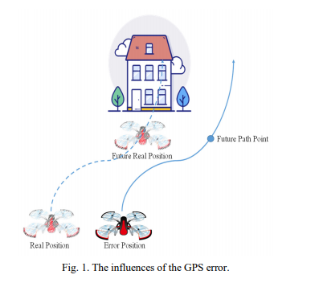
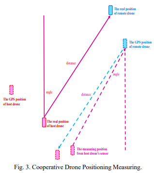
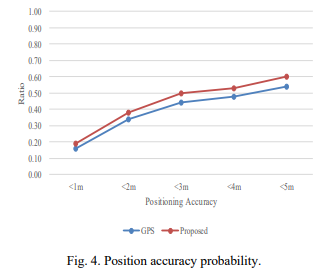

# Drone Internet에서 드록 협력 측위

## Abstract
최근에는 다른 플랫폼보다 편리성, 유연성 및 유용성으로 인해 이동성 목적에 이점을 제공하는 드론으로 알려진 무인 항공기가 있음.

제어 모듈과 결합된 GPS 수신기와 같은 여러 센서가 내비게이션 및 자율 비행을 가능하게 하는 자동 조종 시스템에 부착됨. 그러나 저비용 GPS 장치에서 습득한 측위는 낮은 품질로 악명 높음. 자율 비행 작업에서 UAV는 비행 중에 정확한 위치 정보를 가져와야 함. 

최근에, 스마트 도시는 중요한 기술이 되었고, IoT와 드론이 결합된 스마트 도시에서 IoD(Internet of Drones)는 인기있는 기술중의 하나임. 따라서, IoD는 실시간 통신 및 비용 측면에서 만족스러운 솔루션이 될 수 있음.

이 논문은 IoD에서 측정하는 협력 드론 위치 측정을 제안함. 연결된 모든 드론은 위치 정보, 거리 측정 정보를 다른 드론과 공유하여 자기 드론과 장애물의 정밀 위치를 얻음. 시뮬레이션을 통해 IoD를 통한 측위가 정확도를 높일 수 있음을 보여줌.

## Intorduction
최근 수십 년 동안 무인 항공기(UAV) 또는 일반적으로 드론으로 알려 진 젓은 학계와 산업계에서 점점 더 관심을 받고 있음. 이는 MEMS(Micro-Electromechanical Systems) 기술 발전 때문임. 드론은 교통 감시, 오염 추정, 배달 등과 같이 다양한 목적으로 사용할 수 있음. 항공기는 사전 정의 된 경로를 통해 원격으로 또는 자율적으로 제어됨. 이러한 드론은 대부분 정교한 인식 기술을 사용하여 장애물을 효과적으로 회피하는게 필수적이며, 높은 비용이 필요함.

최근 스마트 시티는 시민의 삶의 질을 높이고 미래 도시의 효율성을 높이기 위해 지능적인 자동화를 위한 중요한 기술이 되어가고 있음. 이러한 첨단 기술을 달성하기 위해 드론과 사물 인터넷(IoT)은 스마트 시티의 중요한 부분으로 간주됨. IoT와 드론의 결합이 드론 인터넷(IoD)로 이어짐. IoD는 드론을 IoT 장치로 활용하여 여러 스마트 시티 애플리케이션을 수행함. 그러나 여전히 장애물 회피 및 위치 파악과 같은 몇 가지 문제가 있음.

Wang는 AoA(Angle-Of-Arrival) 측정을 사용함으로써 대상을 찾기위한 분산 협업 자율 생성(DCAG, Distributed Collaborative Autonomous Generation)을 개발함. 또한 최적의 배치에 대한 각도 간격과 거리를 조정하였음. Lazzari는 초광대역(UWB) 위치 파악 기법을 이용한 무인 항공기의 추적 및 제어 방법을 제안함. UWB 위치 파악을 통해 지상국과 UAV 사이의 거리를 추정 한 다음 지상국과 UAV간의 상대 이동 속도를 통해 UAV의 위치를 측정함. Zhang는 UAV의 RFID(Radio-Frequency Identification)태그를 통해 위치를 추정하기 위해 실내 위치 파악 시스템을 이용했음. 베이지안 필터 알고리즘을 적용하여 태그의 위치를 추적하고 UAV의 6개 각도의 위치를 계산함. Luo는 UAV 비행 중 수신 신호 강도(RSS) 기반 위치 추정의 경로 손실 계수를 추정하기 위해 확장 칼만 필터(EKF)를 사용하여 적응형 알고리즘을 고안하였음.

## Cooperative Drone Positioning Measuring
무인 항공기는 지난 10년 동안 점점 더 흥미로워지고 있음. 그러나 위치 추정은 드론에서 한계를 가지고 있음. 실외 환경에서 드론은 GPS(Global Positioning System) 장치를 사용하여 위치를 파악하는 경우가 많음. 모든 드론이 GPS를 사용할 수 있는것은 아니며, 드론은 부하 및 에너지 문제로 인해 고정밀 GPS를 장착 할 수 없는 경우가 많음. 대부분의 드론은 약 10미터 이상의 오차가 있는 일반적인 상용 GPS를 이용함. 따라서 사고가 발생할 수 있음.

예를 들어, 그림 1에서 비행 중 드론에 대한 GPS 오류의 영향을 나타냄. 드론이 미리 정의 된 경로를 따라 내비게이션 작업을 수행 할 때 GPS 정보 오류로 인해 장애물에 부딪 힐 수 있음. 상용 GPS로 인해 오류가 있으며 드론이 경로 앞의 장애물을 피할 수 없게됨. 따라서 최근 상용화 된 무인 항공기는 장애물을 감지하기 위한 주변 센서를 많이 가지고 있음. 그러나 이러한 많은 센서는 많은 비용을 증가 시킴. 예를 들어 DJI Mavic 2는 매우 인기 있고 비용이 많이 드는 드론이며 장애물을 피하기 위해 7대의 카메라와 여러 센서를 갖추고 있음.

통신 기술은 위치 추정에서 실시간 및 비용 측면에서 만족스러운 솔류션이 될 수 있음. 이 연구는 드론 인터넷을 이용하여 협력 드론 위치 측정을 제안함.

CDPM이라고 불리는 협동 드론 췽의 측정 방법은 드론 인터넷을 통한 센서 융합 기술을 이용한 측위 최적화 방법임. 센서 데이터 융향의 원리는 센서에서 더 많은 정보를 캡처 한 다음, 측정된 정보를 분석하여 위치 정보를 줄이는 것임. 그림 2 와 같이, 센서로부터 많은 위치 정보를 얻을 수 있다면 위치 데이터의 교차를 통해 위치 오류를 줄일 수 있음. 그러나 드론의 위치 추정 장치는 제한적임. 일반적으로 도른은 GPS 장치, 카메라 장치 및 초음파 장치를 갖추고 있음. 그러나 GPS 장치만 사용하여 자체 위치를 파악함. 따라서 본 연구에서는 다른 드론에서 장착 한 주변 센서를 연결된 드론 네트워크를 통해 드론의 위치 추정 장치로 사용함.

협력 드론 위치 측정의 목적은 각 드론이 드론 인터넷과 측정 거리를 공유하고 통신 장치를 텔레매틱스 센서로 만드는 것임. 그림 3 은 IoD를 통해 연결된 두 드론 간의 협동 드론 위치 측정의 일례를 나타냄. 호스트 드론과 원격 드론의 두 가지 드론이 있음. 이 드론은 주변 환경을 감지하는 GPS 장치와 거리 측정 센서를 갖추고 있다고 가정함. 따라서 호스트 드론의 위치 측정을 위해 우리는 GPS 데이터, 호스트 드론의 센서에서 측정 위치, 원격 드론의 센서에서 측정 위치를 얻을 수 있음. 

* GPS 데이터 : GPS 장치에서 수집된 위치 정보
* 호스트 드론 센서의 측정 위치 : 호스트 드론의 센서가 원격 드론을 감지하고 그 사이의 거리와 각도를 측정함. 원격 드론은 자신의 GPS 정보를 호스트 드론으로 보냄. 따라서 호스트 드론은 원격 드론의 GPS 정보와 호스트 드론의 거리 측정 데이터를 이용하여 자기 위치를 계산함.
* 원격 드론 센서의 측정 위치 : 원격 드론의 센서는 호스트 드론을 감지하고 그 사이의 거리와 각도를 측정함. 원격 드론은 거리와 각도를 포함한 정보를 호스트 드론으로 보냄. 따라서 호스트 드론은 원격 드론의 GPS 정보와 거리 측정 데이터를 사용하여 자기 위치를 계산함.

## Performace Evalution
이 연구는 IoD에서 협력 드론 위치 측정을 제안하였음. 시뮬레이션 환경은 2개의 UAV를 사용할 수 있는 100m X 100m 공간임. 우리는 각 UAV가 10m 오차 반경을 가진 GPS 장치와 다른 장애물을 감지 할 수 있는 센서를 갖추고 있다고 가정함. 이는 이 두 UAV가 서로를 감지 할 수 있음을 의미함.

그림 4는 GPS 만 사용한 방법과 위치 정확성 확률을 비교한 결과임. 제안된 방법이 저가의 GPS 장치만 사용하는 UAV에서 더 나은 위치 정확도를 보임. 사용 가능하나 UAV가 두 개 이상이면 IoD를 연결하였음. 위치 정보 공유를 통해 모든 UAV는 더 정확한 위치를 얻을 수 있음.

## Conclusion
지난 10년 동안 드론은 점점 더 흥미로워졌으며 여러 자동 작업에 적용 되는 것을 목표로함. 실외 환경에서 드론은 로딩 문제로 인해 저렴한 GPS 장치를 사용하여 위치를 파악하는 경우가 많음. 그러나 저비용 GPS의 위치 정확도는 위치 요구 사항을 충족하기 위한 계층화가 되어있지 않았으며, 자율 주행 드론에서 상당한 한계를 지님. 본 연구에서는 드론 인터넷을 통한 센서 융합 기술을 이용한 위치 최적화 기법인 CDPM으로 간략히 알려진 협력 드론 측위 측정 방법을 제안함. CDPM은 다른 드론에서 장착된 주변 센서가 연결된 드론 네트워크를 통해 드론의 위치 추정 장치로 만들어 위치 정확도를 높임.
