# 협동 인프라 기반 차량 포지셔닝

## Abstract
많은 운전 지원 시스템은 정확한 차량 위치 파악에 의존함. 이것은 일반적으로 관성 센서, 속도 센서, 휠 틱 센서 및 스티어링 휠 각도 센서와 같은 온보드 센서와 함께 GNSS(Global Navigation Sateillite Systems)에서 제공됨. 그러나 이러한 접근 방식은 GNSS 중단이 발생할 경우 오류가 축적됨. 또한 GNSS는 위성 가시선 차단, 신호 감쇠 및 다중 경로 전파로 인해 도시와 같은 환경에서 성능이 좋지 않다는 것이 널리 알려져 있음. 레이더 센서로 감지 된 주변 도로 인프라 객체(RIO)를 이용하여 GNSS 기반 측위와 관련된 오류를 억제하는 솔수션을 제안함. 이 물체의 위치는 사전에 알려지지 않았기 때문에 차량 간 통신을 사용하여 차량간에 예상 위치를 공유하고 이러한 방식으로 시간이 지남에 따라 전반적인 위치 정확도를 개선하는 것이 좋음. 이러한 방식으로 GNSS 거부 영역에 진입하는 차량의 위치 정확도를 유지할 수 있고, GNSS를 사용할 수 있는 영역에서 더 나은 결과를 얻을 수 있음.

## Introduction
도로 차량은 자신의 위치를 점점 더 정확하고 신뢰할 수 있께 추정해야함. 특히 미래의 ADAS(Advanced Driver Assistance Systems)의 맥락에서, 예를 들어 충돌 방지 또는 협조적인 적응형 크루즈 컨트로로가 같이 이 위치 추정은 주변 환경 변화에 견고해야 함. 도로 차량의 자체 위치 지정은 전통적으로 GNSS를 사용하여 해결해 왔음. 이 시스템을 통해 차량은 최소 4개의 위성에서 전송 된 신호의 전파 시간을 측정하여 지구상에서 위치를 찾음. 그러나 장애물이 위성에 대한 가시선(LOS)를 차단하면 신호 전력이 떨어지거나 위성이 완전히 차단되어 예상 위치에 큰 오류가 발생함. 또한 다중 경로 전파는 특히, 도시 환경에서 몇 미터의 차량 위치 오류의 원인이 됨. GNSS 단독 포지셔닝에는 터널이나 차고 및 주차장 내부를 주행하는 동안 위치 솔루션을 사용 할 수 없다는 단점이 있음. 그림 1 은 도시 협곡을 통과하고 터널을 빠져 나가기위한 예상 차량 위치를 보여줌. 시대 별 최소 제곱 알고리즘(노랑색) 및 칼만 필터 위치 추정(파랑색)은 이러한 상황에서 수십 미터 정도의 큰 오류를 나타내거나 때로는 완전히 사용할 수 없음.

이러한 한계를 극복하고 여전히 위치 솔루션을 제공하기 위해 센서 융합 접근법이 일반적으로 사용됨. 이러한 방법은 가속도계, 자이로스코프, 속도 센서 및 주행 거리계와 같은 온보드 센서를 사용하여 추측 항법(dead-reckoning)으로 알려진 접근 방식을 따라 시간 경과에 따른 차량의 위치를 추정함. 그러나 이것은 센서의 오류가 위치로 전파되어 시간이 지남에 따라 누적된다는 단점이 있음. GNSS가 없는 상황에서도 현지화를 제공하는 한 가지 가능한 접근 방식은 파일럿으로 알려져 있음. 조종시 차량의 위치는 랜드 마크라고 하는 외부 참조 또는 앵커 포인트를 사용하여 추정함. 카메라, 레이더 센서 또는 레이저 스캐너 또는 모바일 기지국 또는 WiFi 액세스 포인트와 같은 무선 비콘으로 감지 된 주변 물체 일 수 있음.

GNSS에서 주변 랜드 마크, 즉 지도의 위치가 사전에 알려지지 않은 경우 SLAM(Simultaneous Localization and Mapping)이라는 접근 방식을 따름. SLAM에서 환경지도는 로봇, 즉 차량의 현지화 됨과 동시에 만들어 짐. 그러나 SLAM에서도 앞서 언급 한 동일한 오류 누적이 발생함. 이미 감지된 랜드 마크(루프 폐쇄)를 다시 방문하면 이러한 오류 증가를 줄이는데 도움이 됨

자율 주행을 위한 자동차 환경의 확률 지도가 [2]와 [3]에 제시되어있음. [4]에서는 기성 카메라를 이용하여 차량에 레이더 검출 차선 표시 및 보호하기 위한 위치 파악 알고리즘이 제안됨. 생성 된 지도의 품질을 평가하는 로봇을 위한 레이더 기반 위치 파악 알고리즘이 [5]에 제시되어 있음. [6]의 저자는 자동차 환경에서 360도 FMCW(Frequency Modulated Continuous Wave) 24GHz레이더에만 기반한 SLAM 접근 방식을 제안하는 반면 [7]은 동일한 목적으로 레이저 스캐너를 사용함. 시각적 SLAM의 고유한 드리프트는 [8]에서 차량 자체 위치 파악을 위한 지도 정보를 통합함으로써 뒷받침 됨. [9]의 저자는 회전 거리 센서에 대한 위치 파악 기술을 제안함. 철도 여역에서 트랙 특징 추출을 기반으로 한 SLAM 접근법은 [10]에서 제안되었음.

본 논문에서 GNSS 포지셔닝이 막힘 및 다중 경로 전파로 인해 심하게 손상되거나 완전히 사용할 수 없는 지역에서 차량 위치 파악을 위한 방법을 제안함. 이를 위해 자동차 레이더 센서를 기반으로 한 SLAM접근 방식을 차량 자체 위치 파악의 특수한 경우에 적용하고 생성된 RIO(Road Infrastructure Objects) 맵을 차량간에 공유하여 위치 파악을 향상시키는 방법으로 확장함. 이 GNSS 구부 영역을 통과하는 각 차량과 함께. 이 맵을 교환하기 위해 V2V(Vehicle-to-Cehicle)통신이 고려됨. 미국의 DSRC(Dedicated Short-range Communication)와 유럽의 ITS-G5는 IEEE 802.11 WiFi 표준을 기반으로 한 차량 간 직접 통신을위한 후보 기술임

## Infrastructure Localization
이 섹션에서는 레이더 센서의 측정 모델과 RIO의 확률 적 맵의 동적 생성을 통합하여 한 차량의 자체 위치 파악 문제를 이론적인 방식으로 공식화 함.

### Vehicle Localization
챠량이 위치, 전직 속도 및 진행 각도를 추정한다고 가정. 단순화를 위해 이 작업의 프레임에서는 차량이 평평한 2D 표면에서 주행하고 차량의 z축이 로컬 내비게이션 프레임의 위쪽 축과 정렬되어 있다고 가정함. 차량의 이동과 관련하여, 세로 방향으로만 움직일 수 있고 수직 또는 측면으로 움직이는 움직임이 없다고 가정함. 결과 상태 벡터는 방정식 1과 같음.

xk와 yk는 2D 로컬 내비게이션 프레임에서 차량의 좌표임. vk는 차량의 전진 속도이며, ψk는 로컬 내비게이션 프레임과 관련된 차량의 진행 각도임. 상태 벡터 xk에는 현재 불확실성을 모델링하는 관련 분산-공분산 행렬 Pk이 있음. GNSS를 사용할 수 없을 때 자신의 위치를 추정하기 위해 차량에 속도 센서와 자이로 스코프가 장착되어 있다고 가정함. 예측 단계는 다음 방정식으로 제공됨.

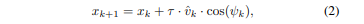    
    
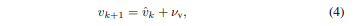    
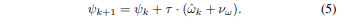    

여기서 𝜏는 예측 시간 단계이고 vk은 속도 센서의 속도 측정 값이며 𝜔k은 차량의 z축 자이로 스코프에서 측정 한 회전 속도 임. 속도 및 자이로 스코프 측정은 각각 표준 편차가 𝜎V 및 𝜎𝜔인 additive white Gaussian noise로 인해 손상됨. 예측 방정식의 통합적 특성으로 인해 위치 좌표 xk 및 yk에서 오류가 계속 증가함. 새로운 분산-공분산 Pk+1을 계산하기 위해 비선형 예측 방정식을 선형화해야하는 경우 구현을 확장 칼만 필터로 함.

차량에는 위치와 속도를 측정하는 GNSS 수신기가 장착되어있는 것으로 간주됨. GNSS 수신기는 일련의 GNSS 위성에 대한 범위를 측정하고 동시에 자체 클럭 바이어스를 추정하여 3D 위치를 추정함. 3D 속도는 각 위성에 대한 도플러 편이를 측정하고 수신기 클록 드리프트를 해결하여 유사한 방식으로 추정됨. 3D 속도 벡터에서 평면 전직 속도와 방향을 얻을 수 있음. 세 가지 측정에 대한 모델은 다음과 같이 제공됨.

    
    
    

왼쪽의 기호는 위치, 속도 및 방향에 대한 GNSS 파생 측정 값임. pk = [xk yk]T 임. 측정 값은 additive white Gaussian noise 𝜂p, 𝜂v 및 𝜂𝜓에 의해 손상되었다고 가정함.

### Radar Targets
레이더 센서는 LoS에서 반사 대상의 상대 위치와 상대 속도를 측정 할 수 있음. 차량 환경에서 이러한 측정은 일반적으로 수평면에서 제공됨. 오프로드 물체를 감지하기 위해 개방 각이 ± 30 ° 정도 더 크고 감지 범위가 100m 미만인 중거리 레이더를 사용함. 이 레이더는 자동 순항 제어에 사용되는 장거리 레이더와 달리 장애물 회피에 사용됨. 레이더는 일반적으로 하나의 표적에 여러개의 근처 반사체를 모음. 측정주기마다 감지된 타겟 목록이 출력됨. 레이더 표적 범위 및 각도 측정에는 다음 방정식이 사용됨

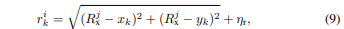    
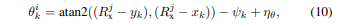    

여기서 rik 및 𝜃ik는 시간 단계 k에서 i 번째 레이더 표적 측정의 범위와 각도 이며, Rjx와 Rjy는 j 번째 RIO의 2D 좌표 이며, 𝜂t와 𝜂𝜃는 white Gaussian noise임. 첫 번째 단계로, 이 작업의 범위에서 차량의 속도 및 위치 추정을 향상시키기 위해 목표 속도 측정을 고려하지 않음.

### Infrastructure-based Localization
RIO는 도로 측면이나 위의 고정 된 물체임. 이러한 물체는 교통 표지판, 가로등 기둥 또는 도로 갠트리와 같은 인공 구조물은 물론 나무나 지형과 같은 자연 물체 일 수 있음. 이러한 물체 중 일부는 일반적인 mm-wave 주파수(77GHz ~ 79GHz)에서 작동하는 레이더의 RF 신호를 반사 할 수 있다고 가정함. 명확한 위치를 가지려면 RIO의 크기를 제한하는 것이 중요함. 소음 방지 벽 및 도로 장벽은 단일 위치에 국한되지 않고 더 넓은 공간에 걸쳐 있기 때문에 구조에 적합하지 않음.

이 백서에 제시된 자체 위치 지정 접근 방식은 전체 레이더 표적 목록에서 정적 물체를 필터링 해야함. 이것은 차량의 전진 속도를 사용하여 완벽하게 수행되는 것으로 가정함. RIO로 잘못 감지 된 움직이는 물체는 차량의 자체 위치 파악에 오류를 발생시킴. 또한 주변에서 감지 된 정적 객체는 RIO에 속한다고 가정함. 주차 된 차량 또는 기타 반 정적 물체는 이 방법을 장기간 사용할 때 적합한 앵커 포인트를 제공하지 않음. 이 경우는 여기서 무시됨.

차량 자체 포지셔닝을 위해 차량 위치와 함께 RIO의 위치를 추정해야함. 따라서 방정식 1은 J 번째 RIO의 좌표의 위치로 확장됨.

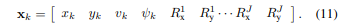    

처음에 상태 벡터에는 차량에 속하는 처음 4개의 상태 만 포함됨. 새로운 레이더 측정을 통해 새로운 RIO가 상태에 도입되고 크기가 동적으로 조정됨. 새로운 레이더 측정을 통해 새로운 RIO가 상태에 도입되고 크기가 동격으로 조정됨. 새로운 레이더 측정을 받은 후 첫 번째 단계 [ r 𝜃 ]ik RIO가 이미 상태 벡터에 포함되어 있는지 확인하는 함. 이것은 먼저 상태 벡터에 포함 된 각 RIO에 대한 추정 된 측정 값을 계산하여 수행됨.

    
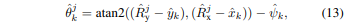    

그런 다음 수신 된 측정 값 [ r 𝜃 ]ik에서 추정 된 측정 값 [ r^ 𝜃^ ]ik에 따라 Mahalanobis 거리 𝛿를 계산함.

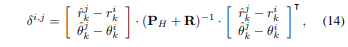    

여기서 R은 레이더 범위 및 각도 측정의 오류를 모델링하는 2x2 공분산 행력이고 PH = H⋅P⋅HT 임. 여기서 P는 상태 벡터 x의 분산-공분산 행렬이고 H는 상태 벡터 xk와 관련하여 방정식 12와 13의 Jacobian 행렬 임. Mahalanobis 거리는 현재 위치와 레이더 측정 모두의 불확실성을 고려하기 때문에 특히 적합함. Mahalanobis 거리가 특정 임계 값 미민인 경우 레이더 측정은 j 번째 RIO에서 파생 된 것으로 간주되고 베이지안 업데이트 단계가 수행됨.

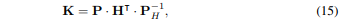    
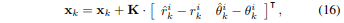   
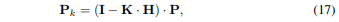    

여기서 K는 칼만 이득이고 I는 2x2 단위 행렬임. 이러한 방식으로 추정된 자체 위치를 업데이트 하는 것 외에도 감지 된 나머지 RIO의 위치가 이후에 수정됨. 그러나 Mahalnobis 거리가 지정된 임계 값을 초과하는 경우 레이더 측정은 알려지지 않은 새로운 RIO에서 비롯된 것으로 간주됨. 

    
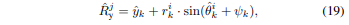    

이 경우 위치 추정 상태 벡터 xk를 확장하여 포함됨. 연관 임계 값은 조정 매개 변수로, 미스 연관(임계 값이 너무 느슨하게 설정된 경우)에 대해 비 감지(임계 값이 너무 빡빡한 경우)를 트레이드인 할 수 있음. 올바른 임계 값은 또한 인접 RIO 사이의 거리에 따라 달라짐. 주변 RIO가 잘못 연관 될 가능성이 더 높기 때문임.

### Cooperative Localization
첫 번째 차량이 GNSS 거부 영역을 통과하면 상태 벡터 및 관련 분산-공분산 하위 메트릭스 PR로 구성된 현재 RIO 맵이 Vehicular Ad-hoc Network(VANET)에서 교환 됨.

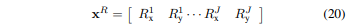    

이 정보를 수신하는 두 번째 차량은 상태 벡터 x 및 분산-공분산 행렬 P를 초기화 할 수 있음. 이제 이 두번째 차량에 사용 가능한 새 레이더 측정이 있을 때 동일한 측정 업데이트 단계를 수행하고 기존 RIO와 연결하거나 위에서 설명한대로 새 RIO를 생성함.

VANET에서 정보를 전파하기 위해 유럽 통신 표준 협회(ETSI)에 의해 유럽에서 적합한 라우팅 프로토콜이 표준화되었음. Greedy Perimeter Stateless Routing 알고리즘을 기반으로하는 지리적 범위의 브로드 캐스트는 소위 탈 중앙화 된 환경 알림 메시지 (DENM) 내부의 RIO 맵을 출구에서 GNSS 거부 영역의 입구로 가져옴. 이는 여러 홉을 통해 메시지를 전송하고 차량이 없는 경우 적합한 이웃 차량이 범위에 들어올 때 정보를 저장하고 전달하여 수행됨. GNSS 거부 영역의 입구에서는 정보를 재방송함으로써 정보가 유지됨. DENM 내에서 데이터 버전 필드를 사용하면 새 차량이 GNSS 거부 영역을 횡단하고 RIO 맵을 업데이트 할 때 업데이트 된 정보를 보낼 수 있음.

현재 RIO 맵을 교환하는데 필요한 통신 리소스이 양이 다음에 계산됨. RIO마다 수평 위치에 두 개의 부동 소수점 값이 필요함. 분산-공분산 행렬은 RIO의 수에 따라 2차적으로 증가함. 예를 들어, 10개의 RIO는 10x10 분산-공분산 행렬과 함께 제공됨. 배정 밀도로 하나의 참조 위치를 코딩하고 단일 정밀도 값으로 모든 RIO 위치 좌표 및 불확실성을 코딩하는 것이 좋음. 10개 RIO의 경우 244바이트 페이로드가 발생하는 반면, 20개 및 50개 RIO에는 각각 884 바이트와 5.2KB가 필요함. 최대 26개의 RIO를 하나의 V2V 메시지에 저장하고 전송할 수 있으며, 최대 페이로드 길이는 1536 바이트(네트워크 오버헤드 무시)임. 비교를 위해 CAM(Cooperative Awareness Message)의 길이는 300 ~ 500 바이트 임.

## Simulation Results
도로 인프라를 기반으로 제안 된 차량 자체 위치 결정 접근 방식의 기능을 보여주기 위해 시뮬레이션 환경이 개발됨. Matlab에서 차량은 인프라 구성 요소가 양쪽에 균일하게 분산 된 도로의 직선 구간을 주행함. 그림 2는 1500m 도로 섹션과 GNSS 거부 환경 내의 10개 RIO분포를 보여줌

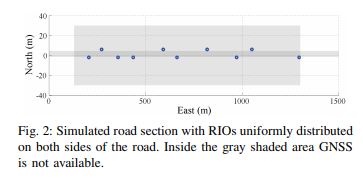

시뮬레이터에서 차량의 실제 위치, 속도 및 회전율은 1kHz에서 시뮬레이션됨. GNSS 수신기, 속도 센서, 자이로스코프 및 레이더 센서가 모델링 됨. 표 1이 평가를 위한 시뮬레이터와 센서 매개 변수를 모두 요약함. GNSS 수신기는 차량의 실제 위치에 백색 가우스 노이즈를 추가하여 모델링 됨. GNSS 업데이트는 5Hz에서 생성됨. 속도 센서는 속도 벡터의 크기를 취하고 백색 가우스 잡음을 추가하여 모델링된 5Hz에서 세로 속도 측정 값을 출력함. z축 자이로 스코프는 차량의 회전 속도에 백색 가우스 노이즈를 추가하여 모델링되며 100Hz에서 시뮬레이션됨. 범위 및 각도의 레이더 측정은 서로 독립적이며 백색 가우스 잡음에 의해 손상됨. 루프를 구동하는 모든 새로운 차량은 실험의 새로운 실혐임. 이 섹션의 플롯은 실험의 대표적인 실현을 보여줌.

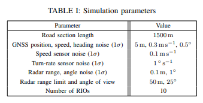

### First vehicle
첫 번째 테스트는 GNSS 이용 가능 도로 구간에서 GNSS 거부 구역으로, 다시 GNSS 이용 가능 구역으로 주행하는 차량 한대로 구성됨. 그림 3은 파란색으로 표시된 위치 오류와 빨간색으로 표시된 1𝜎 위치 불확실성을 보여줌. 비교를 위해 GNSS를 사용할 수 있는 경우 위치 오류가 노란색으로 표시됨. 후속 GNSS 측정이 가능해지면 초기 오류가 어떻게 빠르게 감소하는지 알 수 있음. GNSS 거부 영역이 두 번째 13에 입력되면 데드 레커닝 방법의 통합 특성으로 인해 GNSS 가용 곡선에 대한 위치 추정 오류가 커짐. 속도 센서 덕분에 위치 오류 통합은 스트랩 다운 알고리즘을 사용하여 가속도계를 이중 통합하여 예상 할 수 있는 것만 큼 크지 않음. 자이로 스코프 노이즈의 통합으로 인해 헤딩 오류로 커짐. 두 번쨰 130에서 GNSS 거부 영역의 출구에서 GNSS 측정을 다시 사용할 수 있고 위치 오류가 다시 감소하여 녹색 곡선을 충족함.

두 번째 테스트에서는 동일한 차량(차량 센서의 동일한 구현)이 레이더 센서를 활성화하고 주변 RIO를 감지 할 수 있음. 그림 4(a)는 위치 오류(녹색)과 1𝜎위치 불확실성(빨간색)을 나타냄. 레이더의 LoS에 RIO가 있는 동안 오류 증가는 약간 억제되었으며 위치 불확실성은 일정하게 유지됨. GNSS 거부 영역 내에서 RIO가 더 빨리 감지 될 수록 관련 불확실성과 추정 오류가 작아짐. 이것은 그림 4(b)와 4(c)에서 볼 수 있음. 또한 GNSS 거부 영역을 종료하고 GNSS 위치 수정을 다시 획독 할 때 각 RIO 위치 추정의 오류와 불확실성이 어떻게 명확하게 감소하는지 확인 할 수 있음. 최근에 획득한 RIO는 불확실성과 오류 측면에서 가장 많은 이익을 얻음.

### Subsequent vehicles
제시된 협력 방법은 후속 차량이 V2V 통신을 통해 이전 차량의 RIO 위치 추정을 획득한다는 원칙을 기반으로 함. 그림 5는 두 번째 차량에 대한 차량 위치 오류, RIO 오류 및 불확실성을 표시함. 그림 5(a)는 RIO 지원자가 위치 지정(녹색)과 온보드 센서(파란색)만을 기반으로 한 예측을 사용하여 차량 위치를 비교함. 이미 이 실현에서 위치 정확도의 향상을 볼 수 있음. 첫 번째 차량과 달리 두 번째 차량은 V2V 통신을 통해 받은 RIO 위치를 사전에 추정하여 GNSS 거부 영역에 들어감. 이것은 그림 5(b)와 그림 5(c)에서 볼 수 있음. GNSS 거부 영역을 종료 한 후 RIO 위치의 불확실성이 더욱 감소됨.

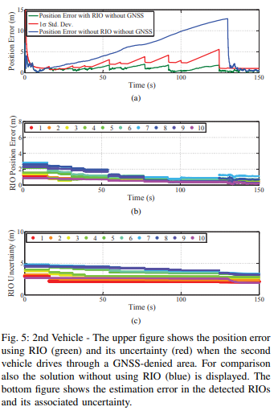

RIO 지원 포지셔닝을 사용한 개선은 더 많은 차량이 GNSS 거부 영역을 횡단할수록 증가하고 RIO가 더 잘 추정됨. 실행할 때 마다 RIO 불확실성이 감소하고 RIO 위치 추정이 안정화됨. 그림 6은 GNSS 거부 영역을 통과하는 10 번째 차량의 차량 위치 및 RIO 추정을 보여줌. 그림 6(a)에서 보다 정확한 지도를 가지고 있는 이점이 있음. GNSS를 사용할 수 있었다면 에상 할 수 있는 순서(노란색)에서 RIO 기반 자체 위치 지정(녹색)에 오류가 발생하는 방식을 알 수 있음. RIO 위치 오류가 1m 미만으로 더욱 감소함(그림 6(b)). 실제로 차량 위치 오류는 RIO의 감지 범위에 있을 때 RIO 위치 오류와 관련이 있음. RIO 객체의 수가 증가함에 따라 더 많은 통신 리소스를 사용하여 차량 위치 지정 오류를 더욱 줄일 수 있음.

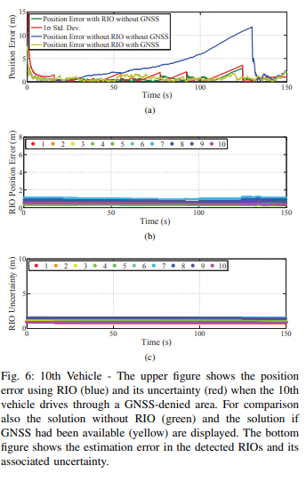

## Conclusions
본 논문에서는 다중 경로 전파 등으로 인해 GNSS를 사용할 수 없거나 큰 오류로 손상된 도로 구간에 대한 협동 차량자가 위치 결정을 위한 새로운 방법을 제안함. 이러한 환경에서 주행 중 위치 오류의 증가는 주변 도로 인프라 객체(RIO)를 감지하고 추적 할 수 있는 레이더 센서를 사용하여 제한됨. 첫 번째 차량은 RIO의 위치에 대한 확률적 맵을 생성하고 V2V통신을 통해 후속 차량과 이를 공유함. 시뮬레이션 환경에서 시간이 지남에 따라 RIO맵이 어떻게 향상되는지, 그리고 차량의 자체 위치 지정 알고리즘에 통합되어 GNSS에서 예상 한 순서대로 위치 정확도를 유지할 수 있는 방법을 보여줌.

