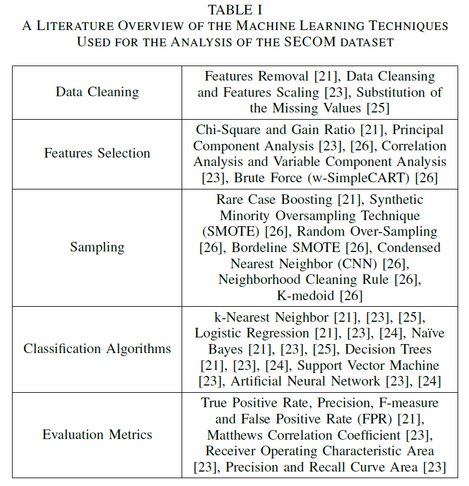
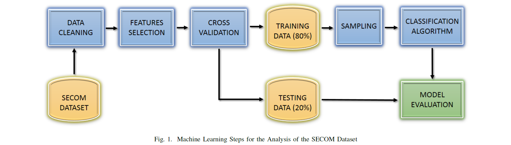

# 센서 기반의 제조 공정을 위한 머신러닝
## Abstract
생산 라인에 IoT 센서 기술을 배치하여 현대 공장 환경에서 관련 정보, 이벤트 및 제약 조건의 가용성이 증가함에 따라 상황 별 빅 데이터의 "폭발"이 발생했습니다. 동시에 지난 몇 년간 기계 학습 분야의 발전은 노이즈 데이터, 많은 기능 및 샘플의 불균형 분류로 특징 지어지는 제조 프로세스 데이터 세트의 분석을위한 새로운 접근 방식을 열었습니다. 본 논문에서는 반도체 제조 공정 (SECOM 데이터 셋)의 데이터를 고려하여 생산 공정 관리를위한 머신 러닝 기법의 적용 가능성과 영향을 조사합니다. 우리는 가장 관련성이 높은 기능을 선택하기 위해 Boruta 및 MARS와 같은 알고리즘을 적용하고 샘플 분류를 위해 Random Forest 및 Gradient Boosted Trees를 적용했습니다. 결과는 PCA가 아닌 Boruta 및 MARS를 사용하여 피처를 선택할 때 정밀도 값이 더 우수하고 Gradient Boosted Tree 대신 Random Forest 및 Logistic Regression을 사용하여 데이터가 샘플링되지 않고 분류 될 때 정확도가 더 좋습니다.

## 1. INTRODUCTION
세계화, 경쟁 시장, 엄격한 규정 준수, 합병 및 인수로 인한 복잡성 증가, 급변하는 고객 요구 사항으로 인해 오늘날의 비즈니스 세계는 지속적으로 변화하고 있습니다. 매장 수준에서 스마트 구성 요소와 새로운 IoT 센서를 배치하면 제조 프로세스 관리가 점점 더 복잡해졌습니다. 이는 전체 공급망에 걸쳐 공장 내부 및 비즈니스 환경 외부에서 발생하는 등록 된 이벤트의 수가 증가하기 때문입니다. 경쟁이 치열하고 자주 변화하는 환경에서 제조 공정은 공급 업체, 물류 제공 업체 및 자재 조달의 급격한 변화로 인해 발생하는 불확실성뿐만 아니라 생산의 유연한 조정과 제품 출시 시간 단축을 요구하는 시장 상황 및 고객 요구 사항에 노출되어 있습니다. 이러한 압력 조건에 대응하여 공장은 항상 외부 (공장 외부) 및 내부 (공장 수준) 자극을 고려하여 생산 프로세스를 신속하게 조정, 조정, 최적화 및 제어해야합니다. 제조 회사는 고급 감지, 임베디드 시스템, 스마트 제어 및 기계 학습 기술을 활용하여 상황 상황 (공장 외부 및 내부 모두)의 변화에 ​​동적으로 대응할 수 있도록 제조 프로세스의 엄격한 구조에서 스스로를 해체해야합니다.

빅 데이터 및 머신 러닝 [1]은 분산 된 데이터 수집, 데이터 정리, 잡음이있는 데이터에서 의미있는 정보 추출 및 실시간으로 흐름 데이터에서 최적화 통찰력 새로 고침을 활용하여 제조 프로세스 관리 및 최적화를위한 새로운 기회를 엽니 다. 제조 공정 분석의 복잡성 [2]은 생산 라인 장비가 수백, 때로는 수천 개의 신호를 생성하는 수많은 센서에 의해 증가된다는 사실에 기인합니다. 또한 센서 판독 값의 샘플링 속도는 최근에 중요한 증가를 보였습니다 [3]. 이러한 발전은 분석해야 할 엄청난 양의 데이터로 이어졌습니다.

제조 공정 관리에서 빅 데이터와 머신 러닝 기술 [4]을 사용하는 데 따른 몇 가지 영향은 품질과 관련된 문제의 조기 발견, 제품과 관련된 결함의 더 나은 감지, 품질 향상 및 예측 수행입니다. 제품 실패. 센서 데이터 분석은 비용이 많이 드는 사람의 개입을 피하고 낭비를 줄이는 이점이 있습니다. 제품 공급 업체와 제조 회사는 반도체 제조를 최적화하는 데 사용되는 분석을 통해 많은 이점을 얻었습니다 [5]. 따라서 빅 데이터 분석은 사전 예방 적 유지 관리 및 예측에 사용될 수 있습니다 [6]. 제조 프로세스를 관리하는 데있어 가장 중요한 과제 중 일부는 높은 차원, 합격 사례와 실패 사례 간의 불균형, 예측 모델 구성입니다. 특이 치 탐지는 고차원 데이터의 공통적 인 특징입니다 [7]. 고차원 데이터에 대한 특징 [8]의 선택은 클래스 불균형, 데이터 세트 이동, 점진적 학습, 노이즈 데이터 및 예산 제약과 같은 많은 문제를 처리해야합니다. Richard Bellman이 [9]에서 소개 한 용어 인 차원의 저주는 분류 알고리즘의 일반화 능력의 감소와 관련이 있습니다. 불균형 데이터 세트는 분류 문제뿐만 아니라 회귀 문제에서도 나타날 수 있습니다 [10]. 불균형 데이터 세트와 관련된 한 가지 특별한 문제는 차선의 분류 모델 생성입니다 [11]. 클러스터링 알고리즘 [12]의 효율성과 성능은 불균형 데이터 세트에 의해 크게 영향을받을 수 있습니다.

이 논문에서 우리는 반도체 제조 공정 (SECOM 데이터 세트)의 데이터를 고려하여 생산 공정을 관리하기위한 기계 학습 기술의 적용 가능성과 영향을 연구함으로써 위에서 제시된 문제를 해결했습니다. 더 자세히 설명하자면 : (i) SECOM 데이터 세트에서 머신 러닝 기술을 사용하기위한 최첨단 접근 방식을 조사했습니다. (ii) 관련 기능 선택을 위해 세 가지 알고리즘을 교차 비교했습니다 (Boruta [13], Multivariate Adaptive RegressionSpline (MARS)) [14]와 주성분 분석 (PCA)) 및 (iii) 마지막으로 세 가지 샘플 분류 알고리즘 (로지스틱 회귀 (LR) [15], RandomForest (RF) [16] 및 Gradient Boosted Trees (GBT))을 비교했습니다. [17]). 서로 다른 알고리즘의 평가는 다섯 가지 측정 항목을 사용하여 수행되었습니다 [18] : 거짓 양성률 (FPR), 정밀도, 재현율, F- 측정 및 정확도

논문의 나머지 부분은 다음과 같이 구성됩니다. 섹션 II는 관련 작업을, 섹션 III는 대규모의 불균형 및 잡음이있는 데이터 세트에 적용 할 수있는 일련의 기계 학습 기술을 제안하고, 섹션 IV는 실험 결과를 제시하고, 섹션 V는 결론을 제시합니다.

## 2. REALATED WORK
SECOM 데이터 세트 [19]는 100 개 이상의 단계로 구성된 반도체 제조 공정 [20]에 의해 생성되며 더 큰 등급의 최신 센서 기반 제조 공정을 대표합니다. 제조 공정의 결과 인 최종 제품은 공정에서 발생하는 결함이있는 경우 테스트에 실패 할 수 있습니다. 제품의 품질, 장비 가동 시간의 증가 및 신뢰성이 중요하며 적절한 분류 기술을 사용하여 개선 할 수 있습니다.

데이터 세트는 공정 측정 지점에 설치된 센서에서 수집 된 기능 또는 변수로 구성되며 유용한 정보와 노이즈 또는 상수 값과 같은 무관 한 정보를 모두 포함합니다. 샘플 수는 1567 개이고 각 샘플에는 591 개의 특성이 있습니다. 각 테스트 포인트는 데이터 타임 스탬프와 연결되어 있으며 1은 실패를 나타내고 -1은 통과를 나타냅니다. null 값은’NaN’을 사용하여 설명됩니다.

SECOM 데이터 세트는 수백 개의 신호 또는 센서에서 생성 된 데이터 분석과 관련된 세 가지 주요 문제의 영향을 연구하기 위해 문헌에서 널리 사용되었습니다. 첫 번째 주요 문제는 많은 수의 특성 또는 신호, 잡음의 존재 및 무관 한 정보의 존재와 같이 존재할 수있는 가능한 단점을 고려하여 측정 데이터를 특성화하는 가장 대표적인 특성을 선택하는 것입니다. 두 번째 주요 문제는 각 측정 지점이 합격 또는 불합격으로 특성화된다는 점을 고려할 때 합격 사례와 불합격 사례 간의 불균형으로 나타납니다. 세 번째 주요 문제는 최상의 분류 알고리즘의 선택으로 나타납니다.

[21]에서 저자는 일정한 값을 갖는 특성 제거, 결 측값이 많은 특성 제거, 카이-제곱 통계 분석, 주성분 분석 (PCA) 및 게인 비율 (GR). 테스트 된 알고리즘은 k-Nearest Neighbor (k-NN), Logistic Regression (LR), Na¨ıve Bayes (NB) 및 Decision Trees (DT)입니다. 모델의 성능을 평가하는 데 사용되는 메트릭은 참 양성률 (TPR), 정밀도, F- 측정 및 거짓 양성률 (FPR)입니다. 기능 선택은 데이터 전처리, 분류, 클러스터링, 속성 선택 및 데이터 시각화와 같은 많은 기능을 지원하는 기계 학습 워크 벤치 인 WEKA 소프트웨어 [22]를 사용하여 실현됩니다.

[23]에서 저자는 반도체 제조 공정에서 장비 결함을 감지하기위한 예측 모델을 정의했습니다. 저자가 사용하는 접근 방식은 데이터 준비, 데이터 정리, 기능 스케일링, 기능 축소, 기능 선택, 가변 구성 요소 분석 및 모델 선택과 같이 SECOM 데이터 세트에 적용되는 여러 단계로 구성됩니다.

[24]에서는 합격 또는 불합격 클래스에서 발생하는 데이터 불균형 문제를 고려하여 다양한 기법을 연구하고 있으며, 데이터 불균형 문제를 해결하기 위해 제안 된 방법은 SMOTE (Synthetic Minority Oversampling Technique)이다. 통과 클래스와 실패 클래스 간의 불균형은 실패 클래스를 오버 샘플링하여 해결됩니다. 비교되는 네 가지 알고리즘은 랜덤 포레스트 (RF), 인공 신경망 (ANN), 로지스틱 회귀 (LR) 및 의사 결정 트리 (DT)입니다.

불완전한 데이터의 문제는 [25]의 주요 주제입니다. 데이터 완성 방법은 의사 결정 트리 (DT), Na¨ıve Bayes (NB) 및 Nearest Neighbor (NN)와 같은 다양한 유형의 분류기에서 파생됩니다. 누락 된 데이터는 분류에 문제를 일으키지 않도록 대체되며, 누락 된 값으로 이어지는 원인은 다양하며 수집 비용에서 데이터를 얻을 수 있더라도 데이터를 사용할 수없는 적시성 측면에 이르기까지 다양합니다. 결 측값을 대체하는 데 사용되는 일반적인 접근 방식은 모드 또는 모드의 평균을 사용하는 것입니다. SECOM 데이터 셋이 실험에 사용 된 다른 데이터 셋에 비해 매우 불균형하더라도 Na¨ıve Bayes를 사용하여 데이터를 분류하면 두 클래스 모두 균등하게 예측됩니다.

[26]에서는 클래스 불균형, 클래스 중복 및 밀도 부족 문제를 조사합니다. 불균형은 한 클래스가 다른 클래스를 심각하게 능가 할 때 발생합니다. 클래스 중복은 데이터 세트의 클래스를 선형으로 분리 할 수 ​​없을 때 발생하는 문제입니다. 밀도 부족은 분류자가 요구하는 데이터가 일반화 된 규칙을 만들기에 불충분 할 때 나타납니다. 이 경우 SECOM 데이터 세트의 기능 수는 PCA (Principal Component Analysis)와 bruteforce (w-SimpleCART)의 두 가지 기능 선택 기법을 사용하여 감소됩니다.

표 1은 SECOM 데이터 셋 분석을 위해 [21], [23]-[26]에서 사용 된 주요 기계 학습 기술을 요약합니다.

## 3. RESEARCH APPROACH
기계 학습을 사용하여 제조 공정에서 의미있는 정보를 추출하는 문제는 복잡한 문제이며 누락 된 데이터, 노이즈의 존재, 매우 많은 기능, 샘플 클래스의 불균형 등과 같은 기존의 많은 문제를 처리해야합니다. 의 위에. SECOM 데이터 세트를 사용하여 위의 문제를 조사하기 위해 제안 된 단계 순서는 그림 1에 설명되어 있습니다. 다음 하위 섹션에서는 각 단계에 대한 세부 정보를 제공합니다.

### A. Data Cleaning
데이터 정리의 목적은 처리를 위해 데이터를 준비하는 것입니다. 데이터 정리 단계에서 수행되는 변환은 많은 수의 결 측값이있는 특성 제거, 'NaN'으로 표기된 정의되지 않은 값을 숫자 값으로 대체하고 값을 [0,1]로 정규화합니다.

기능 제거의 주요 목적은 데이터의 55 % 이상이 누락 된 기능을 제거하는 것입니다. 누락 된 데이터의 일부 가능한 원인은 센서의 측정 값이 전송되는 속도 또는 전송 매체의 특성입니다. 기능 제거에 대한 임계 값 55 %는 [21] 및 [23]에서 사용되는 반면 임계 값 60 %는 [24]에서 사용됩니다. 그림 2는 결 측값의 수를 고려한 특성 분포를 보여줍니다. 이 단계는 초기 591 개 기능에서 24 개 기능을 제거하므로 이후 단계에서는 567 개 기능 만 고려됩니다.

정의되지 않은 값은 평균 휴리스틱 및 최근 접 이웃 휴리스틱을 사용하여 대체됩니다. 'NaN'값이 두 숫자 값 사이에 있으면 'NaN'값이 평균으로 대체되고, 그렇지 않으면 'NaN'값이 'NaN'값과 숫자 값으로 둘러싸여 있으면 'NaN'값은 숫자 값으로 대체됩니다.

상수 값을 제거하면 훈련 데이터의 모든 샘플에 대한 상수 값이있는 데이터 세트에서 해당 특성이 제거됩니다. 상수 값으로 구성된 116 개의 특성을 제거한 후 다음 단계에서 고려할 특성의 수는 451 개가됩니다.

마지막으로 데이터는 다음 방정식을 사용하여 [0,1] 간격에서 값을 가져 오도록 정규화됩니다.

여기서 xnorm은 x의 정규화 된 값이고, xmin은 x가 가질 수있는 최소값이고 xmax는 x가 가질 수있는 최대 값입니다.
