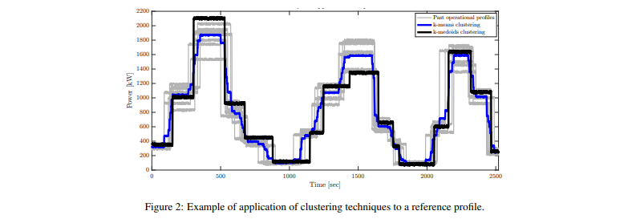

# 전기 선박의 에너지 관리 시스템 최적화에 기계 학습 및 수학적 프로그래밍 적용

## 개요
해운은 오늘날 사람에의한 전세계 온실 가스 배출량의 2.1%를 점유하고 있으며, 앞으로 더욱 증가할 것으로 예상됨. 동시에, 연료 가격의 상승과 해운 관련 기업의 운영 비용이 증가할것으로 예상되고있음. 따라서 효율적인 선박 운영이 필요함. 배터리를 이용한 선박은 효율적인 선박 운영을 위한 유망한 솔루션으로 간주되고 있음. 그러나 선박 운영 시스템에 에너지 저장 요소의 존재는 효율적인 제어에서 추가적인 물제를 발생시킴

논문에서는 주기적인 운영 방식에 따라 작동하는 에너지 저장 시스템을 사용하는 디젤 전기 선박의 에너지 관리 시스템을 최적화하기위한 기계 학습 및 수학적 프로그래밍의 적용 방법을 제시함

제안된 에너지 관리 시스템은 비지도 학습 알고리즘인 k-means 또는 k-medoids를 사용함. 그리고 나서, 혼합 정수 선형 계획법에 기반한 수학적 프로그래밍을 사용하여 연료 소비를 최소화하기 위한 시스템을 최적화함으로써 최적의 단위 투입 문제를 해결함. 계산된 에너지 저장 시스템의 최적의 충전 상태는 실시간 운영 동안 비례 적분 컨트롤러의 기준 값으로 사용됨

제안된 에너지 관리 시스템은 도시 지역에서 여러 정거장을 통하며, 주기적으로 운행되는 하이브리드-전기 페리에 관한 사례 연구에 적용하여 평가됨. 그 결과 이상적인 컨트롤러와 비교할 때 작동 프로필과 충전소에 큰 변화가 있어도, 87%에서 99% 사이의 정확도로 제어 동작의 효율성이 높다는 것을 보여줌

두 개의 테스트 된 클러스트링 알고리즘 사이에서, k-means는 충전소가 있을 때 연료 소비를 줄이는 데 높은 효율성을 보였으며, k-medoids는 충전소가 없을 때 더 높은 효율성을 보임

## 1. Introduce
해외 및 국내 해운 활동은 결제 발전의 촉매제이며, 지난 세기 동안 광법위한 성장을 보였음. 오늘날 해운은 운영을 위해 화석 연료를 광범위하게 사용하기 때문에 전 세계 온실 가스 배출에 중요한 역할을 함. 지난 수십년 동안 엄격한 환경 규제와 연료 가격의 변동으로 인해 운송 부문은 연료 소비를 줄이기위한 새로운 시스템에 투자해오고 있음.

하이브리드 전기 선박(HEV)는 내연 기관과 에너지 저장 시스템(ESS)을 결합하여 전력 수요가 제공되는 선박 시스템임. 하이브리드 개념은 실제 작동 조건에서 CO2 배출량을 크게 줄이는 데 기여하는 것으로 밝혀진 자동차 산업에서 성공적으로 입증되었음. 최근에는 CO2 배출량과 연료 소비량을 줄이기 위한 수단으로 해양 부문에서도 사용이 확산되고 있음.

자동차 산업의 대부분의 하이브리드 어플리케이션과 마찬가지로, 운송에서 하이브리드 시스템의 주요 목적은 peak shaving임. 이 상태에서 디젤 엔진은 연료 효율이 가장 높은 운전 조건에 최대한 가깝게 작동하고 ESS는 고출력 및 저출력 조건을 관리 함. 이것은 일반적으로 총 설치 전력의 크기를 감소시킴. ESS 용량이 증가하면 HEV를 사용하여 충전소와 연계하여 해얀에서 에너지 수요의 일부를 제공 할 수 있으므로 지역 배출량을 더욱 줄일 수 있음

이전 문헌에서 몇 저자들은 HEV 설계를 통해 운송시 연료 소비를 줄일 수 있는 잠재력을 보여줌. Dedes et al은 선박 유형 및 운영 프로필에 따라 0.3%에서 28%까지 절감된 것으로 확인되어 이 기술을 다양한 선박 유형에 구현할 수 있는 큰 잠재력을 보여주었음. Zahedi또한 유사한 결론을 내렸으며, ESS를 직류(DC)배전 그리도와 함께 사용함으로써 발생하는 시너지 효과를 강조함. 시스템 크기 조정 관점에서 Anvari-Moghadam은 ESS의 최적 크기 조정을 위해 혼합 정수 비선형 프로그래밍 방식을 사용했으며, 드릴십 전력 시스템의 경제적 인 파견과 함께 선박 운영 비용을 최소화 하였음

HEV사용을 다룰 때 시스템 최적 스케줄링 및 제어가 문제가 됨. 선박의 선상 시스템에서 의사 결정 지원 도구로 에너지 관리 시스템(EMS)를 사용하면 여러 전원을 작동하기 위한 최적의 작동 지점을 결정할 수 있으며 연료 소비 및 환경적 영향의 감소 관점에서 발전소의 효율성을 극대화 할 수 있음. 게다가 EMS의 사용은 동적 성능과 서비스 수명에 긍정적인 영향을 미칠 수 있음.

HEV 제어의 대부분은 자동차 부문에 비롯되었음. Musardo은 하이브리드 전기 자동차에 적용하기 위해 EMS에서 사용되는 적응 알고리즘을 제안하였음. Yu Wang은 하이브리드 전기 자동차의 서로 다른 발전기간에 수요 전력을 분할 할 목적으로 다중 변수 제어 프레임 워크를 제시하였음

많은 저자들이 최적의 스케줄링 문제에 대해 다른 접근법을 제안하였음 Bassam은 선박 에너지 효율을 높이기 위해 하이브리드 연료 전지/배터리 여객선에 대한 다중 계획 에너지 관리 전략을 제안하였음

Barklund는 전력 공유 목적으로 EMS 설계에서 선형 프로그래밍 방식을 사용함. Kanel los는 ESS를 포함하는 모든 전기 선박 전력 시스템에 대한 동적 프로그래밍 접근 방식 덕분에 온실 가스 배출이 감소 된 최적의 전력 관리 시스템(PMS)에 대해 논의 하였음. Zahedi은 선상 DC하이브리드 전력 시스템의 세부 효율 분석을 다루고 당댱한 부하 조건에서 연료 소비를 최소화하기 위한 최적화 알고리즘을 제안하였음. 그들으느 모든 전기 선박 전력 시스템에 대한 온라인 최적화 제어를 제안하였음. Skjong은 세 가지 다른 발전소 구성에 대한 세 개의 서로 다른 선박에서 추출된 부하 프로필을 분석하고 MILP(Mixed-Integer Linear Programming) 및 논리 알고리즘을 사용하는 EMS를 제안하였음. 이러한 모든 접근 방식은 HEV의 설계 및 운영에 대한 올바른 분석과 매우 관련이있지만 향후 운영에 대한 지식을 감안할 때 시스템의 오프라인 스케줄링으로 작업이 제한됨.

실제 응용 프로그램에서 미래의 작업은 미리 알려지지 않았으며 최적화 기반 컨트롤러 응용 프로그램은 더욱 어려워 짐. Grimmelius는 하이브리드 선박 구동 시스템의 동적 컴퓨터 모델의 적용을 제안하고 퍼지 규칙 기반과 최적화 알고리즘의 조합을 사용하고 선형 프로그래밍 접근 방식을 사용하여 다른 시스템 레이아웃과 제어 전략을 비교하였음. 보다 구체적으로, 그들은 문제의 시간 의존성을 제거하기 위해 등가 소비 모델의 사용을 제안함. Seenumani는 전력 공급 시스템으로 ESS, 연료 전지 및 가스 터빈과 함께 모든 전기 선박의 실시간 PMS를 위한 계층적 컨트롤러와 모델 예측 제어를 비교하였음.

앞서 언급한 방법은 대부분의 적용 사례에서 매우 효과적이며 자동차 산업과 같은 다른 성숙한 분야의 광범위한 경험을 기반으로 함. 그러나 주기적 운항 패턴에 따라 운항하는 선박의 경우 과거에 대한 정보를 사용하여 향후 운항을 추정 할 수 있음

본 연구는 주기적 패턴에따라 운영되는 선박에 대한 EMS를 제시함. 학습 알고리즘을 효과적으로 사용하여 이전 주기에서 발생한 일에 따라 향후 작업을 예측 할 수 있음

## 2. Methodology
### 2.1 General description
본 논문에서 제안하는 EMS는 오프라인과 온라인 제어 계층으로 구성되어 있음. 오프라인 계층은 새로운 주기를 시작하기 전에 발생하는 계산을 의미하며 세 가지 주요 상호 연결된 부분으로 더욱 세분화 됨

#### Clustering
과거 운영 데이터는 과거 측정 된 운영 프로필의 분석을 기반으로 향후 운영에 대한 추정치를 제공하는데 사용됨. 이는 k-means 및 k-medoids와 같은 클러스터링 알고리즘을 사용하여 수행됨.

#### Segmentation
클러스터링 된 데이터는 데이터 세트와 차원을 줄이기 위해 APCA(Adaptive Piecewise Constatnt Approximation)으르 사용하여 단순화 됨. 이는 최적화 섹션에서 계산 시간을 줄이기 위해 수행됨.

#### Optimization
세그먼트 프로필은 다가오는 운영주기에 위한 최적의 전력 공유를 식별하기 위한 목적으로 MILP 최적화 프로그램에 전송됨.

EMS의 온라인 계층에서는 ESS의 최적 충전 상태(SOC) 정보가 ESS의 제어 시스템으로 전송되어 비례 적분(PI) 컨트롤러에서 기준 값으로 사용됨. 제안된 EMS의 계획은 그림(1)에 나와있음.

### 2.2 Offline layer
제안된 제어 시스템에서 EMS는 클러스터링 기술 및 데이터 분석 프로세스의 원칙에 따라 작동함. 각 운전주기 후, 다음 운전을 예측하기 위해 최근 운전을 고려하여 제어 시스템을 자동으로 업데이트 함.

#### 2.2.1 Clustering
제안된 EMS는 다움 운영 주기의 추정치를 제공하기 위해 과거 운영으로부터 학습한다는 아이디어를 기반으로 함. 내재된 가정은 미래주기가 이전에 시스템에서 경험한 주기와 유사할 것이라는 것을 가정함.

요소 그룹의 가장 대표적인 요소로 식별하는 작업을 종종 클러스터링이라고 함. 이 특정 경우에는 추진 및 선박 보조 장치에 대한 수요의 합계로 인한 선박의 전력 수요가 클러스터링 기능으로 사용되며, 여기서 분석 공간의 각 지점의 차원은 측정 된 데이터 시리즈의 시간 단계의 숫자에 의해 주어진다. 계산된 클러스터 센서는 다음 운영주기에 대한 참조 프로필로 사용됨.

k-means와 k-medoids는 유클리드 거리에 의존하는 두 가지 비지도 학습 알고리즘임. k-means는 접근 방식에서 클러스터 중심은 모든 과거 운영 성능의 평균에 따라 평가됨. k-medoids는 접근 방식에서 중심은 과거 전력 프로필 중에서 선택됨.

훈련 데이터 셋은 각 작업주기가 종료 된 후 마지막으로 측정 된 관찰을 통해 제어 시스템을 지속적으로 업데이트하고 가장 최근의 목표를 기반으로 의사 결정을 개선함.

참조 프로필(섹션 3)의 무작위 변형으로 인한 9개 주기에 두 클러스터링 알고리즘을 적용한 결과의 예가 그림(2)에 나와있음. 여기서 두 알고리즘 간의 학습 된 프로필 간의 차이는 다음과 같이 관찰됨.

