# 전기 선박의 에너지 관리 시스템 최적화에 기계 학습 및 수학적 프로그래밍 적용

## 개요
해운은 오늘날 사람에의한 전세계 온실 가스 배출량의 2.1%를 점유하고 있으며, 앞으로 더욱 증가할 것으로 예상됨. 동시에, 연료 가격의 상승과 해운 관련 기업의 운영 비용이 증가할것으로 예상되고있음. 따라서 효율적인 선박 운영이 필요함. 배터리를 이용한 선박은 효율적인 선박 운영을 위한 유망한 솔루션으로 간주되고 있음. 그러나 선박 운영 시스템에 에너지 저장 요소의 존재는 효율적인 제어에서 추가적인 물제를 발생시킴

논문에서는 주기적인 운영 방식에 따라 작동하는 에너지 저장 시스템을 사용하는 디젤 전기 선박의 에너지 관리 시스템을 최적화하기위한 기계 학습 및 수학적 프로그래밍의 적용 방법을 제시함

제안된 에너지 관리 시스템은 비지도 학습 알고리즘인 k-means 또는 k-medoids를 사용함. 그리고 나서, 혼합 정수 선형 계획법에 기반한 수학적 프로그래밍을 사용하여 연료 소비를 최소화하기 위한 시스템을 최적화함으로써 최적의 단위 투입 문제를 해결함. 계산된 에너지 저장 시스템의 최적의 충전 상태는 실시간 운영 동안 비례 적분 컨트롤러의 기준 값으로 사용됨

제안된 에너지 관리 시스템은 도시 지역에서 여러 정거장을 통하며, 주기적으로 운행되는 하이브리드-전기 페리에 관한 사례 연구에 적용하여 평가됨. 그 결과 이상적인 컨트롤러와 비교할 때 작동 프로필과 충전소에 큰 변화가 있어도, 87%에서 99% 사이의 정확도로 제어 동작의 효율성이 높다는 것을 보여줌

두 개의 테스트 된 클러스트링 알고리즘 사이에서, k-means는 충전소가 있을 때 연료 소비를 줄이는 데 높은 효율성을 보였으며, k-medoids는 충전소가 없을 때 더 높은 효율성을 보임

## 1 Introduce
해외 및 국내 해운 활동은 결제 발전의 촉매제이며, 지난 세기 동안 광법위한 성장을 보였음. 오늘날 해운은 운영을 위해 화석 연료를 광범위하게 사용하기 때문에 전 세계 온실 가스 배출에 중요한 역할을 함. 지난 수십년 동안 엄격한 환경 규제와 연료 가격의 변동으로 인해 운송 부문은 연료 소비를 줄이기위한 새로운 시스템에 투자해오고 있음.

하이브리드 전기 선박(HEV)는 내연 기관과 에너지 저장 시스템(ESS)을 결합하여 전력 수요가 제공되는 선박 시스템임. 하이브리드 개념은 실제 작동 조건에서 CO2 배출량을 크게 줄이는 데 기여하는 것으로 밝혀진 자동차 산업에서 성공적으로 입증되었음. 최근에는 CO2 배출량과 연료 소비량을 줄이기 위한 수단으로 해양 부문에서도 사용이 확산되고 있음.

자동차 산업의 대부분의 하이브리드 어플리케이션과 마찬가지로, 운송에서 하이브리드 시스템의 주요 목적은 peak shaving임. 이 상태에서 디젤 엔진은 연료 효율이 가장 높은 운전 조건에 최대한 가깝게 작동하고 ESS는 고출력 및 저출력 조건을 관리 함. 이것은 일반적으로 총 설치 전력의 크기를 감소시킴. ESS 용량이 증가하면 HEV를 사용하여 충전소와 연계하여 해얀에서 에너지 수요의 일부를 제공 할 수 있으므로 지역 배출량을 더욱 줄일 수 있음

이전 문헌에서 몇 저자들은 HEV 설계를 통해 운송시 연료 소비를 줄일 수 있는 잠재력을 보여줌. Dedes et al은 선박 유형 및 운영 프로필에 따라 0.3%에서 28%까지 절감된 것으로 확인되어 이 기술을 다양한 선박 유형에 구현할 수 있는 큰 잠재력을 보여주었음. Zahedi또한 유사한 결론을 내렸으며, ESS를 직류(DC)배전 그리도와 함께 사용함으로써 발생하는 시너지 효과를 강조함. 시스템 크기 조정 관점에서 Anvari-Moghadam은 ESS의 최적 크기 조정을 위해 혼합 정수 비선형 프로그래밍 방식을 사용했으며, 드릴십 전력 시스템의 경제적 인 파견과 함께 선박 운영 비용을 최소화 하였음

HEV사용을 다룰 때 시스템 최적 스케줄링 및 제어가 문제가 됨. 선박의 선상 시스템에서 의사 결정 지원 도구로 에너지 관리 시스템(EMS)를 사용하면 여러 전원을 작동하기 위한 최적의 작동 지점을 결정할 수 있으며 연료 소비 및 환경적 영향의 감소 관점에서 발전소의 효율성을 극대화 할 수 있음. 게다가 EMS의 사용은 동적 성능과 서비스 수명에 긍정적인 영향을 미칠 수 있음.

HEV 제어의 대부분은 자동차 부문에 비롯되었음. Musardo은 하이브리드 전기 자동차에 적용하기 위해 EMS에서 사용되는 적응 알고리즘을 제안하였음. Yu Wang은 하이브리드 전기 자동차의 서로 다른 발전기간에 수요 전력을 분할 할 목적으로 다중 변수 제어 프레임 워크를 제시하였음

많은 저자들이 최적의 스케줄링 문제에 대해 다른 접근법을 제안하였음 Bassam은 선박 에너지 효율을 높이기 위해 하이브리드 연료 전지/배터리 여객선에 대한 다중 계획 에너지 관리 전략을 제안하였음

Barklund는 전력 공유 목적으로 EMS 설계에서 선형 프로그래밍 방식을 사용함. Kanel los는 ESS를 포함하는 모든 전기 선박 전력 시스템에 대한 동적 프로그래밍 접근 방식 덕분에 온실 가스 배출이 감소 된 최적의 전력 관리 시스템(PMS)에 대해 논의 하였음. Zahedi은 선상 DC하이브리드 전력 시스템의 세부 효율 분석을 다루고 당댱한 부하 조건에서 연료 소비를 최소화하기 위한 최적화 알고리즘을 제안하였음. 그들으느 모든 전기 선박 전력 시스템에 대한 온라인 최적화 제어를 제안하였음. Skjong은 세 가지 다른 발전소 구성에 대한 세 개의 서로 다른 선박에서 추출된 부하 프로필을 분석하고 MILP(Mixed-Integer Linear Programming) 및 논리 알고리즘을 사용하는 EMS를 제안하였음. 이러한 모든 접근 방식은 HEV의 설계 및 운영에 대한 올바른 분석과 매우 관련이있지만 향후 운영에 대한 지식을 감안할 때 시스템의 오프라인 스케줄링으로 작업이 제한됨.

실제 응용 프로그램에서 미래의 작업은 미리 알려지지 않았으며 최적화 기반 컨트롤러 응용 프로그램은 더욱 어려워 짐. Grimmelius는 하이브리드 선박 구동 시스템의 동적 컴퓨터 모델의 적용을 제안하고 퍼지 규칙 기반과 최적화 알고리즘의 조합을 사용하고 선형 프로그래밍 접근 방식을 사용하여 다른 시스템 레이아웃과 제어 전략을 비교하였음. 보다 구체적으로, 그들은 문제의 시간 의존성을 제거하기 위해 등가 소비 모델의 사용을 제안함. Seenumani는 전력 공급 시스템으로 ESS, 연료 전지 및 가스 터빈과 함께 모든 전기 선박의 실시간 PMS를 위한 계층적 컨트롤러와 모델 예측 제어를 비교하였음.

앞서 언급한 방법은 대부분의 적용 사례에서 매우 효과적이며 자동차 산업과 같은 다른 성숙한 분야의 광범위한 경험을 기반으로 함. 그러나 주기적 운항 패턴에 따라 운항하는 선박의 경우 과거에 대한 정보를 사용하여 향후 운항을 추정 할 수 있음

본 연구는 주기적 패턴에따라 운영되는 선박에 대한 EMS를 제시함. 학습 알고리즘을 효과적으로 사용하여 이전 주기에서 발생한 일에 따라 향후 작업을 예측 할 수 있음

## 2 Methodology
### 2.1 General description
본 논문에서 제안하는 EMS는 오프라인과 온라인 제어 계층으로 구성되어 있음. 오프라인 계층은 새로운 주기를 시작하기 전에 발생하는 계산을 의미하며 세 가지 주요 상호 연결된 부분으로 더욱 세분화 됨

#### Clustering
* 과거 운영 데이터는 과거 측정 된 운영 프로필의 분석을 기반으로 향후 운영에 대한 추정치를 제공하는데 사용됨. 이는 k-means 및 k-medoids와 같은 클러스터링 알고리즘을 사용하여 수행됨.

#### Segmentation
* 클러스터링 된 데이터는 데이터 세트와 차원을 줄이기 위해 APCA(Adaptive Piecewise Constatnt Approximation)으르 사용하여 단순화 됨. 이는 최적화 섹션에서 계산 시간을 줄이기 위해 수행됨.

#### Optimization
* 세그먼트 프로필은 다가오는 운영주기에 위한 최적의 전력 공유를 식별하기 위한 목적으로 MILP 최적화 프로그램에 전송됨.

EMS의 온라인 계층에서는 ESS의 최적 충전 상태(SOC) 정보가 ESS의 제어 시스템으로 전송되어 비례 적분(PI) 컨트롤러에서 기준 값으로 사용됨. 제안된 EMS의 계획은 그림(1)에 나와있음.

### 2.2 Offline layer
제안된 제어 시스템에서 EMS는 클러스터링 기술 및 데이터 분석 프로세스의 원칙에 따라 작동함. 각 운전주기 후, 다음 운전을 예측하기 위해 최근 운전을 고려하여 제어 시스템을 자동으로 업데이트 함.

#### 2.2.1 Clustering
제안된 EMS는 다움 운영 주기의 추정치를 제공하기 위해 과거 운영으로부터 학습한다는 아이디어를 기반으로 함. 내재된 가정은 미래주기가 이전에 시스템에서 경험한 주기와 유사할 것이라는 것을 가정함.

요소 그룹의 가장 대표적인 요소로 식별하는 작업을 종종 클러스터링이라고 함. 이 특정 경우에는 추진 및 선박 보조 장치에 대한 수요의 합계로 인한 선박의 전력 수요가 클러스터링 기능으로 사용되며, 여기서 분석 공간의 각 지점의 차원은 측정 된 데이터 시리즈의 시간 단계의 숫자에 의해 주어진다. 계산된 클러스터 센서는 다음 운영주기에 대한 참조 프로필로 사용됨.

k-means와 k-medoids는 유클리드 거리에 의존하는 두 가지 비지도 학습 알고리즘임. k-means는 접근 방식에서 클러스터 중심은 모든 과거 운영 성능의 평균에 따라 평가됨. k-medoids는 접근 방식에서 중심은 과거 전력 프로필 중에서 선택됨.

훈련 데이터 셋은 각 작업주기가 종료 된 후 마지막으로 측정 된 관찰을 통해 제어 시스템을 지속적으로 업데이트하고 가장 최근의 목표를 기반으로 의사 결정을 개선함.

참조 프로필(섹션 3)의 무작위 변형으로 인한 9개 주기에 두 클러스터링 알고리즘을 적용한 결과의 예가 그림(2)에 나와있음. 여기서 두 알고리즘 간의 학습 된 프로필 간의 차이는 다음과 같이 관찰됨.

충전소가있는 경우 이론적으로 클러스터링 할 두 가지 다른 기능, 즉 수요 전력과 충전소의 최대 전력이 있음. 이 부문에서는 이러한 클러스터링 문제의 중복을 방지하기 위해 시스템이 충전소에 연결될 때 고정된 음수 값을 가정하여 측정 된 수요 프로필을 수정함(그림 3)

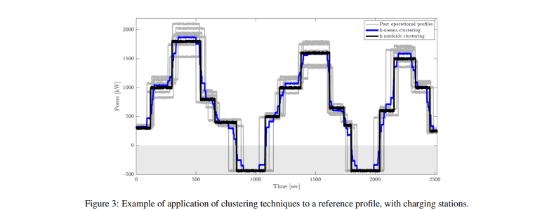

두 클러스터링 기술의 차이점은 그림(2)와 (3)에 나와있음. k-means 알고리즘으로 얻은 학습 후 프로필은 평균을 기반으로 하기 때문에 운영 프로필과 덜 유사함. 반대로 k-medoids post learning 프로필은 과거의 운영 프로필 중 하나로 선택되며 나머지 작업과 더 유사함.

#### 2.2.2 Data processing-segmentation
클러스터 된 프로필의 결과의 크기는 온보드 모니터링 시스템의 샘플링 속도를 반영함. 참조 예로서, 샘플링 주파수가 1Hz인 온보드 모니터링 시스템에서 시작하여 1시간 작동주기가 있는 페리의 클러스터링 된 프로필에는 3600개의 포인트가 포함됨. 최적화 문제의 해결 시간이 변수 및 제약 조건의 수에 따라 대략적으로 조정되므로 불필요한 많은 시간 단게를 사용하면 계산 시간이 길어질 수 있음

시계열은 여러 관찰을 통해 시간에 따라 변수의 변화를 모니터링하고 추적하는 시간 데이터베이스 임. 데이터 셋에서 흥미롭고, 에상치 못한, 해석적 가치있는 구조를 찾기 위해 일반적으로 다양한 기술이 사용됨. segmentation은 데이터 셋의 차원을 줄이기 위한 목저으로 압축 분할 분석에 사용되는 기술 중 하나임. Segmentation splits은 데이터 베이스를 동질적으로 관리 가능한 조각 별 정보로 분할하여 최소한의 시간 단계로 가장 많은 양의 정보를 전달할 수 있도록 함. 제안된 모든 차원 축소 알고리즘 중에서 본 논문에서는 APCA을 사용하였음.

그림 (4)는 현재 충전소에서 학습 후 와 분할 후 프로필을 보여줌 하위 그림 (A) 및 (B)는 이전 단계에서 사용 된 클러스터링 알고리즘을 보여줌.

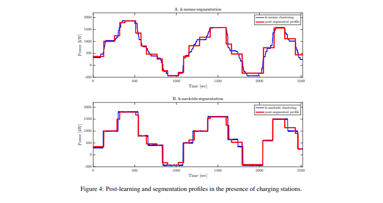

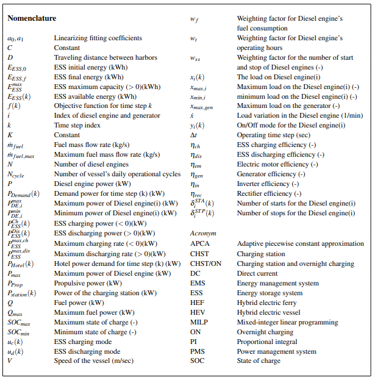

#### 2.2.3 Optimizer-Mathematical programming
세그먼트화 된 수요는 최적화 섹션에서 사용되어 다음 작업주기를 위한 ESS와 엔진 간의 최적 로드 공유를 결정함. 이 섹션에서 제안하는 접근 방식은 MILP 문제로 모델링됨.

EMS 최적화 단계의 주된 목표는 디젤 엔진과 ESS간의 전력 분배에 작용하여 선박의 연료 소비를 최소화 하는 것임. 목적 함수는 방정식 (1)에 표시됨.

여기서 i와 N은 각각 지수와 디젤 엔진의 수임. 목적 함수에서 디젤 엔진의 연료 소비는 방정식 (2)에 표시된 것처럼 엔진 제동력의 선형 함수로 모델링 됨.

여기서 mfuel은 연료 소비율, Pmax>는 최대 엔진 출력, a0 및 a1이 피팅계수임. 이 공식은 그림 (5)에 표시된 것처럼 사례 연구에 사용된 디젤 엔진의 효율 거동을 잘 나타냄

이 문제는 시스템의 물리적 동작 및 운영 제한과 관련된 여러 제약의 영향을 받음

보다 현실적인 솔류션을 보장하기 위해 목적 함수에는 디젤 엔진의 작동 시작 및 중지 및 작동 시간과 관련된 벌금도 포함됨. 첫 번째 기여는 연료 소비에 대한 제한적인 이점으로 엔진이 지속적으로 시동 및 정지되는 솔루션을 방지하는 데 사용되며, 두 번째 기여는 유지 보수 비용의 영향을 포함함.

에너지 절약은 전력 공급 시스템이 수요 전력을 충족하도록 하는 방정식 (3)으로 표현됨

논문에서 Pstation(k)라는 용어로 표현되는 충전소에서 선박의 하나 이상의 정류장에서 ESS를 충전 할 가능성이 있다고 가정함. 충전 스테이션이 없으면 이 방정식에서 Pstation(k) = 0으로 간주됨.

비 현실적인 최적화 결과를 방지하기 위해 각주기의 시작과 끝에서 SOC가 서로 관련되어야함. 이 논문에서는 선박이 정상적인 작업에 사용되지 않을 때 밤새 충전되는 것으로 간주됨. 밤새 누적 된 전하를 활용하기 위해 각주기가 끝날 때 SOC가 ESS 용량과 하루 예상 주기 수에 따라 달라지는 양 만큼 초기 SOC보다 낮을 수 있다고 가정함. 이것은 방정식 (4)로 표현됨.

ESS의 수명주기를 늘리기 위해 SOC는 실제 적용시 30% ~ 100% 범위에서만 변할 수 있다고 가정함. 이는 선박이 SOC = SOCmax로 작동을 시작하고 SOC = SOCmin으로 일일 작동을 종료하는 야간 충ㅇ전의 기초를 제공함.

야간 충전 시설이 없는 경우 에너지 절약법에 따라 ESS의 초기 및 최종 SOC가 동일하도록 제한됨

ESS에 대한 에너지 절약 방정식과 디젤 엔진의 전환 조건에 따른 시동/정지 횟수와의 상관 관계는 등식 제약으로 식 (5)와 (6)에 각각 제시되어 있음

MILP 문제는 또한 결정 변수의 변화를 제한하거나 시스템의 구성 요소를 활성화/비활성화하는 데 사용되는 일부 불평등 제약의 영향을받음. 생성 된 부하는 디젤 엔진과 발전기가 생성하고 유지할 수 있는 최대 실행 가능 부하(방정식 (7) 과 (8))보다 크지 않아야하며 디젤 엔진에서 생성 할 수 있는 최소 부하보다 낮아서는 안됨(방정식 (9)). 디젤 엔진이 켜지거나 꺼질 수 있고 두 상태가 동시에 발생하지 않는다는 사실을 나타내는 디젤 엔진의 켜짐/꺼짐 상태에 대한 조건부 제약이 있음(방정식 (10). 또한 디젤 엔진의 부하 변동에 대한 제한은 방정식 (11)에서 고려됨.

방정식 (12)는 ESS의 충전 또는 방전에 대한 조건 적 제약을 나타내고 방정식 (13) 및 (14)는 ESS의 충전 및 방전 속도에 대한 제한을 나타냄

### 2.3 Online layer
시스템의 온라인 부분은 선박 에너지 시스템에 대한 전력 공유를 위한 제어 입력을 생성하는 실제 컨트롤러에 의해 만들어짐. 제안된 제어 시스템에서 온라인 계층은 실시간 동작에서 SOC의 실제 값이 오프라인 계층에서 제공하는 기준 값을 추적 하는 피드배개 PI 컨트롤러로 구성됨. 이 제어 구성에 큰 차이가 있는 경우에도 수요를 충족하는 시스템의 높은 유연성을 허용함.

시스템이 충전 스테이션에 대한 연결을 감지하면 제어 시스템이 "무시"되고 시스템이 ESS를 충전하고 충전 스테이션에서 사용 가능한 모든 전력을 가져와야한다는 점에 유의해야 함.

### 2.4 Ideal and real controller
제안된 컨트롤러의 성능을 비교할 수 있는 기준값을 제공하기 위해 이상적인 컨트롤러도 구현해야함. 이 연구에서 이상적인 컨트롤러는 과거의 작업에 따라 미래를 예측해야 하는 실제 컨트롤러와 달리 향후 운영 수요에 대한 지식에 엑세스 할 수 있는 컨트롤러로 정의됨(그림 (6)). 그림 (7)에 따라서 제안된 제어 시스템의 효율은 이상적인 컨트롤러에 기반한 시스템의 연료 소비량과 제안된 컨트롤러의 연료 소비량간의 비율로 계산됨.

## 3 Case study
제안된 EMS는 사례 연구에 적용됨. 이 경우, 주기적인 운영 프로필을 받는 매우 일반적인 해운 어플리케이션을 나타내는 도시 페리를 제안함

### 3.1 Urban hybrid-electric ferry(HEF)
도시 페리는 교량 건설의 대안으로 대중 교통 시스템의 일부로 도시 지역에서 운영되는 선박임. 이러한 맥락에서 ESS를 페리 발전소에 통합하는 것은 디젤 엔진의 고연비, 저 배출, 과도 부하 감소로 운영 할 수 있는 흥미로운 솔루션으로 강조됨. 주기적 운영 프로필 덕분에 도시 페리는 주기적 운영 체제를 가진 선박의 편리한 예로 간주 될 수 있음.

이 사례 연구에서 HEF는 ESS가 4분 동안 충전되는 2개의 충전소와 함께 완전한 사이클을 수행하는 데 42분이 소요됨. 해안 연결 시설을 갖춘 페리의 두 사례는 별도로 평가 됨(그림 (8) 과 (9)). 표 (1)과 (2)는 각각 결정 변수에 대한 설계 데이터 상한/하한을 나타냄.

 
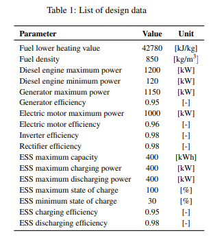 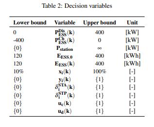

### 3.2 Stochastic artificial data generation
측정 된 운영 데이터가 없는 경우, 이 작업에서는 제안 된 제어 시스템을 테스트하기 위해 확률적 인공 운영 프로필을 생성하기 위해 단순화 된 알고리즘을 개발함. 이 작업에 사용 된 방법은 이동 거리를 유지하는 참조 프로필에서 시작하여 전력 요구 사항 및 운영 일정에 임의의 변화를 도입하는 아이디어를 기반으로 함. 이 연구에서 V의 속도로 물을 통과하는 선박의 저항력에 대한 추진력 PProp이 방정식 (15)에 의해 결정될 수 있다고 가정함.

추진력에 대한 선박의 속도를 갖도록 방정식 (15)를 방정식 (16)으로 재구성

선박이 이동한 거리 D는 시간에 따른 속도 프로파일을 통합하여 쉽게 찾을 수 있음(방정식 (17)

두 항구 D 사이의 거리는 일정하며 사례 연구 및 실제 운영에 대한 특정 정보가 없는 경우 K도 상수로 단순화 될 수 있다고 가정함. 결과적으로 방정식 (18)은 다음과 같이 재구성됨.

여기서 C도 상수임. 선박의 작동 프로필을 개별 패턴으로 간주 할 수 있다고 가정함. 예를 들어 두 항만 A와 B사이의 항해는 항 A에서 정박하는 단계, 짧은 기동 단계, 주 작던 단계, 마지막으로 항구에 정박하는 단계를 포함하여 4 단계의 작업으로 구성 될 수 있음. 이 모든 단계는 각 단계의 지속 시간과 필요한 평균 전력으로 설명 할 수 있음. 따라서 방정식 (18)의 이산형은 방정식 (19)로 표현 가능함.

여기서 Pi 와 ∆ti는 각각 부하 다이어그램에서 각 단계의 평균 전력과 지속 시간임. n은 두 항구 사이의 단계 수임. 방정식 (19)는 높은 수준의 적합성을 가지고 있음. 네 가지 유형의 부하 다이어그램을 생성하기 위한 기반을 제공함. 다음 에서는 네 가지 주요 데이터 생성 기술에 대해 설명함.

  1. 시간 단계 기간의 변화 : 각 단계와 관련된 일정한 평균 전력을 고려함. 각 시간 단계에 대한 시간 기간은 확률적으로 변하여 방정식 (19)의 C가 일정하게 유지됨. 사이클의 총 지속 시간도 일정하게 유지됨.

  2. 전력의 변화 : 반대로 이 경우에는 각 시간 단계와 관련된 일정한 시간 기간을 고려함. 각 시간 단계의 평균 전력을 방정식 (19)의 C가 일정하게 유지되는 방식으로 무작위로 변할 수 있음.
  
  3. 시간 단계 및 전력의 변화 : 이 경우의 범위는 방정식 (19)에서 C가 일정하게 유지되는 한 작동의 각 단계에 대해 시간 지속 시간과 평균 전력의 변화를 갖는 확률적 부하 프로필을 생성하는 것임.
  
  4. 동적 잡음이 있는 경우 시간 단계 및 전력의 지속 시간 변화 : 부하 다이어그램에서 잡음을 고려하여 평균 전력 주변의 전력 변화를 고려함. 이러한 유형의 데이터 생성은 선박이 실제로 어떻게 작동하는지 가장 근접하게 표현하기 위한 것임. 
  
자동 데이터 생성을 위한 제안된 방법은 추가 저항의 부재 또는 일정한 프로펠러 효율의 암시적 가정과 같은 추진 시스템의 실제 동작을 강력하게 단순화하는 데 기반을 두고 있지만, 이 방법에서만 사용됨. 제안된 제어 시스템은 인공 데이터 생성을 포함하지 않으므로 올바른 기능에 의존하지 않음. 본 연구에서 제안한 제어 시스템은 엔진과 ESS 간의 전력 분배 최적화에 초점을 맞추고 있으므로 선박의 추진 효율에는 관심이 없음.

## 4 Result
이 부분에서는 다양한 유형의 HEF에 대한 제어 기술 구현에 해당하는 결과를 제시하고 비교하려고 함. 첫 번쨰 부분에서는 다양한 시나리오에 대한 디젤 엔진과 ESS의 부하 조건을 제시하고 연비를 비교함. 그 후 이상 및 실제 컨트롤러에 대한 제어 시스템의 성능에 해당하는 결과를 시각화하고 다양한 유형의 작동에 대한 제어 시스템의 견고성을 논의함.

### 4.1 Effect of external charing circuits
이 섹션에서는 제안된 EMS를 사용하는 선박 전력 시스템의 동작을 다양한 잠재적 구성에 대해 분석함.

#### HEF with peak-shaving(HEF)
* 디젤 엔진은 선박에 동력을 공급하고 ESS를 충전할 수 있는 유일한 에너지원임.

#### HEF with charging station(HEF-CHST)
* 페리는 충전소를 사용하여 하나 이상의 정류장에서 전기 그리드에 연결할 수 있음.

#### HEF with overnight charging (HEF-ON)
* 페리의 ESS는 밤에는 완전히 충전되지만 낮에는 충전되지 않음.

#### HEF with both charging station/overnight charging (HEF-CHST/ON)
* 페리의 ESS는 야간에 완전히 충전되며 낮에는 충/방전이 가능함. 또한 운영 중에 ESS를 충전하기 위해 그리드에 연결됨.

결과는 페리에 대한 두 가지 시나리오(하루에 5회 및 10회 운행)에 대해 비교됨. 이러한 작업은 시간과 전력면에서 최대 20% 확률적으로 변한다고 가정함. 실시간 조건을 시뮬레이션하기 위한 동적 잡음이 전원에 적용됨.

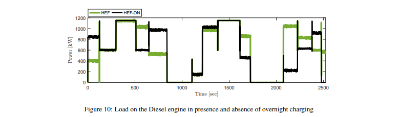
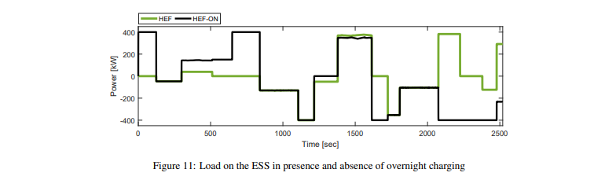

HEF 모드에서 시스템의 동작은 그림 (10)에 표시된 것 처럼 하이브리드 시스템에서 예상 한 것과 일치함. 저 부하 수요 기간 동안 최적화 프로그램은 디젤 엔진을 끄고 ESS를 사용하여 수요를 공급할 것을 제안하는 반면 중간 고출력 작동 중에는 디젤 엔진이 ESS를 충전하기 위해 더 높은 부하로 작동됨. 이 동작은 규칙을 미리 설정하지 않고도 달성되었으며 따라서 다른 선박 유형에 적용하거나 동일한 선박에 대해 다른 운영 패턴에 유연하게 적용 할 수 있음.

peak-shaving 기능만 있는 경우 ESS 시스템은 거의 사용되지 않음. 이는 선박용 디젤 엔진이 저 부하에서도 상대적으로 높은 연비로 작동하는 경향이 있고, 매우 낮은 부하 작동 및 과도 현상이 자동차 적용 분야에 비해 드물다는 사실의 결과임. 이는 또한 ESS가 에너지(ESS 용량)이나 전력(최대 C-rate)측면에서 잠재력을 최대한 발휘하지 못한다는 사실에서도 알 수 있음.

야간 충전이 있는 경우 ESS는 각주기에 대한 에너지의 일부를 방전 할 수 있기 때문에 전력 수요의 더 많은 부분을 공급함. 야간 충전이있는 경우 ESS는 매일 작동하는 동안 점차적으로 고갈됨. 두 가지 경우에 대한 각 작동주기에 대한 연료 소비 감소에 대한 야간 충전의 기여는 표 (3)에 보고되어있음.

충전소(HEF-CHST)가 있는 경우는 HEF-ON케이스와 유사하게 디젤 엔진의 평균 부하가 낮음. ESS가 해안에 연결될 때 충전하여 에너지의 일부를 제공하기 때문임(그림 (12)). 정지 중, 충전소에 연결하면 ESS가 충전 될 뿐만 아니라 페리의 최대 전력 수요도 그리드에서 나오는 전력으로 충족됨.

이것은 또한 EMS가 충전소의 향후 가용성을 인식하고 결과적으로 충전이 가능하다는 것을 알고 ESS 요금의 더 많은 부분을 사용할 수 있다는 사실의 결과이기도 함을 언급할 가치가 있음. 곧, 예상되는 미래 이벤트에 따라 시스템을 최적화하기 위해 과거주기의 작업을 사용하는 이 동작은 이전 문헌과 비교하여 이 작업에서 제안 된 주요 개선 사항 중 하나를 나타냄.

각 운전 사이클에 대한 연료 소비 감소에 대한 충전소의 기여는 표 (3)에 보고되어 있음. 또한 야간 충전소와 충전소를 모두 사용할 수 있는 경우 두 개의 단일 기여를 합한 것보다 더 많은 비용을 절감 할 수 있으며, 이 두가지 조합의 시너지 효과를 보여줌.

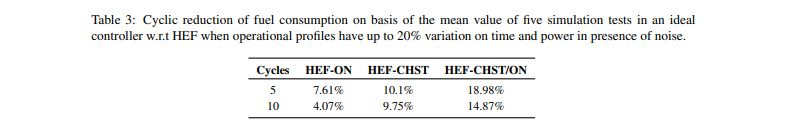

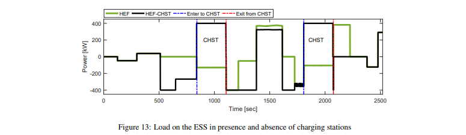

### 4.2 Controller performance
이 섹션에 제시된 결과는 컨트롤러의 온라인 부분에 중점을 둠. 이상적인 컨트롤러는 향후 운영에 대한 예측이 실제 전력 수요와 일치하기 때문에 오프라인 계층에서 오는 기준 SOC를 적절하게 추적 할 수 있음. 또한 ESS는 PI 컨트롤러에 의해 모니터링되고 나머지 수요 전력은 디젤 엔진에서 공급됨. 이는 모든 구성 및 운영 프로필에 대한 모든 유형의 변형에 유효함.

반대로 실제 컨트롤러는 미래를 모름. 제안된 제어 시스템에서 k-means 또는 k-medoids 학습 알고리즘이 실제 제어기에서 채택되어 과거의 작동 프로필을 기반으로 향후 작동을 추정함. 시뮬레이션 결과는 충전소(HEF 및 HEF-ON 구성)가 없는 경우 컨트롤러가 사용 된 클러스터링 알고리즘 유형에 관계없이 기준을 적절하게 따를 수 있음을 시사함.

그러나 충전소가 있는 경우 그림 (14)와 같이 상황이 다름.

이는 주로 시스템이 해안에 연결되어있을 때 ESS의 PI컨트롤러를 지배하기로 결정하고 이것이 발생하는 타이밍이 클러스터링 알고리즘에 의해 추정 된 향후 참조주기와 비교할 수 있다는 사실에 의해 발생함. 충전소 이후 기준과 측정된 SOC간의 오류가 지속되는 것은 ESS의 방전 전력 제한 때문임.

실제 컨트롤러에서 이러한 장애의 원인은 평균 전력의 변동이 아니라 시간 단계의 짖속 시간 측면에서 작동 프로필의 변동에 있음.

또한 충전소가 있는 경우 선택한 학습 알고리즘에 따라 EMS의 성능에 상당한 차이가 있음. 특히, 운영 프로필이 시간 기간에서 크게 다를 경우 k-means 접근법이 k-medoids보다 더 나은 성능을 발휘하는 것으로 관찰됨(그림 (14)).

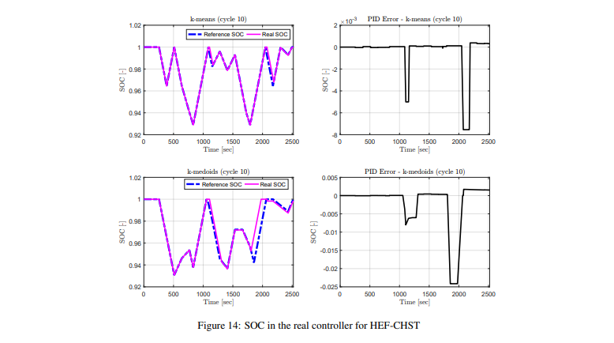

### 4.3 Efficiency of k-means and k-medoids algorithms
이전 섹션에서는 일부 시나리오에서 k-means 알고리즘이 k-medoids보다 더 잘 작동한다는 것이 정성적으로 관찰되었음. 두 개의 클러스터링 알고리즘 중 어떤 알고리즘을 결정하기 위해 다양한 전력 조건, 시간 단계 기간 및 잡음이 있는 상태에서 일련의 테스트를 수행했음. 분석은 총 120개의 테스트를 기반으로 함. 그런 다음 클러스터링 알고리즘은 이상적인 컨트롤러와 비교할 때 달성 된 연료 소비 감소를 기반으로 비교함.

이 테스트의 결과는 표 (4)에 요약되어 있음. 그들은 k-means 학습 패키지의 적용이 충전소가 있고 운영 프로필의 큰 변화에 대한 페리의 이상적인 컨트롤러에 더 가깝고 k-medoids 접근 방식은 충전소가 없을 때 더 잘 작동한다고 제안함.

### 4.4 Analysis of weight factors in the objective function
제안된 EMS에서 Optimizer 섹션 내에서 최소화되는 목적 함수는 연료 소비량, 엔진 시동 및 정지 횟수, 작동 시간의 세가지 요소의 기여로 구성됨. 이러한 기여는 원래 다른 단위를 갖기 때문에 문제는 다중 목표 최적화로 이어짐. 단일 목표 문제로 처리하기 위해 가중치 요인을 사용함. 따라서 가중치 요소에 할당 된 값의 선택은 시스템 동작에 미치는 영향에 따라 논의됨.

사이클의 엔진 시동 및 정지 횟수에 대한 시동 및 정지 횟수(wss) 및 작동 시간 (wt)의 가중치 요인의 영향이 그림 (15)에 나와 있음. 작은 wss만으로도 엔진 시동 횟수를 16(wt</sut>=0)에서 10 또는 12로 줄일 수 있다는 것을 알 수 있음. 또한 wt에 대해 0이 아닌 값을 갖는 것이 시스템을 만드는 데 도움이 된다는 것을 보여줄 수 있음. 잘못된 wss 선택에 대해 더 탄력적임.

엔진 시동 및 정지 횟수에 가중치 계수를 사용하면 지나치게 높고 정당하지 않은 엔진 시동 및 정지 횟수를 피하는데 도움이 되며, 작동 시간에 가중치 계수를 사용하면 이를 가능하게 한다고 결론을 내릴 수 있음. wt에 대한 합리적인 값을 채택하기 쉬움.

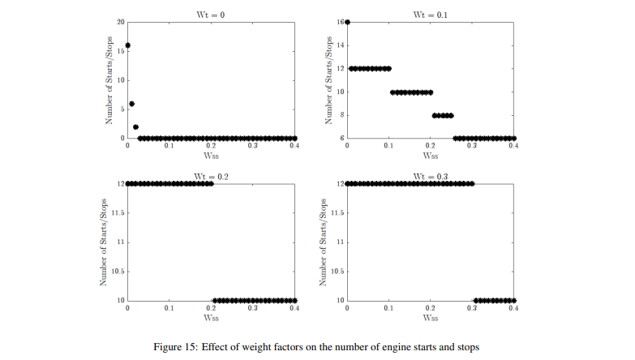

## 5 Discussion
하이브리드 선박의 최적 제어를 위해 제안한 방법은 이러한 시스템의 에너지 효율을 최적화하는데 긍적적인 성능을 보여줌. 그러나 이 방법에는 제한 사항이 있으며 그 중 일부는 제안 된 접근 방식에 내재되어 있음.

우선, 이 접근 방식은 반복적인고 주기적인 운영 프로필을 가진 선박을 위해 특별히 설계됨. 이 가설은 미래의 작업을 예측하기 위해 이전 작업을 사용하기 위한 기초이며 방법의 기능의 중심임. 따라서 이 방법은 사례에서 테스트 된 것처럼 작동주기가 몇 분에서 몇 시간 사이에 지속되는 도시 또는 가까운 섬 상에서 운영되는 단거리 페리와 같이 고주파로 반복되는 짧은 주기로 운항하는 선박에 적합함. 제안된 방법은 적절한 테스트 단계를 거쳐 페리, 유람선, 어선 및 컨테이너 선과 같은 장거리 노선에서 정기 운항하는 선박으로 확장 될 수 있을 것으로 기대됨. 반면에 이러한 접근 방식이 부정기선 무역에서 운항하는 선박과 같이 본질적으로 불규칙한 패턴을 가진 선박에는 부적절 할 것으로 예상함.

또한 시스템 최적화를 위해 제시된 모델은 여러 부분의 사례 연구에 맞게 조정되었으며 다른 유형의 시스템에 대한 모델의 유효성에 의문을 제기 할 수 있음.

첫 번째로, 많은 유형의 선박용 디젤 엔진에서 최대 효율은 최대 부하의 약 80%로 결정된다는 점을 언급 할 가치가 있음. 그러나 이 연구에 사용된 특정 엔진에 대해 제조업체가 제공 한 실험 포인트(그림 (5))는 선택한 엔진의 다른 동작을 보여주며 최대 효율은 엔진 부하의 100%에 위치함. 이는 특정 사례에 대한 간단한 선형 모델링 가정을 선택할 수 있는 근거를 제공함. 그러나 중간 부하에서 최고 효율을 갖는 표준 사례는 조각 별 선형화 접근 방식을 사용하여 처리 할 수 있음.

또한 이 특정 경우에 디젤 엔진은 발전기 모드에서 일정한 속도로 작동하므로 엔진 효율이 엔진 속도와 독립적으로 작동함. 기계적 추진이 사용되어 엔진 속도의 영향을 무시할 수 없는 경우 그에 따라 방법을 수정해야하며 정확도가 더 낮을 것으로 예상됨.

논문에서는 전기 기계 부품(발전기 및 모터)과 ESS의 효율이 일정하다고 가정함. 이 가정은 이전 문헌에서 공통적으로 적용됨에 따라 정당화되지만 확실히 선박 모델의 단순화를 도입함. 그러나 이것은 솔루션 속도의 순실이 제한된 추가 정수 변수를 사용하여 부분적으로 해결할 수 있다는 점에 유의해야 함.

## 6 Conclusions
이 연구는 주기적 운영 프로필을 갖는 특정 범주의 HEV에서 제어 시스템의 효율성을 향상시키는 데 있어 학습 알고리즘의 효과를 평가하는 것을 목표로 함. 서로 다른 전원에 대한 부하 공유 최적화 문제가 해결됨. 제안된 EMS는 다가오는 작업에 대한 새로운 예측을 추론하기 위해 과거 작업을 통해 훈련되었음. 분할 기법을 통해 학습 후 프로필을 처리한 후 MILP 최적화 프로그램에서 정보를 사용하여 ESS 충전 및 방전의 최적 상태를 평가함. 이 정보는 PI 컨트롤러에서 선박의 실시간 운영에서 실제 SOC를 모니터링하는데 사용됨.

제어 시스템은 사례 연구를 통해 HEF의 다양한 구성에 적용됨. 제어 시스템에 대한 외부 충전 회로의 영향은 기준 작동 프로필과 관련하여 최대 20%까지 작동 프로필의 무작위 변화를 가정하여 분석됨.

이 연구에서 제안된 EMS는 운영 프로필에 큰 변화가 있는 경우에도 효율적으로 작동한다고 결론지음. 이상적인 최적의 컨트롤러에 대한 제어 동작의 효율성은 충전소가 있는 경우에도 높으며, 클러스터링 알고리즘에 따라 87%에서 99%(이상적인 컨트롤러와 비교했을 때) 범위의 정확도를 제공함. 운영 프로필의 변동 크기 및 충전소 가용성. 이 시스템은 운영 프로필의 큰 변화에도 이상적인 성능에 가까운 것으로 나타났으므로 접근 방식의 견고함을 보여줌.

두 개의 테스트된 클러스터링 알고리즘 중 k-means은 충전소가 있을 때 연료 소비를 줄이는 데 더 높은 효율을 보였지만, k-medoids는 충전소가 없는 경우 더 나은 성능을 제공하는 것으로 나타남.

