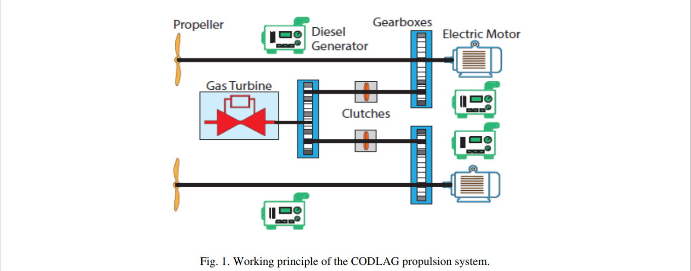
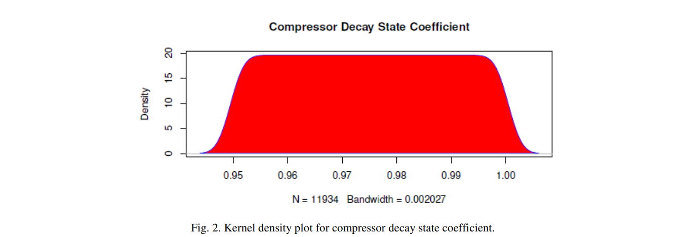
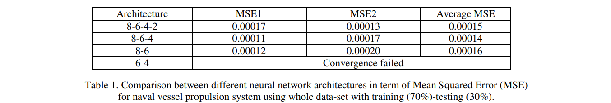

# 심층 신경망을 사용하는 CODLAG 해군 추진 시스템의 터빈 및 압축기의 상태 기반 유지 관리

## Abstract
시스템 및 하위 시스템 유지 관리는 모든 동적 시스템에서 중요한 작업임. 
시스템 안전을 보장하고 시스템 다운 타임을 최소화하기 위해 정량적 및 정성적 접근 방식이 많이 제안됨. 
컴퓨팅 기술과 다양한 기계 학습 접근 방식의 급속한 발전으로 인해 복잡한 기계 학습 기술을 유지 관리 전략과 통합하여 시스템 유지 관리를 미리 예측할 수 있음. 
현재 연구에서는 ANN (인공 신경망)과 ANN을 PCA (원리 성분 분석)와 통합하여 프리깃에 장착 된 해군 함정에 사용되는 Compound Diesel-Electric and Gas(CODLAG) 추진 발전소 가스 터빈 (GT)의 압축기 붕괴 상태 계수 및 터빈 붕괴 상태 계수를 모델링하고 예측하는 다양한 방법을 분석함. 
입력 매개 변수는 GT 매개 변수이고 출력은 GT 압축기 및 터빈 감쇠 상태 계수임. 많은 수의 입력이 존재하기 때문에 더 많은 히든 레이어가 필요하며 결과적으로 심층 신경망이 적절하다고 판단됨. 
시뮬레이션 결과는 제안 된 대부분의 모델이 해군 추진 용 가스 터빈의 붕괴 상태 계수 예측을 수행함을 확인함. 
결과는 입력 및 출력에 비례하는 지속적으로 감소하는 히든 레이어 크기가 다른 신경망 아키텍처보다 성능이 우수하다는 것을 보여줌. 
또한 ANN의 결과는 대부분의 경우 하이브리드 PCAANN을 능가함. 
ANN 아키텍처 설계는 다른 예측 유지 보수 시스템과 관련 될 수 있음.

## 1. Introduction
하나 이상의 구성 요소가 고장 나면 전체 시스템이 손상 될 수 있으므로 동적 시스템 및 구성 요소의 유지 관리는 항상 매우 중요하고 중요한 작업임.
해군 함정과 같은 복잡한 시스템의 경우 유지 보수에는 높은 수준의 전문 지식이 필요하며 때로는 달성하기가 어려움 [1, 2]. 
컴퓨팅 기술의 급속한 발전과 다양한 머신 러닝 접근 방식으로 인해 오늘날 복잡한 머신 러닝 기술과 유지 관리 전략을 통합 할 수 있으므로 새로운 표준을 식별하고 성능 수준을 높일 수 있음[3, 4].
물리적 시스템의 예측 유지 관리는 작동 중에 발생할 수있는 모든 오류를 식별하는 데 중요함. 
예측 유지 보수는 시스템 성능의 신뢰성과 효율성을 향상시키는 데 도움이됨 [5, 6]. 
해군 구축함의 추진 장치와 같은 시스템은 중단없이 항상 적절한 작동 상태를 유지해야하며 동시에 예상치 못한 고장을 방지하기 위해 성능을 지속적으로 모니터링해야함 [7, 8]. 
이러한 상황에서 예측 유지 관리는 좋은 유지 관리 전략임. 
시스템 구성 요소에 통합 된 센서는 시스템 작업 및 성능을 방해하지 않고 실시간으로 스트리밍 데이터를 제공 할 수 있음 [9]. 
그런 다음 수신 된 센서 데이터를 분석하여 다양한 시스템 구성 요소의 상태를 모니터링하고 잠재적 인 향후 오류의 위험을 예측할 수 있음.

이 논문에서는 해군 함정에 사용되는 CODLAG 추진 시스템 [10, 11]의 유지 보수 전략을 예측하기 위해 다양한 방법을 분석했흠. 
해군 함정의 상세한 작동 원리를 이해하려면 다양한 배경 지식이 필요함. 
다양한 유형의 해군 선박 추진 시스템 (특히 우리의 경우 CODLAG 추진 시스템)에 대한 기본 지식과 가스 터빈의 작동 원리 및 사용 가능한 유지 관리 전략과 함께 시스템 유지 관리에 대한 지식이 필요함.

이 작업에서 우리는 해군 선박의 추진 공장의 유지 보수를 예측하는 딥 러닝과 같은 기계 학습 전략의 기능을 보여줌. 
CODLAG 추진 시스템의 세부 사항은 그림 1에 나와 있음. CODLAG는 하이브리드 추진 시스템으로 디젤 발전기로 구동되는 전기 모터를 사용하여 선박을 조용히 항해하거나 운행함. 
가스 터빈은 예를 들어 해군이 직면 한 비상 상황과 같이 고속이 필요할 때 사용됨. 
디젤 발전기로 구동되는 전기 모터는 프로펠러 샤프트에 연결됨. 
고속이 필요한 경우, 축을 회전시키기 위해 교차 연결 기어 박스를 사용하여 가스 터빈을 체결함. 
순항하는 동안 클러치는 터빈의 드라이브 트레인을 분리하는 데 사용됨. 
전기 모터는 광범위한 회전이 필요할 때 매우 효과적임. 
전동기와 샤프트를 직접 연결하여 기어 박스의 복잡성을 줄일 수 있음.

추진력이란 물체가 앞으로 나아가도록하는 것을 의미함. 
추진 시스템은 물체를 앞으로 이동시키는 데 필요한 추력을 생성함 [12]. 
해양 추진 시스템은 선박이나 선박이 물을 가로 질러 앞으로 이동하는 데 필요한 추력을 생성함 [13, 14]. 
다양한 유형의 해양 추진 시스템을 사용할 수 있음. 
디젤 추진력 [15], GT 추진력 [16], 핵 추진력 [17], 태양열 추진력 [18], 증기 터빈 추진력 [19], 디젤 전기 추진력 [20] 등이 있음. 
선박에 적합한 추진 시스템 선택 [21] 문제 중 일부는 선박 속도, 방출되는 오염, 발생하는 소음, 선박을 유지 및 운영하는 데 필요한 인원 수, 선박이 기지에서 얼마나 멀리 떨어져있을 수 있는지 등임.

신경망은 많은 연구에서 유지 관리를 예측하는 데 사용됨. 
Lucifred[22]는 예측 유지 보수를 위해 선형 다중 회귀, 동적 크리깅 기법 및 신경망을 비교함. 
결과는 통합 크리깅과 ANN 기술이 최상의 결과를 달성했음을 보여줌. 
Javadpour와 Knapp [23]은 또한 자동화 된 제조 환경에서 결함 진단을 위해 NN을 사용했음. 
성능은 시계열 및 실시간 기계 진동 데이터로 테스트됨. 
[24]는 유지 보수 예측을위한 회전 장비의 통합 NN 기반 의사 결정 지원 시스템을 제안함.

본 논문의 나머지 구성은 다음과 같음. 
2 장에서는 해군 추진 및 유지 보수에 대해 자세히 설명함. 
그런 다음 섹션 3에서는 현재 연구에 사용 된 데이터 세트에 대한 세부 정보를 제공함. 
시뮬레이션 결과는 섹션 4에 나와 있음. 
결론과 함께 향후 범위는 섹션 5에 있음.

## 2. Naval Propulsion And Maintenance
이 논문에서는 CODLAG 추진 시스템에 관심이 있음. 
많은 국가의 해군은 프리깃이나 구축함에 CODLAG 추진 시스템을 사용함. 
영국 해군이 사용하는 Type 23 프리깃과 독일 해군이 사용하는 F125 Baden-Wrttemberg 급 프리깃, 이탈리아 해군이 사용하는 FREMM은 CODLAG 추진 시스템을 구현함. 
CODLAG는 하이브리드 추진 시스템임. 
CODLAG는 순항하거나 선박을 조용히 운행하기 위해 디젤 발전기로 구동되는 전기 모터를 사용함. 
가스 터빈은 예를 들어 해군이 직면 한 비상 상황과 같이 고속이 필요할 때 사용됨. 
GT에는 공기 압축기, 연소실 및 터빈의 세 가지 구성 요소가 있음. 
압축기는 대기로부터 공기를 흡수하고 압력을 증가시킴. 
그러면 압축 된 공기가 연소실로 들어감. 
연소실 내부에는 연료 인젝터와 고강도 스파크 점화기가 있음. 
연료 인젝터는 연료의 일정한 흐름을 챔버로 분사함. 
분사 된 연료는 압축기에서 유입되는 공기와 혼합됨. 
분사 된 연료-공기 혼합물은 연소실에있는 점화기에 의해 점화됨. 
이 과정에서 매우 뜨겁고 고압의 가스가 생성됨. 
생성 된 가스는 배기 노즐을 통해 팽창됨. 
연소실에서 나오는 고온의 고속 배기 가스가 터빈을 구동함. 
GT는 샤프트를 회전시키는 기계적 에너지를 생성함. 
막대한 토크를 가진이 샤프트는 프로펠러 또는 발전기를 회전시킴 [12, 25]. 
Altosole[26]은 과도 상태 및 설계 조건을 벗어난 동안 수치 3 자유도 선박 시스템을 시뮬레이션했음

선박의 전체적인 동작은 전적으로 추진 시스템에 의존하기 때문에 선박의 추진 시스템은 매우 중요함. 
따라서 선박의 추진 시스템을 적절하게 유지하는 것은 중요하고 피할 수없는 작업임. 
다양한 유형의 유지 관리 전략이 있음. 
유지 관리는 전체 시스템 성능을 유지하기 위해 시스템 및 구성 요소 테스트, 조정, 시스템 구성 요소의 수리 및 교체, 재 구축 등과 같은 많은 활동을 포함하는 용어임. 
유지 관리 전략은 크게 세 가지 범주로 나뉨. 
예방 또는 예정된 유지 관리, 수정 유지 관리 및 예측 유지 관리임. 
예방 적 유지 보수는 시스템이 작동하는 동안 시스템과 구성 요소를 정기적으로 점검하는 것임. 
예방 유지 보수는 정기적 인 시간 간격으로 수행됨. 
그렇기 때문에 예정된 유지 관리라고도함. 
시스템 또는 해당 구성 요소가 고장 나면 시스템에서 수정 유지 관리가 수행됨. 
최근 과학 기술의 발전으로 세 번째 유형의 유지 관리 전략 인 예측 유지 관리가 도입되었음.
예측 적 유지 보수 전략에서 센서는 시스템 또는 시스템 구성 요소에 사용되어 시스템과 관련된 주요 매개 변수를 실시간으로 모니터링함. 
시스템 데이터는 지속적으로 수집되고 시스템 상태를 평가하고 향후 오류 발생 가능성을 예측하는 데 사용할 수있는 다양한 기술을 사용하여 분석됨. CBM (Condition Based Maintenance)은 예측 유지 보수 전략에 속함[27]. 
CBM은 시스템 및 시스템 구성 요소를 지속적으로 모니터링하여 서비스를받을시기와 구성 요소를 결정함. 
논의 된 세 가지 유지 관리 전략을 바탕으로 몇 가지 결론을 도출 할 수 있음. 
예방 적 유지 보수는 프로세스가 복잡하고 시스템 자체가 복잡한 시스템 인 경우 수행하는 데 시간이 많이 걸림. 
또한 고장이 발생하기 전에 유지 보수가 이루어지기 때문에 점검시 시스템 및 구성품의 상태가 양호하여 비용이 낭비 될 수 있음. 
수정 유지 보수는 시스템 또는 시스템 구성 요소가 실패한 후에 만 수행되므로 차선책임.
이 경우 이미 손상된 시스템 구성 요소가 다른 구성 요소를 손상시켜 여러 번의 오류가 발생할 수 있음. 
교정 유지 보수 전략은 갑작스런 고장을 감당할 수없는 호위함의 추진 장치와 같은 시스템에도 적합하지 않음. 
발생할 수있는 비상 상황에 대응하기 위해 항상 양호한 작업 상태 여야하기 때문임. 
예측 유지 보수 또는 상태 기반 유지 보수는 해군 CODLAG 추진 시스템을위한 최선의 선택임.

## 3. Naval Propulsion Data-set
이 백서에서 수행 된 실험을 위해 UCI 기계 학습 저장소 [28]에서 데이터를 수집했음. 
데이터는 CODLAG 추진 플랜트가 특징 인 호위함에 장착 된 GT의 정교한 시뮬레이터에서 생성되었음[29]. 
완전한 시뮬레이터를 구성하는 다양한 블록 (Propeller, Hull, GT, Gear Box 및 Controller)은 여러 유사한 실제 추진 플랜트에서 수년에 걸쳐 개발되고 미세 조정되었음. 
이러한 관찰을 고려하여 사용 가능한 데이터는 가능한 실제 선박과 일치함. 
시스템의 상태를 나타내는 일련의 측정 값 (16 개의 특징 벡터)이 인공 신경망을 사용하여 압축기 붕괴 상태 계수와 터빈 붕괴 상태 계수를 예측하는이 실험에서 분석되었음.

16 개 기능의 입력 벡터에는 가스 터빈 및 압축기의 성능에 영향을 미치고 붕괴를 일으킬 수있는 다음 매개 변수가 포함됨.
  1. Lever position
  2. Ship speed [knots]
  3. CGT shaft torque [k N m]
  4. GT rate of revolutions [rpm]
  5. Gas generator rate of revolutions [rpm]
  6. Starboard propeller torque [k N m]
  7. Port propeller torque [k N m]
  8. High pressure (HP) turbine exit temperature [C]
  9. GT compressor inlet air temperature [C]
  10. GT compressor outlet air temperature [C]
  11. HP turbine exit pressure [bar]
  12. GT compressor inlet air pressure [bar]
  13. GT compressor outlet air pressure [bar]
  14. GT exhaust gas pressure [bar]
  15. Turbine injection control [%]
  16. Fuel flow [kg/s] 

목표는 다음과 같은 붕괴 상태 계수를 최적화하여 가스 터빈 및 가스 터빈 압축기의 기대 수명을 연장하는 것임.
  1. GT compressor decay state coefficient
  2. GT turbine decay state coefficient 
  

두 출력에 대한 커널 밀도 플롯은 그림 2와 그림 3에 나와 있음. 
커널 밀도 플롯은 주어진 데이터의 확률 밀도 분포를 나타냄. 
곡선 아래의 총 면적은 1임. 
여기에있는 두 개의 플롯은 두 출력 변수의 확률 밀도 분포를 나타냄.
값이 구간 내에 떨어질 확률을 찾으려면 해당 구간 내에서 곡선 아래 면적을 계산해야함.
커널 밀도 플롯에서 두 출력 모두 균일하게 분포되어 있음이 분명함.

모든 입력 및 출력 변수의 산점도 행렬이 그림 4에 나와 있음. 
여기서 산점도 행렬은 데이터 집합의 열 쌍 간의 상관 관계를 시각적으로 표현한 것임.
데이터 세트의 각 열 쌍에 대한 쌍별 산점도를 보여줌.
여기 산점도 다이어그램에서 우리는 모든 입력 기능이 서로 강한 상관 관계를 가지고 있음을 아래에 보여줌.

모든 작은 상자는 두 가지 다른 기능이있는 산점도를 나타냄.
16 개의 입력과 2 개의 출력이 있으며 V1, V2, ..., V18로 표시됨.
가스 터빈 압축기 입구 공기 온도 (C)를 나타내는 V9 열과 가스 터빈 압축기 입구 공기 압력 (bar)을 나타내는 V12 열은 모든 데이터 항목에 대해 상수 값을 갖습니다. V6 열과 V7 열은 각각 우현 프로펠러 토크와 포트 프로펠러 토크를 나타냄.
우현 프로펠러 토크와 해당 포트 프로펠러 토크가 모든 데이터 값에 대해 동일하므로 V6 및 V7이 동일한 것으로 확인됨.
데이터는 산점도 행렬을 사용하여 플로팅되어 변수 쌍 간의 관계를 시각적으로 설명함

그림은 데이터 세트의 각 열 쌍에 대한 쌍별 산점도를 보여줌. 
크기가 18X18 인 산점도 행렬에는 가능한 모든 변수 쌍 사이의 모든 산점도가 포함됨. 
산점도에서 서로 다른 변수 간의 상관 관계를 분석 할 수 있음. 
두 변수가 상관 관계가 없으면 두 변수 사이의 산점도에는 패턴을 형성하지 않고 무작위로 흩어져있는 데이터 포인트가 포함됨.
그러나 상관 관계가있는 두 변수의 경우 산점도에는 패턴을 형성하는 데이터 포인트가 포함됨.
패턴이 선에 해당하면 두 변수는 선형 상관 관계가 있고 그렇지 않으면 비선형 상관 관계임.
다이어그램에서 대부분의 변수가 거의 선형 적으로 상관되어 있음을 알 수 있음.
V9 및 V16 열의 모든 데이터 항목이 일정하므로 V9 및 V16을 포함하는 모든 산점도는 축에 평행 한 선형 패턴을 형성함.
V6 및 V7 열은 동일하므로 동일한 산점도를 형성함.
V17 및 V18은 출력 열이며 출력은 단일 입력과 상관되지 않음.
결과적으로 출력 변수의 산점도는 패턴을 형성하지 않고 전체 상자를 덮음.
위쪽, 아래쪽, 왼쪽 및 오른쪽의 산점도에서 나오는 숫자와 선은 공간 부족으로 인해 일부 플롯에만 나타나는 데이터 항목의 배율을 나타냄.

## 4. Simulation Results
압축기와 터빈의 감쇠 범위는 균일 한 정밀도 격자 (0.001)로 샘플링되어 좋은 표현 세분성을 가짐.
특히 압축기 붕괴 상태 이산화의 경우 계수는 영역 [0.95 : 1]에서 조사되었으며 터빈의 경우 감쇠 상태 계수는 영역 [0.975 : 1]에 있음.
우리는 다 계층 피드 포워드 신경망을 사용하여 16 개 기능의 입력에 대해 두 출력을 동시에 예측했음.
R 신경망 라이브러리에서 제공하는 기본 신경망 구성 (threshold = 0.01, stepmax = 100000)을 사용하여 코드를 실행하는 동안 결과가 수렴되지 않았음.
stepmax를 1000000으로 늘리고 임계 값을 동일하게 유지하여 네트워크를 조정하려고함 (임계 값을 늘리면 정확도에 영향을 미칠 수 있음). 
여전히 수렴하지 않았음.
stepmax를 더 높이는 것만으로도 수렴을 보장하지 않고 코드를 실행하는 데 엄청나게 많은 시간이 걸릴 수 있음. 
마지막으로 임계 값을 0.1로, stepmax를 1000000으로 늘려 신경망을 조정하고 수렴함.
임계 값을 높여 정확도를 떨어 뜨린 후에도 신경망은 성공적으로 최적화 할 수 있음. 
시뮬레이션은 8-6-4-2, 8-6-4, 8-6 및 6-4의 네 가지 숨겨진 계층 아키텍처로 수행됨.
우리의 결과는 표 1에 나와 있음.

